# Class 7: Machine Learning 1
Harshitha Palacharla (PID: A17775151)

- [Background](#background)
- [K-means clustering](#k-means-clustering)
- [Hierarchical Clustering](#hierarchical-clustering)
- [Principal Component Analysis
  (PCA)](#principal-component-analysis-pca)
- [Analysis of UK food data](#analysis-of-uk-food-data)
- [Data Import](#data-import)
- [Tidy the data](#tidy-the-data)
- [Exploratory analysis: Spotting major differences and
  trends](#exploratory-analysis-spotting-major-differences-and-trends)
  - [Bar plots: Using base R](#bar-plots-using-base-r)
  - [Bar plots: Using ggplot2](#bar-plots-using-ggplot2)
  - [Pairs plots and heatmaps](#pairs-plots-and-heatmaps)
- [PCA to the rescue](#pca-to-the-rescue)
- [Digging deeper (variable
  loadings)](#digging-deeper-variable-loadings)
- [Learnings from lab](#learnings-from-lab)

## Background

Today we will explore some core machine learning methods that are very
popular in bioinformatics. These include **clustering** and
**dimensionality reduction**.

## K-means clustering

The main function in “base” R for K-means clustering is called
`kmeans()`.

Before we go too deep, let’s make up some “simple” data that we can
cluster and know if we are getting a good answer or not. To help us do
this, we can use the `rnorm()` function:

``` r
hist(rnorm(10000, mean = 3))
```

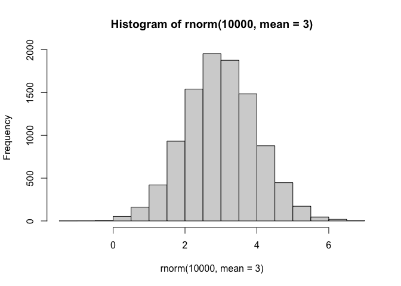

``` r
# make two clusters of x-values, around -3 and +3, and save as single vector
x <- c(rnorm(30, -3), rnorm(30, +3))
```

``` r
#rev(x) will generate reversed version of argument
#cbind() will combine x and y vectors as columns
z = cbind(x = x, y = rev(x))

plot(z)
```

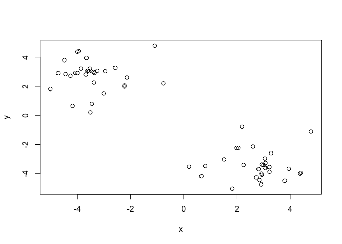

Now we can run `kmeans()` on this input `z` and see what the results
look like.

``` r
km2 <- kmeans(z, centers = 2)
km2
```

    K-means clustering with 2 clusters of sizes 30, 30

    Cluster means:
              x         y
    1  2.750215 -3.415704
    2 -3.415704  2.750215

    Clustering vector:
     [1] 2 2 2 2 2 2 2 2 2 2 2 2 2 2 2 2 2 2 2 2 2 2 2 2 2 2 2 2 2 2 1 1 1 1 1 1 1 1
    [39] 1 1 1 1 1 1 1 1 1 1 1 1 1 1 1 1 1 1 1 1 1 1

    Within cluster sum of squares by cluster:
    [1] 59.70239 59.70239
     (between_SS / total_SS =  90.5 %)

    Available components:

    [1] "cluster"      "centers"      "totss"        "withinss"     "tot.withinss"
    [6] "betweenss"    "size"         "iter"         "ifault"      

``` r
attributes(km2)
```

    $names
    [1] "cluster"      "centers"      "totss"        "withinss"     "tot.withinss"
    [6] "betweenss"    "size"         "iter"         "ifault"      

    $class
    [1] "kmeans"

> Q. How many points are in each cluster? What “component” of your
> result object details cluster size?

``` r
km2$size
```

    [1] 30 30

There are 30 points in each cluster, as detailed by the “size”
component.

> Q. What “component” of your result object details cluster
> assignment/membership?

``` r
km2$cluster
```

     [1] 2 2 2 2 2 2 2 2 2 2 2 2 2 2 2 2 2 2 2 2 2 2 2 2 2 2 2 2 2 2 1 1 1 1 1 1 1 1
    [39] 1 1 1 1 1 1 1 1 1 1 1 1 1 1 1 1 1 1 1 1 1 1

The “cluster” component details cluster assignment.

> Q. What “component” of your results object details cluster center?

``` r
km2$centers
```

              x         y
    1  2.750215 -3.415704
    2 -3.415704  2.750215

The “centers” component details the center (x and y coordinates) of each
cluster.

> Q. Plot `z` colored by the kmeans cluster assignment and add cluster
> centers as blue points.

``` r
plot(z, col=c(1, 2))
```

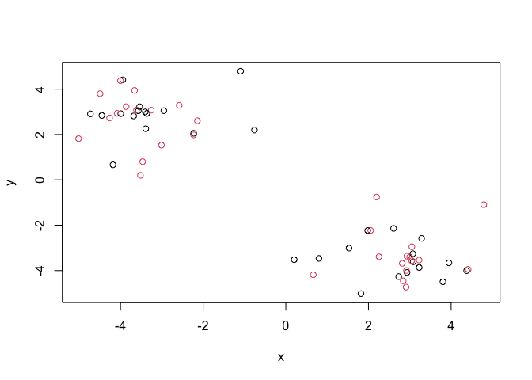

``` r
# Not what we want: does not yield a plot colored by kmeans cluster assignment!
```

``` r
# Final plot, correctly colored by kmeans cluster assignment.
plot(z, col = km2$cluster)
points(km2$centers, col="blue", pch=15)
```

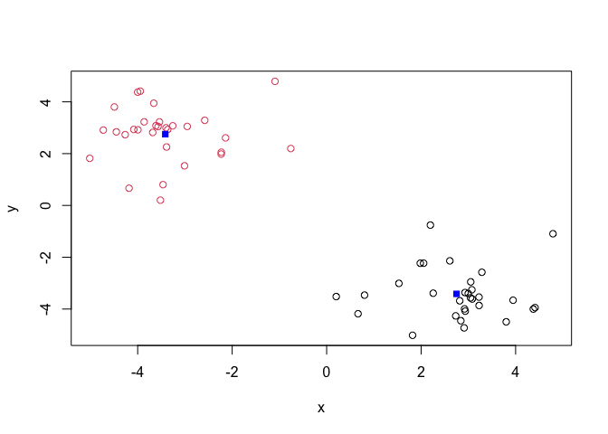

> Q. Run a K-means clustering and plot the results asking for 4
> clusters.

``` r
km4 <- kmeans(z, centers = 4)
km4
```

    K-means clustering with 4 clusters of sizes 11, 21, 19, 9

    Cluster means:
              x         y
    1 -2.622680  3.252071
    2  3.178579 -3.164316
    3 -3.874822  2.459667
    4  1.750700 -4.002275

    Clustering vector:
     [1] 3 3 3 3 1 3 1 1 3 1 1 1 3 1 3 1 3 3 1 1 3 3 1 3 3 3 3 3 3 3 2 4 4 2 2 2 2 2
    [39] 4 2 2 2 4 2 2 2 2 4 2 2 2 4 2 2 4 2 4 2 2 4

    Within cluster sum of squares by cluster:
    [1] 21.69915 30.41512 22.70607 12.01888
     (between_SS / total_SS =  93.1 %)

    Available components:

    [1] "cluster"      "centers"      "totss"        "withinss"     "tot.withinss"
    [6] "betweenss"    "size"         "iter"         "ifault"      

``` r
plot(z, col=km4$cluster)
points(km4$centers, col="black", pch=15)
```

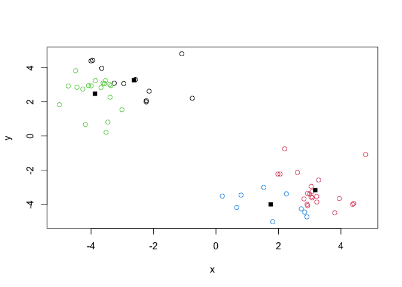

> **N.B.** You need to tell K-means the number of clusters (i.e. set
> `centers=2`)!!

One approach is to try different values for `centers` and then pick the
best…

``` r
ans <- NULL
for(i in 1:10) {
 km <- kmeans(z, centers=i)
 ans <- c(ans, km$tot.withinss) 
}

plot(ans, typ = "o", main = "Scree Plot", 
     xlab = "Number of clusters", 
     ylab = "Total Sum of Squares")
```

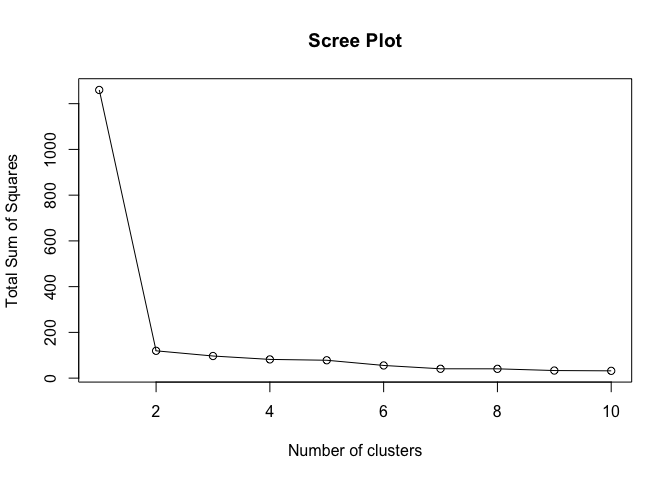

We see that the elbow of the scree plot is at k=2 (i.e. where there is a
significant drop in the total sum of squares). Thus, the optimal number
of clusters is 2.

## Hierarchical Clustering

The main function in “base” R for Hierarchical Clustering is called
`hclust()`.

This function does not take your “raw” data for clustering. You must
first build a “distance matrix” (aka dissimilarity matrix, using
Euclidean distance as default) from your data and pass this as input to
`hclust()`.

``` r
d <- dist(z)
hc <- hclust(d)
hc
```


    Call:
    hclust(d = d)

    Cluster method   : complete 
    Distance         : euclidean 
    Number of objects: 60 

There is a bespoke `plot()` method for `hclust()` result objects.

``` r
plot(hc)
abline(h=8, col="red")
```

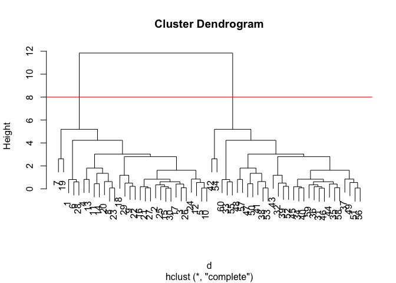

Once we have our `hclust` object (our “tree” of “cluster dendrogram”),
we can *“cut”* the tree to reveal the clustering pattern.

``` r
# Cutting by height. 
cutree(hc, h=8)
```

     [1] 1 1 1 1 1 1 1 1 1 1 1 1 1 1 1 1 1 1 1 1 1 1 1 1 1 1 1 1 1 1 2 2 2 2 2 2 2 2
    [39] 2 2 2 2 2 2 2 2 2 2 2 2 2 2 2 2 2 2 2 2 2 2

``` r
# Cutting by desired number of clusters.  
grps <- cutree(hc, k=2)
grps
```

     [1] 1 1 1 1 1 1 1 1 1 1 1 1 1 1 1 1 1 1 1 1 1 1 1 1 1 1 1 1 1 1 2 2 2 2 2 2 2 2
    [39] 2 2 2 2 2 2 2 2 2 2 2 2 2 2 2 2 2 2 2 2 2 2

> Q. Make a plot of `z` with your hclust results (i.e. colored by
> cluster membership).

``` r
plot(z, col = grps)
```

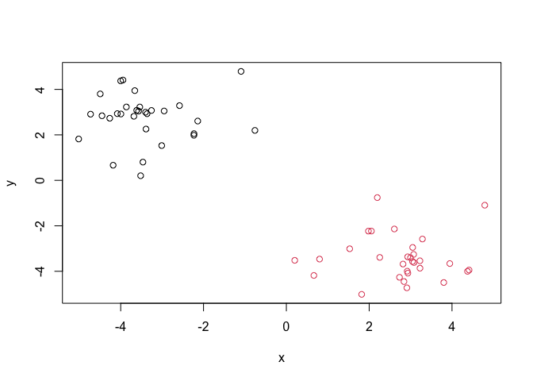

## Principal Component Analysis (PCA)

PCA is a dimensionality reduction method that is popular for revealing
patterns in complex datasets.

## Analysis of UK food data

Let’s look at some data on the eating habits of folks from the UK to see
if there are patterns and trends that have some regions being distinct
from others.

## Data Import

The data is made available in CSV format, so we can use the `read.csv()`
function for import to R:

``` r
url <- "https://tinyurl.com/UK-foods"
x <- read.csv(url)
```

> Q1. How many rows and columns are in your new data frame named x? What
> R functions could you use to answer this questions?

``` r
dim(x)
```

    [1] 17  5

There are 17 rows and 5 columns in the data frame. I used the `dim()`
function to answer this question (alternatively, the `nrow()` and
`ncol()` functions can be used together, to separately return the number
of rows and number of columns).

## Tidy the data

Fix anything that went wrong with data import.

``` r
# Preview the first 6 rows
head(x)
```

                   X England Wales Scotland N.Ireland
    1         Cheese     105   103      103        66
    2  Carcass_meat      245   227      242       267
    3    Other_meat      685   803      750       586
    4           Fish     147   160      122        93
    5 Fats_and_oils      193   235      184       209
    6         Sugars     156   175      147       139

Row-names are incorrectly set as the first column, resulting in 5
columns. We want only 4 columns, for the 4 countries. One option is to
set the current first column as proper row-names (using the `rownames()`
function), followed by removing the first column (using minus indexing):

``` r
# rownames(x) <- x[,1]
# x <- x[,-1]
```

Alternatively, let’s read the data file again, now setting the row.names
argument of `read.csv()` to be the first column (which removes the
row-names from the actual data columns).

``` r
url <- "https://tinyurl.com/UK-foods"
x <- read.csv(url, row.names = 1)
head(x)
```

                   England Wales Scotland N.Ireland
    Cheese             105   103      103        66
    Carcass_meat       245   227      242       267
    Other_meat         685   803      750       586
    Fish               147   160      122        93
    Fats_and_oils      193   235      184       209
    Sugars             156   175      147       139

``` r
dim(x)
```

    [1] 17  4

``` r
# data frame should now have only 4 columns
```

> Q2. Which approach to solving the ‘row-names problem’ mentioned above
> do you prefer and why? Is one approach more robust than another under
> certain circumstances?

I prefer adding the row.names argument to the `read.csv()` function
during data import, as the data frame imported into the R brain already
has the correct row-names set-up (i.e. foods as row names) and doesn’t
require further modification. The `read.csv(url, row.names = 1)`
approach is also more robust than minus indexing with `x <- x[,-1]`; if
the code block is run multiple times, minus indexing would remove an
additional column each time, thus removing the actual data.

## Exploratory analysis: Spotting major differences and trends

Make some plots to help make sense of obvious trends…

### Bar plots: Using base R

``` r
barplot(as.matrix(x), beside=T, col=rainbow(nrow(x)))
```


> Q3: Changing what optional argument in the above barplot() function
> results in the following plot?

Changing the beside argument to `beside = FALSE` results in the stacked
bar plot. Alternatively, the argument can be removed entirely, since it
is optional and the function defaults to `beside = FALSE`.

``` r
# Make bar plot stacked.
barplot(as.matrix(x), beside=F, col=rainbow(nrow(x)))
```


### Bar plots: Using ggplot2

``` r
# Currently we have wide format
dim(x)
```

    [1] 17  4

``` r
head(x)
```

                   England Wales Scotland N.Ireland
    Cheese             105   103      103        66
    Carcass_meat       245   227      242       267
    Other_meat         685   803      750       586
    Fish               147   160      122        93
    Fats_and_oils      193   235      184       209
    Sugars             156   175      147       139

We can convert the data frame from wide to long (maximizing rows,
minimizing columns) using the `pivot_longer()` function from the
**tidyr** package:

``` r
library(tidyr)

# Convert data to long format for ggplot with `pivot_longer()`
x_long <- x |>
  tibble::rownames_to_column("Food") |>
  pivot_longer(cols = -Food, names_to = "Country", values_to = "Consumption")

dim(x_long)
```

    [1] 68  3

``` r
head(x_long)
```

    # A tibble: 6 × 3
      Food            Country   Consumption
      <chr>           <chr>           <int>
    1 "Cheese"        England           105
    2 "Cheese"        Wales             103
    3 "Cheese"        Scotland          103
    4 "Cheese"        N.Ireland          66
    5 "Carcass_meat " England           245
    6 "Carcass_meat " Wales             227

``` r
# Create grouped bar plot using the long format data frame.
library(ggplot2)

ggplot(x_long, aes(x = Country, y = Consumption, fill = Food)) +
  geom_col(position = "dodge") +
  theme_bw()
```


> Q4: Changing what optional argument in the above ggplot() code results
> in a stacked barplot figure?

Removing the `position` argument from in the `geom_col()` layer results
in a stacked barplot figure. ggplot2 defaults to `position = "stack"`
(this can be also be manually specified, as shown in the code below).

``` r
ggplot(x_long, aes(x = Country, y = Consumption, fill = Food)) +
  geom_col(position = "stack") +
  theme_bw()
```


### Pairs plots and heatmaps

> Q5. We can use the `pairs()` function to generate all pairwise plots
> for our countries. Can you make sense of the following code and
> resulting figure? What does it mean if a given point lies on the
> diagonal for a given plot?

``` r
# Use pairs() function for data frame x. 
pairs(x, col=rainbow(nrow(x)), pch=16)
```


``` r
# rainbow(n) generates a vector of n contiguous colors
# here, n = nrow(x) since we want enough colors for the num. of rows (foods)
# pch=16 plots filled circles
```

The `pairs()` function is used to make a scatter plot matrix, with a
plot for each possible pair of countries in the data frame. Each
color-coded point represents an individual food type.

We can assess correlations in food consumption for a given pair of
countries, by locating the specific plot with country1 on the x-axis and
country2 on the y-axis (or vice versa). If a given point lies on the x=y
diagonal for a given plot, the corresponding food is consumed equally
(in grams per person, per week) in the two countries. Points/foods lying
off the diagonal are consumed more in one country than the other.

Let’s make a **heatmap**:

``` r
library(pheatmap)
pheatmap( as.matrix(x) )
```


> Q6. Based on the pairs and heatmap figures, which countries cluster
> together and what does this suggest about their food consumption
> patterns? Can you easily tell what the main differences between N.
> Ireland and the other countries of the UK in terms of this data-set?

England, Wales, and Scotland appear to cluster separately from N.
Ireland, with England and Wales being the *least dissimilar* (i.e. the
pairwise plots for England vs. Wales appear closest to an x=y diagonal;
the heat map’s top dendrogram shows England and Wales have the smallest
distance, and these two countries have the most similar heatmap color
patterns). This suggests that among the 4 countries, England and Wales
have the most similar food consumption patterns, whereas N. Ireland has
the most distinct/different food consumption pattern (its pairwise plots
with the other countries stray furthest from an x=y diagonal, and it has
a relatively more distinct heatmap color pattern, as confirmed by its
separation in the top dendogram).

The heatmap figure suggests N. Ireland consumes less alcoholic drinks
(darkest shade of blue) and fresh fruit (furthest shade from red). On
the other hand, N. Ireland consumes more fresh potatoes (closest to red)
than the other countries. However, since there are no drastic
differences across the food consumption profiles, it is difficult to
identify the differences that do exist from the pairs and heatmap plots
alone.

> **Key-point**: Even relatively small datasets can prove challenging to
> interpret.

## PCA to the rescue

The main function in “base” R for PCA is called `prcomp()`. This
function wants the “observations” to be rows and the “variables” to be
columns.

So here we need to take the transpose of our `x` input object.

``` r
# Use the prcomp() PCA function on the transposed data matrix. 
pca <- prcomp( t(x) ) 
summary(pca)
```

    Importance of components:
                                PC1      PC2      PC3       PC4
    Standard deviation     324.1502 212.7478 73.87622 2.921e-14
    Proportion of Variance   0.6744   0.2905  0.03503 0.000e+00
    Cumulative Proportion    0.6744   0.9650  1.00000 1.000e+00

The returned `pca` object has components that we can use to make our
main result figures:

``` r
attributes(pca)
```

    $names
    [1] "sdev"     "rotation" "center"   "scale"    "x"       

    $class
    [1] "prcomp"

The main result figure from this analysis is called a **“PC core plot”**
(a.k.a. an “ordination plot”, “PC plot”, or simply “PC1 vs PC2 plot”)

This plot shows how samples (in this case, countries) relate to each
other along our new PC axis.

This is our new “reduced-dimensional space”. In this case, 2 dimensions,
PC1 and PC2, that capture most of the variance in the original 17
dimensional data-set.

> Q7. Complete the code below to generate a plot of PC1 vs PC2. The
> second line adds text labels over the data points.

``` r
library(ggplot2)

ggplot(pca$x) +
 aes(PC1, PC2, label = rownames(pca$x)) +
  geom_point(size = 3) +
  geom_text(size = 3, vjust = -0.5) +
  xlim(-270, 500) +
  xlab("PC1") +
  ylab("PC2") +
  theme_bw()
```

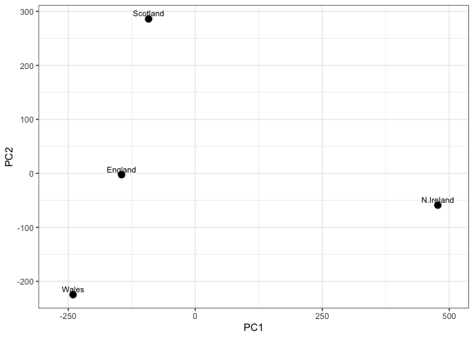

The above PC score plot places N. Ireland far right (positive) along PC1
and the remaining 3 countries far left (negative) along PC1. This
suggests that England, Wales and Scotland have more similar food
consumption profiles than Northern Ireland.

> Q8. Customize your plot so that the colors of the country names match
> the colors in our UK and Ireland map and table at start of this
> document.

``` r
mycols <- c("orange", "red", "blue", "darkgreen")

# add mycol vector to geom_point and geom_text layers to color the points and country names
ggplot(pca$x) +
 aes(PC1, PC2, label = rownames(pca$x)) +
  geom_point(size = 3, col = mycols) +
  geom_text(size = 3, vjust = -0.5, col = mycols) +
  xlim(-270, 500) +
  xlab("PC1") +
  ylab("PC2") +
  theme_bw()
```

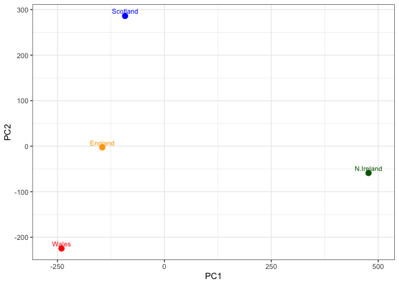

There are two ways to determine how much variation in the original data
each PC accounts for:

``` r
# 1st method is to access the sdev component of the pca object: 

var <- round(pca$sdev^2/sum(pca$sdev^2) * 100)
var
```

    [1] 67 29  4  0

``` r
# 2nd method is to view "Proportion of Variance" output from PCA summary:

summary(pca)$importance
```

                                 PC1       PC2      PC3          PC4
    Standard deviation     324.15019 212.74780 73.87622 2.921348e-14
    Proportion of Variance   0.67444   0.29052  0.03503 0.000000e+00
    Cumulative Proportion    0.67444   0.96497  1.00000 1.000000e+00

A **scree plot** depicts the variances (eigenvalues) with respect to the
principal component number (eigenvector number):

``` r
# Generate a data frame with variance values for PC1 to PC4

variance_df <- data.frame(
  PC = factor(paste0("PC", 1:length(var))), 
  levels = paste0("PC", 1:length(var)),
  Variance = var)
  
variance_df
```

       PC levels Variance
    1 PC1    PC1       67
    2 PC2    PC2       29
    3 PC3    PC3        4
    4 PC4    PC4        0

``` r
# Create scree plot with ggplot
ggplot(variance_df) +
  aes(x = PC, y = Variance) +
  geom_col(fill = "navyblue") +
  xlab("Principal Component") +
  ylab("Percent Variation") +
  theme_bw() +
  theme(axis.text.x = element_text(angle = 0))
```

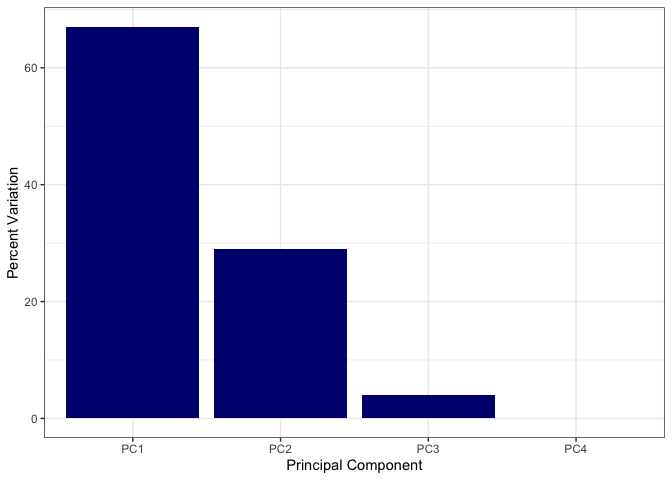

## Digging deeper (variable loadings)

``` r
# To see how the original 17 variables were combined to generate PC1, make a loading plot
ggplot(pca$rotation) +
  aes(x = PC1, y = reorder(row.names(pca$rotation), PC1)) +
  geom_col(fill = "navyblue") +
  xlab("PC1 Loading Score") +
  ylab("") +
  theme_bw() +
  theme(axis.text.y = element_text(size = 9))
```

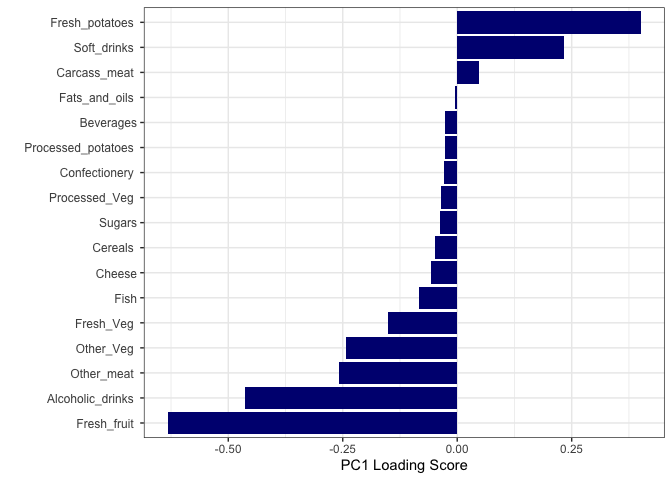

This loading plot tells us that countries on the positive end of the PC1
axis (i.e. Ireland) consume more soft drinks and fresh potatoes.
Countries on the negative end of the PC1 axis (i.e. England, Wales,
Scotland) consume more fresh fruit and alcoholic drinks.

> Q9: Generate a similar ‘loadings plot’ for PC2. What two food groups
> feature prominantely and what does PC2 maninly tell us about?

``` r
# To see how the original 17 variables were combined to generate PC2, make another loading plot
ggplot(pca$rotation) +
  aes(x = PC2, y = reorder(row.names(pca$rotation), PC2)) +
  geom_col(fill = "navyblue") +
  xlab("PC2 Loading Score") +
  ylab("") +
  theme_bw() +
  theme(axis.text.y = element_text(size = 9))
```

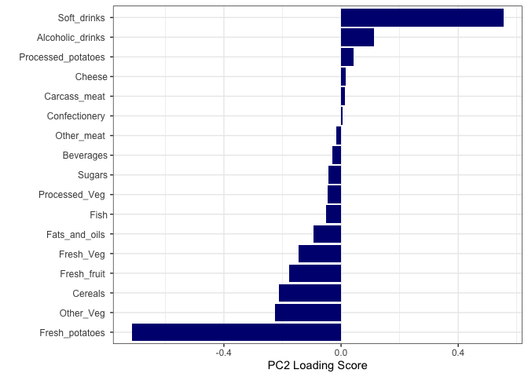

The two food groups that feature prominently are soft drinks (with a
large positive PC2 loading score) and fresh potatoes (with a large
negative PC2 loading score). Since these two features contribute
significantly to PC2, PC2 mainly tells us how countries cluster together
and/or separate from each other on the basis of soft drink and fresh
potato consumption. Countries with high positive PC2 scores
(i.e. Scotland) may have high soft drink consumption and/or low fresh
potato consumption, while the opposite might be true for countries with
high negative PC2 scores (i.e. Wales).

## Learnings from lab

Functions we learned: kmeans (x, centers = n), hclust( dist(x) ), prcomp
(x, scale = TRUE)

The three plots we can generate with the prcomp output are: PC score
plot, Loading plot, Scree plot
