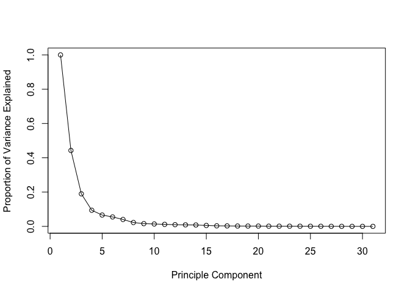
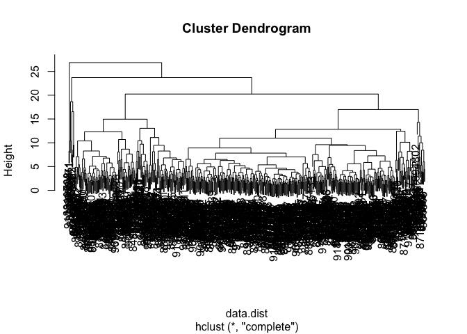
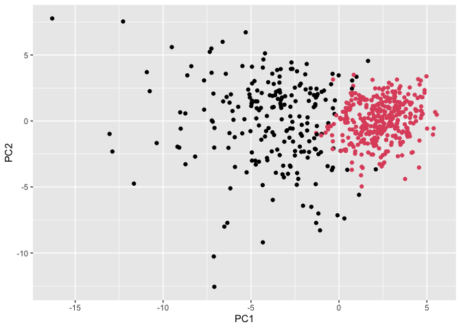
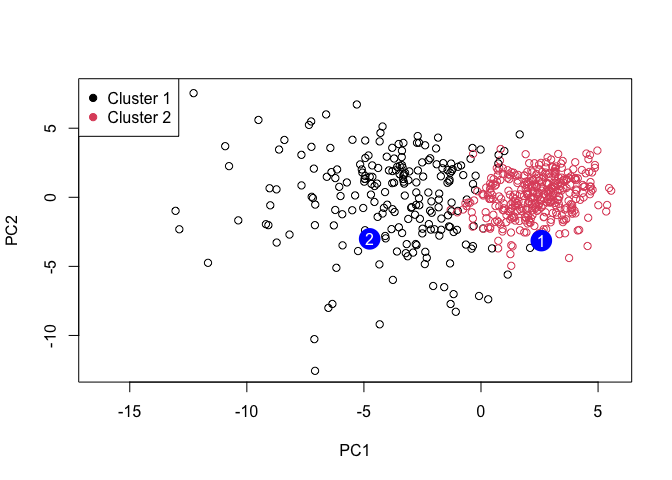

# Class 08: Breast Cancer Mini Project
Harshitha Palacharla (PID: A17775151)

- [Background](#background)
- [Data Import](#data-import)
- [Exploratory data analysis](#exploratory-data-analysis)
- [Principle Component Analysis
  (PCA)](#principle-component-analysis-pca)
  - [Performing PCA](#performing-pca)
  - [Interpreting PCA results](#interpreting-pca-results)
  - [Variance explained](#variance-explained)
  - [Communicating PCA results](#communicating-pca-results)
- [Hierarchical Clustering](#hierarchical-clustering)
  - [Results of hierarchical
    clustering](#results-of-hierarchical-clustering)
  - [Selecting number of clusters](#selecting-number-of-clusters)
  - [Using different methods](#using-different-methods)
- [Combining methods](#combining-methods)
  - [Clustering on PCA results](#clustering-on-pca-results)
- [Prediction](#prediction)

## Background

The goal of this mini-project is for you to explore a complete analysis
using the unsupervised learning techniques covered in class.

Today we will analyze a biopsy data-set from final needle aspiration
(FNA) of breast mass.

## Data Import

The data is made available as a CSV file for download. We can read this
in using `read.csv()`.

``` r
# Input data file is in Project directory 
wisc.df <- read.csv("WisconsinCancer.csv", row.names = 1)

head(wisc.df, 4)
```

             diagnosis radius_mean texture_mean perimeter_mean area_mean
    842302           M       17.99        10.38         122.80    1001.0
    842517           M       20.57        17.77         132.90    1326.0
    84300903         M       19.69        21.25         130.00    1203.0
    84348301         M       11.42        20.38          77.58     386.1
             smoothness_mean compactness_mean concavity_mean concave.points_mean
    842302           0.11840          0.27760         0.3001             0.14710
    842517           0.08474          0.07864         0.0869             0.07017
    84300903         0.10960          0.15990         0.1974             0.12790
    84348301         0.14250          0.28390         0.2414             0.10520
             symmetry_mean fractal_dimension_mean radius_se texture_se perimeter_se
    842302          0.2419                0.07871    1.0950     0.9053        8.589
    842517          0.1812                0.05667    0.5435     0.7339        3.398
    84300903        0.2069                0.05999    0.7456     0.7869        4.585
    84348301        0.2597                0.09744    0.4956     1.1560        3.445
             area_se smoothness_se compactness_se concavity_se concave.points_se
    842302    153.40      0.006399        0.04904      0.05373           0.01587
    842517     74.08      0.005225        0.01308      0.01860           0.01340
    84300903   94.03      0.006150        0.04006      0.03832           0.02058
    84348301   27.23      0.009110        0.07458      0.05661           0.01867
             symmetry_se fractal_dimension_se radius_worst texture_worst
    842302       0.03003             0.006193        25.38         17.33
    842517       0.01389             0.003532        24.99         23.41
    84300903     0.02250             0.004571        23.57         25.53
    84348301     0.05963             0.009208        14.91         26.50
             perimeter_worst area_worst smoothness_worst compactness_worst
    842302            184.60     2019.0           0.1622            0.6656
    842517            158.80     1956.0           0.1238            0.1866
    84300903          152.50     1709.0           0.1444            0.4245
    84348301           98.87      567.7           0.2098            0.8663
             concavity_worst concave.points_worst symmetry_worst
    842302            0.7119               0.2654         0.4601
    842517            0.2416               0.1860         0.2750
    84300903          0.4504               0.2430         0.3613
    84348301          0.6869               0.2575         0.6638
             fractal_dimension_worst
    842302                   0.11890
    842517                   0.08902
    84300903                 0.08758
    84348301                 0.17300

Make sure we remove or exclude the `diagnosis` column from the data-set
that we use for further analysis - this is the expert diagnosis as
either M or B:

``` r
# Use -1 to omit the first (diagnosis) column.
wisc.data <- wisc.df[,-1]

# Store first column, diagnosis, as a factor.
diagnosis <- as.factor(wisc.df$diagnosis)

head(wisc.data, 4)
```

             radius_mean texture_mean perimeter_mean area_mean smoothness_mean
    842302         17.99        10.38         122.80    1001.0         0.11840
    842517         20.57        17.77         132.90    1326.0         0.08474
    84300903       19.69        21.25         130.00    1203.0         0.10960
    84348301       11.42        20.38          77.58     386.1         0.14250
             compactness_mean concavity_mean concave.points_mean symmetry_mean
    842302            0.27760         0.3001             0.14710        0.2419
    842517            0.07864         0.0869             0.07017        0.1812
    84300903          0.15990         0.1974             0.12790        0.2069
    84348301          0.28390         0.2414             0.10520        0.2597
             fractal_dimension_mean radius_se texture_se perimeter_se area_se
    842302                  0.07871    1.0950     0.9053        8.589  153.40
    842517                  0.05667    0.5435     0.7339        3.398   74.08
    84300903                0.05999    0.7456     0.7869        4.585   94.03
    84348301                0.09744    0.4956     1.1560        3.445   27.23
             smoothness_se compactness_se concavity_se concave.points_se
    842302        0.006399        0.04904      0.05373           0.01587
    842517        0.005225        0.01308      0.01860           0.01340
    84300903      0.006150        0.04006      0.03832           0.02058
    84348301      0.009110        0.07458      0.05661           0.01867
             symmetry_se fractal_dimension_se radius_worst texture_worst
    842302       0.03003             0.006193        25.38         17.33
    842517       0.01389             0.003532        24.99         23.41
    84300903     0.02250             0.004571        23.57         25.53
    84348301     0.05963             0.009208        14.91         26.50
             perimeter_worst area_worst smoothness_worst compactness_worst
    842302            184.60     2019.0           0.1622            0.6656
    842517            158.80     1956.0           0.1238            0.1866
    84300903          152.50     1709.0           0.1444            0.4245
    84348301           98.87      567.7           0.2098            0.8663
             concavity_worst concave.points_worst symmetry_worst
    842302            0.7119               0.2654         0.4601
    842517            0.2416               0.1860         0.2750
    84300903          0.4504               0.2430         0.3613
    84348301          0.6869               0.2575         0.6638
             fractal_dimension_worst
    842302                   0.11890
    842517                   0.08902
    84300903                 0.08758
    84348301                 0.17300

## Exploratory data analysis

> Q1. How many observations are in this dataset?

``` r
nrow(wisc.data)
```

    [1] 569

There are 569 observations (patient samples) in the dataset.

> Q2. How many of the observations have a malignant diagnosis?

``` r
# Access the diagnosis column of the original data frame.
# Use table() function to create frequency table
table(wisc.df$diagnosis)
```


      B   M 
    357 212 

``` r
# We can also use the sum() function and a logical argument.
sum(wisc.df$diagnosis == "M")
```

    [1] 212

212 observations have a malignant diagnosis.

> Q3. How many variables/features in the data are suffixed with `_mean`?

We can use the `grep()` function (performs pattern matching in a
character vector) to help us here:

``` r
length(grep("_mean", colnames(wisc.data), value = T))
```

    [1] 10

10 variables/features in the data are suffixed with `_mean`.

## Principle Component Analysis (PCA)

### Performing PCA

We first need to check if the data needs to be scaled prior to
performing PCA. Scaling is especially necessary if the means (reflecting
units of measurement) and/or standard deviations (reflecting variance)
of the columns/features are very different.

``` r
# Check means of wisc.data columns.
colMeans(wisc.data)
```

                radius_mean            texture_mean          perimeter_mean 
               1.412729e+01            1.928965e+01            9.196903e+01 
                  area_mean         smoothness_mean        compactness_mean 
               6.548891e+02            9.636028e-02            1.043410e-01 
             concavity_mean     concave.points_mean           symmetry_mean 
               8.879932e-02            4.891915e-02            1.811619e-01 
     fractal_dimension_mean               radius_se              texture_se 
               6.279761e-02            4.051721e-01            1.216853e+00 
               perimeter_se                 area_se           smoothness_se 
               2.866059e+00            4.033708e+01            7.040979e-03 
             compactness_se            concavity_se       concave.points_se 
               2.547814e-02            3.189372e-02            1.179614e-02 
                symmetry_se    fractal_dimension_se            radius_worst 
               2.054230e-02            3.794904e-03            1.626919e+01 
              texture_worst         perimeter_worst              area_worst 
               2.567722e+01            1.072612e+02            8.805831e+02 
           smoothness_worst       compactness_worst         concavity_worst 
               1.323686e-01            2.542650e-01            2.721885e-01 
       concave.points_worst          symmetry_worst fractal_dimension_worst 
               1.146062e-01            2.900756e-01            8.394582e-02 

``` r
# Check standard deviations of wisc.data columns.
apply(wisc.data, 2, sd)
```

                radius_mean            texture_mean          perimeter_mean 
               3.524049e+00            4.301036e+00            2.429898e+01 
                  area_mean         smoothness_mean        compactness_mean 
               3.519141e+02            1.406413e-02            5.281276e-02 
             concavity_mean     concave.points_mean           symmetry_mean 
               7.971981e-02            3.880284e-02            2.741428e-02 
     fractal_dimension_mean               radius_se              texture_se 
               7.060363e-03            2.773127e-01            5.516484e-01 
               perimeter_se                 area_se           smoothness_se 
               2.021855e+00            4.549101e+01            3.002518e-03 
             compactness_se            concavity_se       concave.points_se 
               1.790818e-02            3.018606e-02            6.170285e-03 
                symmetry_se    fractal_dimension_se            radius_worst 
               8.266372e-03            2.646071e-03            4.833242e+00 
              texture_worst         perimeter_worst              area_worst 
               6.146258e+00            3.360254e+01            5.693570e+02 
           smoothness_worst       compactness_worst         concavity_worst 
               2.283243e-02            1.573365e-01            2.086243e-01 
       concave.points_worst          symmetry_worst fractal_dimension_worst 
               6.573234e-02            6.186747e-02            1.806127e-02 

We should scale our data before PCA with the `scale=TRUE` argument to
`prcomp()`.

``` r
wisc.pr <- prcomp(wisc.data, scale = TRUE)
summary(wisc.pr)
```

    Importance of components:
                              PC1    PC2     PC3     PC4     PC5     PC6     PC7
    Standard deviation     3.6444 2.3857 1.67867 1.40735 1.28403 1.09880 0.82172
    Proportion of Variance 0.4427 0.1897 0.09393 0.06602 0.05496 0.04025 0.02251
    Cumulative Proportion  0.4427 0.6324 0.72636 0.79239 0.84734 0.88759 0.91010
                               PC8    PC9    PC10   PC11    PC12    PC13    PC14
    Standard deviation     0.69037 0.6457 0.59219 0.5421 0.51104 0.49128 0.39624
    Proportion of Variance 0.01589 0.0139 0.01169 0.0098 0.00871 0.00805 0.00523
    Cumulative Proportion  0.92598 0.9399 0.95157 0.9614 0.97007 0.97812 0.98335
                              PC15    PC16    PC17    PC18    PC19    PC20   PC21
    Standard deviation     0.30681 0.28260 0.24372 0.22939 0.22244 0.17652 0.1731
    Proportion of Variance 0.00314 0.00266 0.00198 0.00175 0.00165 0.00104 0.0010
    Cumulative Proportion  0.98649 0.98915 0.99113 0.99288 0.99453 0.99557 0.9966
                              PC22    PC23   PC24    PC25    PC26    PC27    PC28
    Standard deviation     0.16565 0.15602 0.1344 0.12442 0.09043 0.08307 0.03987
    Proportion of Variance 0.00091 0.00081 0.0006 0.00052 0.00027 0.00023 0.00005
    Cumulative Proportion  0.99749 0.99830 0.9989 0.99942 0.99969 0.99992 0.99997
                              PC29    PC30
    Standard deviation     0.02736 0.01153
    Proportion of Variance 0.00002 0.00000
    Cumulative Proportion  1.00000 1.00000

> Q4. From your results, what proportion of the original variance is
> captured by the first principal component (PC1)?

44.27% of the original variance is captured by PC1.

> Q5. How many principal components (PCs) are required to describe at
> least 70% of the original variance in the data?

3 PCs are required to describe at least 70% of the original variance (at
PC3, the cumulative proportion is 72.636%).

> Q6. How many principal components (PCs) are required to describe at
> least 90% of the original variance in the data?

7 PCs are required to describe at least 90% of the original variance (at
PC7, the cumulative proportion is 91.010%).

### Interpreting PCA results

Create a biplot of the wisc.pr using the biplot() function.

``` r
biplot(wisc.pr)
```


> Q7. What stands out to you about this plot? Is it easy or difficult to
> understand? Why?

A few things stand out to me from the biplot. Firstly, the
observations/biopsy samples are plotted by their row names (in this
case, sample ids). Secondly, in addition to the observations themselves
in black, the plot also includes red vectors for each of the variables
(each vector shows the contribution of a given variable/biopsy feature
to PC1 and PC2). Altogether, the plot is very dense.

The plot is difficult to understand, both due to using rownames as the
plotting character (individual observations cannot be distinguished) and
due to the overlay of so many labelled, variable vectors. We cannot
identify sample groupings/clusters or patterns.

Let’s see the **PC score plot** of PC1 vs PC2, and color the points by
the diagnosis.

``` r
library(ggplot2)

# Scatter plot of observations along principle components 1 and 2.
ggplot(wisc.pr$x) +
  aes(PC1, PC2, col = diagnosis) +
  geom_point()
```


> Q8. Generate a similar plot for principal components 1 and 3. What do
> you notice about these plots?

``` r
# Repeat for components 1 and 3
ggplot(wisc.pr$x) +
  aes(PC1, PC3, col = diagnosis) +
  geom_point()
```


The PC score plots clearly show separation between the benign (red) and
malignant (turquoise) observations/biopsy samples along the *PC1 axis*
(more so than along the PC2 or PC3 axes). Benign samples have more
positive PC1 scores than malignant samples.

### Variance explained

Calculate the variance of each principle component.

``` r
# Calculate the variance of each component
pr.var <- wisc.pr$sdev^2
head(pr.var)
```

    [1] 13.281608  5.691355  2.817949  1.980640  1.648731  1.207357

Calculate the variance explained by each principle component.

``` r
# Variance explained by each principal component: pve
pve <- pr.var / sum(pr.var)

# Plot variance explained for by each PC.
plot(c(1, pve), xlab = "Principle Component", ylab = "Proportion of Variance Explained", ylim = c(0,1), type = "o")
```



We can also depict the scree plot as a bar plot.

``` r
# Alternative scree plot (bar plot) of the same data, of variance explained by each PC.

barplot(pve, ylab = "Percent of Variance Explained", names.arg = paste0("PC", 1:length(pve)), las=2, axes = FALSE)
axis(2, at=pve, labels=round(pve,2)*100)
```


### Communicating PCA results

> Q9. For the first principal component, what is the component of the
> loading vector (i.e. `wisc.pr$rotation[,1]`) for the feature
> `concave.points_mean`? This tells us how much this original feature
> contributes to the first PC. Are there any features with larger
> contributions than this one?

``` r
# Find PC1 loading value for concave.points_mean
wisc.pr$rotation["concave.points_mean",1]
```

    [1] -0.2608538

``` r
# Following returns TRUE for features with larger contributions to PC1 than concave.points_mean.
abs(wisc.pr$rotation[,1]) > abs(wisc.pr$rotation["concave.points_mean",1])
```

                radius_mean            texture_mean          perimeter_mean 
                      FALSE                   FALSE                   FALSE 
                  area_mean         smoothness_mean        compactness_mean 
                      FALSE                   FALSE                   FALSE 
             concavity_mean     concave.points_mean           symmetry_mean 
                      FALSE                   FALSE                   FALSE 
     fractal_dimension_mean               radius_se              texture_se 
                      FALSE                   FALSE                   FALSE 
               perimeter_se                 area_se           smoothness_se 
                      FALSE                   FALSE                   FALSE 
             compactness_se            concavity_se       concave.points_se 
                      FALSE                   FALSE                   FALSE 
                symmetry_se    fractal_dimension_se            radius_worst 
                      FALSE                   FALSE                   FALSE 
              texture_worst         perimeter_worst              area_worst 
                      FALSE                   FALSE                   FALSE 
           smoothness_worst       compactness_worst         concavity_worst 
                      FALSE                   FALSE                   FALSE 
       concave.points_worst          symmetry_worst fractal_dimension_worst 
                      FALSE                   FALSE                   FALSE 

``` r
# sum() counts number of Ts; if 0, no features contribute more to PC1 than concave.points_mean.
sum(abs(wisc.pr$rotation[,1]) > abs(wisc.pr$rotation["concave.points_mean",1]))
```

    [1] 0

For PC1, the component of the loading vector for `concave.points_mean`
is -0.2608538. There are no features with larger contributions to PC1
than this component.

## Hierarchical Clustering

``` r
# Scale the wisc.data data using the "scale()" function
data.scaled <- scale(wisc.data)
# Calculate Euclidean distances between all pairs of scaled observations
data.dist <- dist(data.scaled)
# Create a hierarchical clustering model using complete linkage.
wisc.hclust <- hclust(data.dist, method = "complete")

plot(wisc.hclust)
```



### Results of hierarchical clustering

> Q10. Using the `plot()` and `abline()` functions, what is the height
> at which the clustering model has 4 clusters?

``` r
plot(wisc.hclust)
abline(h = 19, col = "red", lty = 2)
```


The clustering model has 4 clusters at about h = 19.

### Selecting number of clusters

``` r
# Cut tree to return 4 clusters. 
wisc.hclust.clusters <- cutree(wisc.hclust, k = 4)
table(wisc.hclust.clusters)
```

    wisc.hclust.clusters
      1   2   3   4 
    177   7 383   2 

``` r
# Use table() to compare cluster membership and diagnoses.
table(wisc.hclust.clusters, diagnosis)
```

                        diagnosis
    wisc.hclust.clusters   B   M
                       1  12 165
                       2   2   5
                       3 343  40
                       4   0   2

Cluster 1 mostly contains malignant observations, and Cluster 3 mostly
contains benign observations.

### Using different methods

> Q12. Which method gives your favorite results for the same data.dist
> dataset? Explain your reasoning.

``` r
# Generate hierarchical clustering models using single, average, and ward.D2 linkage methods.
wisc.hclust.single <- hclust(data.dist, method = "single")
wisc.hclust.single.clusters <- cutree(wisc.hclust.single, k = 4)

wisc.hclust.avg <- hclust(data.dist, method = "average")
wisc.hclust.avg.clusters <- cutree(wisc.hclust.avg, k = 4)

wisc.hclust.ward <- hclust(data.dist, method = "ward.D2")
wisc.hclust.ward.clusters <- cutree(wisc.hclust.ward, k = 4)

# Determine which method returns my favorite results.
table(wisc.hclust.clusters, diagnosis)
```

                        diagnosis
    wisc.hclust.clusters   B   M
                       1  12 165
                       2   2   5
                       3 343  40
                       4   0   2

``` r
table(wisc.hclust.single.clusters, diagnosis)
```

                               diagnosis
    wisc.hclust.single.clusters   B   M
                              1 356 209
                              2   1   0
                              3   0   2
                              4   0   1

``` r
table(wisc.hclust.avg.clusters, diagnosis)
```

                            diagnosis
    wisc.hclust.avg.clusters   B   M
                           1 355 209
                           2   2   0
                           3   0   1
                           4   0   2

``` r
table(wisc.hclust.ward.clusters, diagnosis)
```

                             diagnosis
    wisc.hclust.ward.clusters   B   M
                            1   0 115
                            2   6  48
                            3 337  48
                            4  14   1

The “complete” method generates my favorite results. I ran hierarchical
clustering for the scaled data using complete, single, average, and
ward.D2 linkage methods, and cut all trees into k=4 clusters. To
evaluate the quality of the results, I compared cluster membership to
actual diagnoses for each method; for me, the ideal result would have
one cluster containing all benign samples and one cluster containing all
malignant samples.

The “single” and “average” methods were my least favorite, each
resulting in one cluster containing almost all samples (both malignant
and benign).

The “ward.D2” method performed better, with cluster 1 having 115 of the
212 malignant samples (and 0 false positives) and cluster 3 having 337
of 357 benign samples (though 48 false negatives). However, the
“complete” method seemed to perform best in terms of (1) maximizing the
number of benign samples captured in one cluster and malignant samples
in another, and (2) minimizing the number of false negatives (which I
consider a much bigger and riskier flaw than false positives). The
“complete” method’s cluster 1 captured 165 of the 212 malignant samples
(compared to 115 in ward.D2) and cluster 3 captured 343 of the 357
benign samples (compared to 337 in ward.D2, and with fewer–40–false
negatives).

## Combining methods

### Clustering on PCA results

Create a hierarchical clustering model with linkage method=“ward.D2”,
using the minimum number of principal components required to describe at
least 90% of the variability in the data (previously determined to be
PC1 to PC7).

``` r
d <- dist(wisc.pr$x[, 1:7])
wisc.pr.hclust <- hclust(d, method = "ward.D2")

plot(wisc.pr.hclust)
abline(h=70, col="red")
```


``` r
# Cut dendogram into its two main branches.
wisc.pr.hclust.clusters <- cutree(wisc.pr.hclust, k=2)
table(wisc.pr.hclust.clusters)
```

    wisc.pr.hclust.clusters
      1   2 
    216 353 

How do this clustering’s `wisc.pr.hclust.clusters` correspond to the
expert `diagnosis`?

``` r
table(wisc.pr.hclust.clusters, diagnosis)
```

                           diagnosis
    wisc.pr.hclust.clusters   B   M
                          1  28 188
                          2 329  24

``` r
# Color PC score plot of PC1 vs. PC2 by hclust groups.
ggplot(wisc.pr$x) +
  aes(PC1, PC2) +
  geom_point(col = wisc.pr.hclust.clusters)
```



> Q13. How well does the newly created hclust model with two clusters
> separate out the two “M” and “B” diagnoses?

It appears that cluster 1 is the malignant cluster (with 28 false
positives, 188 true positives) and cluster 2 is the benign cluster (329
true negatives, 24 false negatives). By creating distinct “M” and “B”
clusters, the PCA-based hclust model does fairly well at separating out
the two diagnoses. However, we might want to focus on reducing the
number of false negatives in the second, benign cluster, since these are
malignant samples observed incorrectly clustered as benign.

> Q14. How well do the hierarchical clustering models you created in the
> previous sections (i.e. without first doing PCA) do in terms of
> separating the diagnoses? Again, use the `table()` function to compare
> the output of each model (`wisc.hclust.clusters` and
> `wisc.pr.hclust.clusters`) with the vector containing the actual
> diagnoses.

``` r
# Outputs of PCA-based and PCA-independent models, respectively.
table(wisc.pr.hclust.clusters, diagnosis)
```

                           diagnosis
    wisc.pr.hclust.clusters   B   M
                          1  28 188
                          2 329  24

``` r
table(wisc.hclust.clusters, diagnosis)
```

                        diagnosis
    wisc.hclust.clusters   B   M
                       1  12 165
                       2   2   5
                       3 343  40
                       4   0   2

The hierarchical clustering model generated without PCA *did* generate a
distinct malignant cluster (165 positives, 12 false positives) and
benign cluster (343 negatives, 40 false negatives). However,
importantly, it yields more false negatives (40) than the model
generated with PCA (24).

It is important to minimize the number of false negatives, since these
are malignant samples incorrectly clustered as benign. Since the
PCA-dependent model (`wisc.pr.hclust.clusters`) produced fewer false
negatives than the PCA-independent model (`wisc.hclust.clusters`), I
believe the latter is comparatively less successful at separating the
diagnoses.

## Prediction

Use the `predict()` function to apply PCA model to a new cancer cell
dataset.

``` r
#url <- "new_samples.csv"
url <- "https://tinyurl.com/new-samples-CSV"
new <- read.csv(url)

# Apply PCA model to new dataset, and print results.
npc <- predict(wisc.pr, newdata=new)
npc
```

               PC1       PC2        PC3        PC4       PC5        PC6        PC7
    [1,]  2.576616 -3.135913  1.3990492 -0.7631950  2.781648 -0.8150185 -0.3959098
    [2,] -4.754928 -3.009033 -0.1660946 -0.6052952 -1.140698 -1.2189945  0.8193031
                PC8       PC9       PC10      PC11      PC12      PC13     PC14
    [1,] -0.2307350 0.1029569 -0.9272861 0.3411457  0.375921 0.1610764 1.187882
    [2,] -0.3307423 0.5281896 -0.4855301 0.7173233 -1.185917 0.5893856 0.303029
              PC15       PC16        PC17        PC18        PC19       PC20
    [1,] 0.3216974 -0.1743616 -0.07875393 -0.11207028 -0.08802955 -0.2495216
    [2,] 0.1299153  0.1448061 -0.40509706  0.06565549  0.25591230 -0.4289500
               PC21       PC22       PC23       PC24        PC25         PC26
    [1,]  0.1228233 0.09358453 0.08347651  0.1223396  0.02124121  0.078884581
    [2,] -0.1224776 0.01732146 0.06316631 -0.2338618 -0.20755948 -0.009833238
                 PC27        PC28         PC29         PC30
    [1,]  0.220199544 -0.02946023 -0.015620933  0.005269029
    [2,] -0.001134152  0.09638361  0.002795349 -0.019015820

``` r
# Plot PC1 vs. PC2, colored by hclust clusters. 
plot(wisc.pr$x[,1:2], col=wisc.pr.hclust.clusters)
legend("topleft", legend = c("Cluster 1", "Cluster 2"), col=1:2, pch=19)

# Add labeled points on above plot corresponding to observations in new dataset.
points(npc[,1], npc[,2], col="blue", pch=16, cex=3)
text(npc[,1], npc[,2], c(1,2), col="white")
```



> Q16. Which of these new patients should we prioritize for follow up
> based on your results?

We should prioritize Patient 2 for follow-up. Patients 1 and 2 score
very differently along the PC1 axis: patient 1 falls further right
(positive PC1 score) and amongst members of Cluster 2 from PCA-based
hierarchical clustering (red points), whereas patient 2 falls further
left (negative PC1 score) and amongst members of Cluster 1 (black
points). As seen in the “Combining Methods” section, we saw that Cluster
1 largely corresponds to malignant samples and Cluster 2 largely
corresponds to benign samples. Thus, the PCA model would predict that
the Patient 2 sample is malignant and the Patient 1 sample is benign,
meaning we should prioritize Patient 2 for follow-up.
