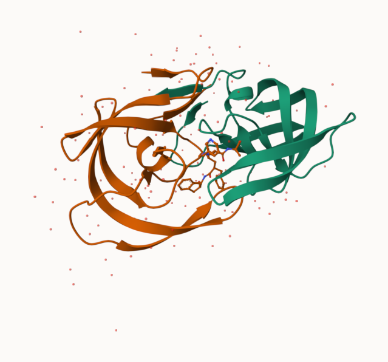
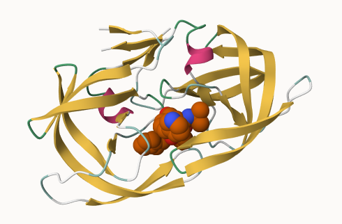
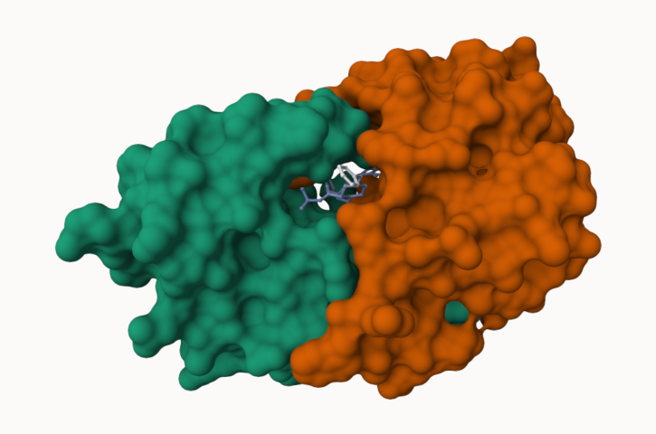
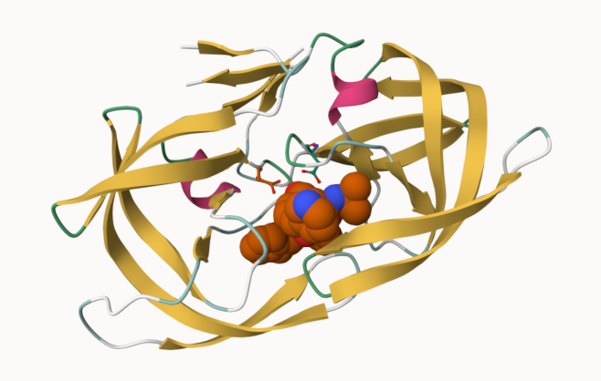
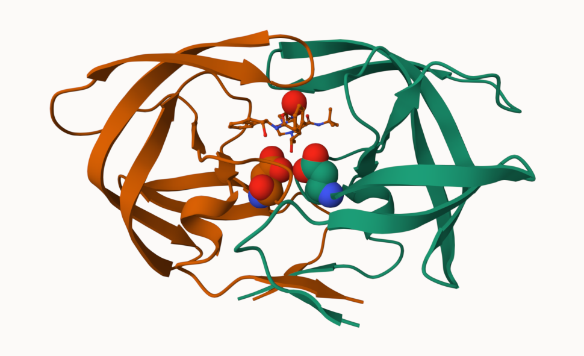
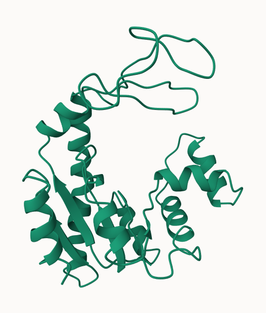
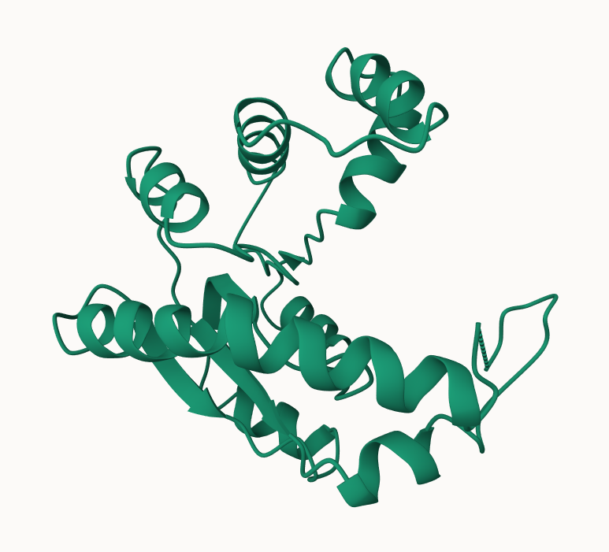

## Background

The main repository of high-resolution structural data on biomolecules is called the **Protein Data Bank** (PDB). 

### PDB statistics

What is in the PDB in terms of molecule type and structure determination method?

Read a CSV file of current PDB stats obtained from https://www.rcsb.org/stats/summary

```{r}
pdb <- read.csv("Data Export Summary.csv")
pdb
```

> Q1: What percentage of structures in the PDB are solved by X-Ray and Electron Microscopy.

80.49% of structures in the PDB are solved by X-ray, and 13.38% are solved by Electron Microscopy.

```{r}
pdb$X.ray
```

This print out above `pdb$X.ray` is "character" not "numeric". Therefore I can't do math with it.

Two functions that can help here are `sub()` and `as.numeric()`
```{r}
# We want to get rid (or sub out) commas:
x <- pdb$X.ray
tmp <- sub(",", "", x)
sum( as.numeric(tmp) )
```

We could make a function to do this:
```{r}
rm.comma <- function(x) {
  tmp <- sub(",", "", x)
  sum( as.numeric(tmp) )
}
```

```{r}
# Percentage of structures solved by X-ray
rm.comma(pdb$X.ray) / rm.comma(pdb$Total)

# Percentage of structures solved by EM
rm.comma(pdb$EM) / rm.comma(pdb$Total)
```

We could also use a different import function for this CSV that speaks American (i.e. deals with commas in numbers in a comma separated value file). 

```{r}
library(readr)

pdb <- read_csv("Data Export Summary.csv")
pdb
```

```{r}
n.tot <- sum(pdb$Total)
n.xray <- sum(pdb$`X-ray`)
n.em <- sum(pdb$EM)

# Percentage of structures solved by X-ray
(n.xray / n.tot) * 100

# Percentage of structures solved by EM
(n.em / n.tot) * 100
```

> Q. How many total protein structures are there in the dataset?

There are 217375 protein structures in the database.

```{r}
pdb$Total[1]
```

> Q2: What proportion of structures in the PDB are protein?

0.107% of PDB structures are protein.

```{r}
# The total number of entries in UniProt is 202,556,314.
(pdb$Total[1] / 202556314) * 100
```

> **Key-point**: We have a very, very small structural coverage of known proteins (~0.1%). Most structures we know about (~80%) come from one method (X-ray crystallography).

> **SKIPPED IN CLASS** Q3: Type HIV in the PDB website search box on the home page and determine how many HIV-1 protease structures are in the current PDB?

# Visualizing PDB data with Mol-star

Main stand alone web version with all features is at https://molstar.org/viewer/



## Getting to know HIV-Pr



   

## Delving deeper



### The important role of water

> Q4: Water molecules normally have 3 atoms. Why do we see just one atom per water molecule in this structure?

We only see each water molecule's oxygen atom. X-ray crystallography has a 2.00 Angstrom resolution, and hydrogen is smaller than this -- thus, it does not appear in the structure.

> Q5: There is a critical “conserved” water molecule in the binding site. Can you identify this water molecule? What residue number does this water molecule have?

The water molecule has the residue number 308.

> Q6: Generate and save a figure clearly showing the two distinct chains of HIV-protease along with the ligand. You might also consider showing the catalytic residues ASP 25 in each chain and the critical water. Add this figure to your Quarto document.

> Discussion Topic: Can you think of a way in which indinavir, or even larger ligands and substrates, could enter the binding site?



For indinavir, or other ligands/substrates to enter the binding site, it's possible that the two loops at the top of the protease structure (as shown in the image above; one loop per chain) undergo a conformational change and "open" in a gate-like manner to enable substrate entry. Once the substrate enters, the loops return to their original, "closed" conformation. The positioning of the loops and the newly-entered substrate may be stabilized by non-covalent/hydrogen bonding interactions with the critical water molecule (HOH 308, shown in the image above). Furthermore, the substrate is stabilized by interactions with the catalytic Asp 25 residues in the protease's active site.

## Getting started with the Bio3D package

The following code has been inputted into the R brain, to install useful packages. Pak can install from multiple sources (i.e. "bioboot/bio3dview" from GitHub, "NGLVieweR" from CRAN, "bioc::msa" from Bioconductor).

```{r}
# install.packages("pak")
# pak::pkg_install( c("bioboot/bio3dview", "NGLVieweR", "bioc::msa"))
```

Bio3D is an R package from CRAN for structural bioinformatics. 

```{r}
library(bio3d)

pdb <- read.pdb("1hsg")
pdb
```

> Q7: How many amino acid residues are there in this pdb object?

There are 198 amino acid residues.

> Q8: Name one of the two non-protein residues?

One non-protein residue is HOH (res no. 127). The other is MK1 (res no. 1).

> Q9. How many protein chains are in this structure?

There are two protein chains.

```{r}
# To access dataset's attributes
attributes(pdb)
```

```{r}
# Access the atom attribute in pdb
head(pdb$atom)
```

There are lots of functions that can work with these `pdb` objects:
```{r}
head(pdbseq(pdb))
```

### Quick PDB visualization in R

We can have a quick view of any of these `pdb` objects:
```{r}
#| eval: !expr knitr::is_html_output()
library(bio3dview)
library(NGLVieweR)

view.pdb(pdb) |>
  setSpin()
```

Let's try a custom view:
```{r}
#| eval: !expr knitr::is_html_output()
# To color by secondary structure
view.pdb(pdb, 
         colorScheme = "sse", 
         backgroundColor = "black")
```

> Q. Create a custom view of HIV-Pr highlighting the active site ASP residues (`resno=25`), the two chains (in your choice of colors), and the ligand all on a custom color background.

```{r}
#| eval: !expr knitr::is_html_output()
# Select the ASP 25 residue
active.site <- atom.select(pdb, resno = 25)

# Highlight D25 residues in spacefill representation
view.pdb(pdb, 
         cols = c("green", "teal"),
         highlight = active.site, 
         highlight.style = "spacefill",
         backgroundColor = "black") |>
  setRock()
```

### Predict the flexibility of a given structure

Let's do a Normal Mode Analysis (NMA) to predict the flexibility of a given `pdb` object:

```{r}
# Step 1: Read in PDB structure of Adenylate Kinase
adk <- read.pdb("6s36")
adk
```

```{r}
# Step 2: Pass pdb object to nma() function
m <- nma(adk)

# Step 3a: Pass nma results to plot(). Fluctuations plot is particularly interesting!
plot(m)
```

View the results with an interactive structure view (use `view.nma()`):
```{r}
#| eval: !expr knitr::is_html_output()
# Step 3b: Pass nma results to view.nma()
view.nma(m)
```

Write out the results for viewing in Mol-star:
```{r}
# Step 3c: Pass nma results to mktrj(), to generate file to open in Mol-star
mktrj(m, file="nma.pdb")
```

 

## Comparative analysis of the ADK family

### Setup

The following installations are relevant for this lab, and were already done in the R console:
```{r}
# install.packages("bio3d")
# install.packages("NGLVieweR")

# install.packages("remotes")
# remotes::install_github("bioboot/bio3dview")

# install.packages("BiocManager")
# BiocManager::install("msa")
```

> Q10. Which of the packages above is found only on BioConductor and not CRAN? 

"msa" is found only on BioConductor (must be installed using `BiocManager::install()`).

> Q11. Which of the above packages is not found on BioConductor or CRAN?: 

"bio3dview" is not found on BioConductor or CRAN (found on GitHub instead, and must be installed using `devtools::install_github`).

> Q12. True or False? Functions from the pak package can be used to install packages from GitHub and BitBucket?

True! Pak can install from multiple sources.

### Search and retrieve ADK structures

Our first step is find a sequence for this family. We will use the database ID "1ake_A" here:
```{r}
id <- "1ake_A"

# Step 1: Use get.seq() with input database identifier.
aa <- get.seq(id)
aa
```

> Q13. How many amino acids are in this sequence, i.e. how long is this sequence?

There are 214 amino acids in the sequence.

Search for related sequences in the database
```{r}
# Step 2a: Find related sequences via a PDB search, using blast.pdb() function
blast <- blast.pdb(aa)
```

```{r}
# Preview the top hits
head(blast$hit.tbl)
```

```{r}
# Plot BLAST results
hits <- plot(blast)

# Each dot is one row from hits table.
# Dashed line represents point of largest drop-off in norm. scores (E-value jump)
# Black dots to the left of dashed line are considered good hits
# Red dots to the right of dashed line have high E-values
```

```{r}
# List out the top hits
hits$pdb.id
```

```{r}
#Step 2b: Download BLAST hits with get.pdb() function.
files <- get.pdb(hits$pdb.id, path="pdbs", split=TRUE, gzip=TRUE)
```

### Align and superpose structures

Align and superpose all these ADK structures
```{r}
# Step 3: Align related PDBs using pdbaln() function, in superposed manner 
pdbs <- pdbaln(files, fit = TRUE, exefile="msa")
# pdbs
```

### Optional: Viewing our superposed structures

Quick interactive structural view
```{r}
#| eval: !expr knitr::is_html_output()
view.pdbs(pdbs)
```

### Annotate collected PDB structures

We can use `pdb.annotate()` to annotate PDB files.
```{r}
# Vector with PDB database codes of collected structures
ids <- basename.pdb(pdbs$id)

# Here, we use pdb.annotate() to annotate structure to source species.
anno <- pdb.annotate(ids)
unique(anno$source)
```

```{r}
# Columns of anno are the available annotation features.
head(anno)
```

### Principal component analysis

PCA of all this structural data (x, y, and z atom coordinates):
```{r}
# Step 4: Run PCA analysis for aligned structural data
pc <- pca(pdbs)

# Generate score plots and loadings plots
plot(pc)
```

```{r}
# Generate score plot of PC1 vs PC2
plot(pc, 1:2)
```

We can cluster structures using RMSD values to determine pairwise structural deviations:
```{r}
# Calculate the RMSD values
rd <- rmsd(pdbs)

# Group structures into 3 clusters using RMSD values
hc.rd <- hclust(dist(rd))
grps.rd <- cutree(hc.rd, k=3)

# Plot PC1 vs PC2, w/ points colored by RMSD-based clustering assignment
plot(pc, 1:2, col="grey50", bg=grps.rd, pch=21, cex=1)
```

The plot above depicts the separation and grouping of our collected PDB structures along PC1 and PC2, representing conformational differences among the structures. 

### PCA visualization

Interactive view of the PCA-captured structural differences:
```{r}
#| eval: !expr knitr::is_html_output()
view.pca(pc)
```

To view structural variation along PC1, in Mol*, first use `mktrj()` to generate a trajectory PDB file. The file can then be opened in Mol-star:
```{r}
mktrj(pc, pc = 1, file = "pc_1.pdb")
```


