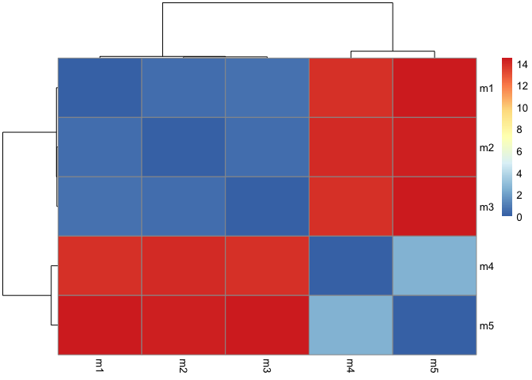
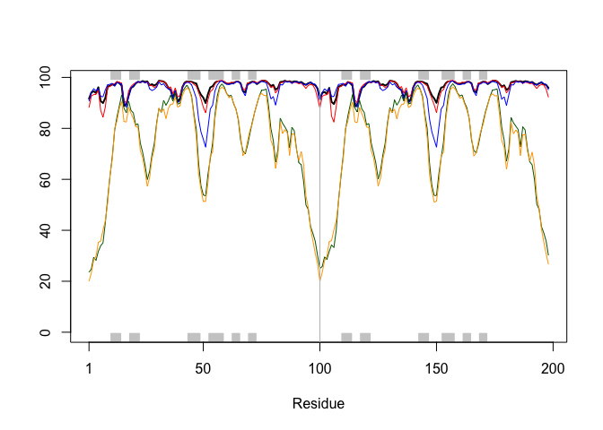
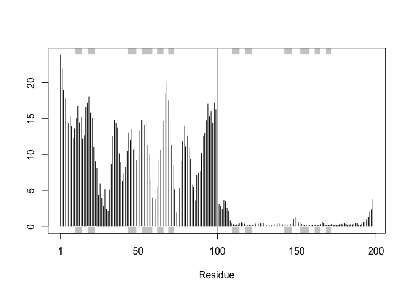
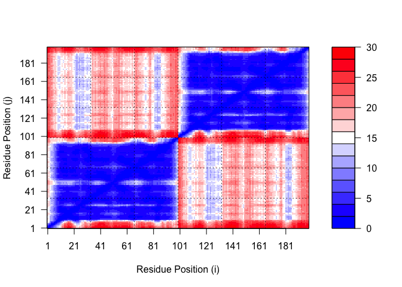
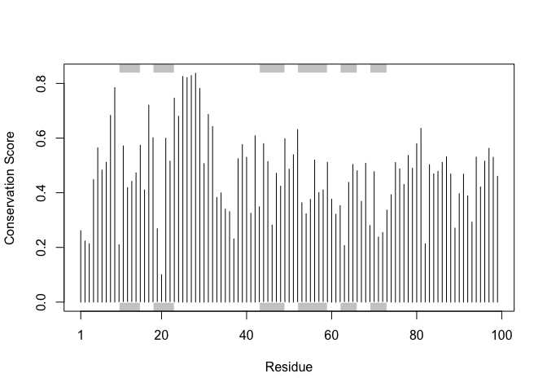

# Class 11: AlphaFold
Harshitha Palacharla (PID: A17775151)

- [Section 7: Interpreting Results](#section-7-interpreting-results)
  - [Visualization of the models and their estimated
    reliability](#visualization-of-the-models-and-their-estimated-reliability)
- [Section 8: Custom analysis of resulting
  models](#section-8-custom-analysis-of-resulting-models)
  - [RMSD](#rmsd)
  - [pLDDT](#plddt)
  - [Using `core.find()` to superpose our
    models](#using-corefind-to-superpose-our-models)
  - [RMSF](#rmsf)
  - [Predicted Alignment Error (PAE) for
    domains](#predicted-alignment-error-pae-for-domains)
  - [Residue conservation from alignment
    file](#residue-conservation-from-alignment-file)

## Section 7: Interpreting Results

After running the HIV protease dimer sequence in the AlphaFold MMSeqs2
notebook (with default settings) and acquiring a zip file, we can begin
result interpretation.

### Visualization of the models and their estimated reliability

We will use Mol\* to visualize the model PDB files for the HIV protease
dimer.

Step 1: Loading the five PDB files into Mol\*.


Step 2: Performing superposition of the five models. A single chain is
aligned at a time.


Step 3: Coloring our superposed dimer model by Mol\*
Uncertainty/Disorder (i.e. using the pLDDT scores derived from
AlphaFold)


We see that secondary structures (i.e. alpha helices and beta sheets)
are generally colored pink/red and have higher confidence scores,
whereas non-compact loop regions (which may be instrinsically disordered
regions, or IDRs) are more likely to be white/blue and have lower
confidence scores. Furthermore, by browsing each chain in
Residue-selection mode, it seems regions at the N and C termini are more
likely to have lower confidence scores.

Step 4: Exploring other coloring settings. For instance, we can color
residues by hydrophobicity.


Coloring the residues by hydrophobicity shows that the HIV protease
dimer appears to have a more hydrophobic (green) core. The dimer’s
hydrophilic residues (orange/red) are generally positioned along the
surface of the protein. This suggests that the protease may be a soluble
protein (i.e. found in the cytosol, as opposed to being an integral
membrane protein).

## Section 8: Custom analysis of resulting models

We need to read in the data from our AlphaFold models.

``` r
library(bio3d)

# Method 1: Use read.pdb() to read in an individual PDB file.
pdb <- read.pdb("hivpr_dimer_23119//hivpr_dimer_23119_unrelaxed_rank_001_alphafold2_multimer_v3_model_4_seed_000.pdb")
pdb
```


     Call:  read.pdb(file = "hivpr_dimer_23119//hivpr_dimer_23119_unrelaxed_rank_001_alphafold2_multimer_v3_model_4_seed_000.pdb")

       Total Models#: 1
         Total Atoms#: 1514,  XYZs#: 4542  Chains#: 2  (values: A B)

         Protein Atoms#: 1514  (residues/Calpha atoms#: 198)
         Nucleic acid Atoms#: 0  (residues/phosphate atoms#: 0)

         Non-protein/nucleic Atoms#: 0  (residues: 0)
         Non-protein/nucleic resid values: [ none ]

       Protein sequence:
          PQITLWQRPLVTIKIGGQLKEALLDTGADDTVLEEMSLPGRWKPKMIGGIGGFIKVRQYD
          QILIEICGHKAIGTVLVGPTPVNIIGRNLLTQIGCTLNFPQITLWQRPLVTIKIGGQLKE
          ALLDTGADDTVLEEMSLPGRWKPKMIGGIGGFIKVRQYDQILIEICGHKAIGTVLVGPTP
          VNIIGRNLLTQIGCTLNF

    + attr: atom, xyz, calpha, call

Alternatively, make a vector of input PDB file names that we can read
into R:

``` r
# Method 2: First make vector of file names for all PDB models.
pdbfiles <- list.files(path = "hivpr_dimer_23119/", 
           pattern = ".pdb", 
           full.names = TRUE)
# Print PDB file names.
pdbfiles
```

    [1] "hivpr_dimer_23119//hivpr_dimer_23119_unrelaxed_rank_001_alphafold2_multimer_v3_model_4_seed_000.pdb"
    [2] "hivpr_dimer_23119//hivpr_dimer_23119_unrelaxed_rank_002_alphafold2_multimer_v3_model_1_seed_000.pdb"
    [3] "hivpr_dimer_23119//hivpr_dimer_23119_unrelaxed_rank_003_alphafold2_multimer_v3_model_5_seed_000.pdb"
    [4] "hivpr_dimer_23119//hivpr_dimer_23119_unrelaxed_rank_004_alphafold2_multimer_v3_model_2_seed_000.pdb"
    [5] "hivpr_dimer_23119//hivpr_dimer_23119_unrelaxed_rank_005_alphafold2_multimer_v3_model_3_seed_000.pdb"

``` r
# Read all data from models using pdbaln() (from BioCon's msa package)
# Superpose coordinates using fit argument
pdbs <- pdbaln(pdbfiles, fit=TRUE, exefile="msa")
```

    Reading PDB files:
    hivpr_dimer_23119//hivpr_dimer_23119_unrelaxed_rank_001_alphafold2_multimer_v3_model_4_seed_000.pdb
    hivpr_dimer_23119//hivpr_dimer_23119_unrelaxed_rank_002_alphafold2_multimer_v3_model_1_seed_000.pdb
    hivpr_dimer_23119//hivpr_dimer_23119_unrelaxed_rank_003_alphafold2_multimer_v3_model_5_seed_000.pdb
    hivpr_dimer_23119//hivpr_dimer_23119_unrelaxed_rank_004_alphafold2_multimer_v3_model_2_seed_000.pdb
    hivpr_dimer_23119//hivpr_dimer_23119_unrelaxed_rank_005_alphafold2_multimer_v3_model_3_seed_000.pdb
    .....

    Extracting sequences

    pdb/seq: 1   name: hivpr_dimer_23119//hivpr_dimer_23119_unrelaxed_rank_001_alphafold2_multimer_v3_model_4_seed_000.pdb 
    pdb/seq: 2   name: hivpr_dimer_23119//hivpr_dimer_23119_unrelaxed_rank_002_alphafold2_multimer_v3_model_1_seed_000.pdb 
    pdb/seq: 3   name: hivpr_dimer_23119//hivpr_dimer_23119_unrelaxed_rank_003_alphafold2_multimer_v3_model_5_seed_000.pdb 
    pdb/seq: 4   name: hivpr_dimer_23119//hivpr_dimer_23119_unrelaxed_rank_004_alphafold2_multimer_v3_model_2_seed_000.pdb 
    pdb/seq: 5   name: hivpr_dimer_23119//hivpr_dimer_23119_unrelaxed_rank_005_alphafold2_multimer_v3_model_3_seed_000.pdb 

``` r
# Print PDB model sequences.
pdbs
```

                                   1        .         .         .         .         50 
    [Truncated_Name:1]hivpr_dime   PQITLWQRPLVTIKIGGQLKEALLDTGADDTVLEEMSLPGRWKPKMIGGI
    [Truncated_Name:2]hivpr_dime   PQITLWQRPLVTIKIGGQLKEALLDTGADDTVLEEMSLPGRWKPKMIGGI
    [Truncated_Name:3]hivpr_dime   PQITLWQRPLVTIKIGGQLKEALLDTGADDTVLEEMSLPGRWKPKMIGGI
    [Truncated_Name:4]hivpr_dime   PQITLWQRPLVTIKIGGQLKEALLDTGADDTVLEEMSLPGRWKPKMIGGI
    [Truncated_Name:5]hivpr_dime   PQITLWQRPLVTIKIGGQLKEALLDTGADDTVLEEMSLPGRWKPKMIGGI
                                   ************************************************** 
                                   1        .         .         .         .         50 

                                  51        .         .         .         .         100 
    [Truncated_Name:1]hivpr_dime   GGFIKVRQYDQILIEICGHKAIGTVLVGPTPVNIIGRNLLTQIGCTLNFP
    [Truncated_Name:2]hivpr_dime   GGFIKVRQYDQILIEICGHKAIGTVLVGPTPVNIIGRNLLTQIGCTLNFP
    [Truncated_Name:3]hivpr_dime   GGFIKVRQYDQILIEICGHKAIGTVLVGPTPVNIIGRNLLTQIGCTLNFP
    [Truncated_Name:4]hivpr_dime   GGFIKVRQYDQILIEICGHKAIGTVLVGPTPVNIIGRNLLTQIGCTLNFP
    [Truncated_Name:5]hivpr_dime   GGFIKVRQYDQILIEICGHKAIGTVLVGPTPVNIIGRNLLTQIGCTLNFP
                                   ************************************************** 
                                  51        .         .         .         .         100 

                                 101        .         .         .         .         150 
    [Truncated_Name:1]hivpr_dime   QITLWQRPLVTIKIGGQLKEALLDTGADDTVLEEMSLPGRWKPKMIGGIG
    [Truncated_Name:2]hivpr_dime   QITLWQRPLVTIKIGGQLKEALLDTGADDTVLEEMSLPGRWKPKMIGGIG
    [Truncated_Name:3]hivpr_dime   QITLWQRPLVTIKIGGQLKEALLDTGADDTVLEEMSLPGRWKPKMIGGIG
    [Truncated_Name:4]hivpr_dime   QITLWQRPLVTIKIGGQLKEALLDTGADDTVLEEMSLPGRWKPKMIGGIG
    [Truncated_Name:5]hivpr_dime   QITLWQRPLVTIKIGGQLKEALLDTGADDTVLEEMSLPGRWKPKMIGGIG
                                   ************************************************** 
                                 101        .         .         .         .         150 

                                 151        .         .         .         .       198 
    [Truncated_Name:1]hivpr_dime   GFIKVRQYDQILIEICGHKAIGTVLVGPTPVNIIGRNLLTQIGCTLNF
    [Truncated_Name:2]hivpr_dime   GFIKVRQYDQILIEICGHKAIGTVLVGPTPVNIIGRNLLTQIGCTLNF
    [Truncated_Name:3]hivpr_dime   GFIKVRQYDQILIEICGHKAIGTVLVGPTPVNIIGRNLLTQIGCTLNF
    [Truncated_Name:4]hivpr_dime   GFIKVRQYDQILIEICGHKAIGTVLVGPTPVNIIGRNLLTQIGCTLNF
    [Truncated_Name:5]hivpr_dime   GFIKVRQYDQILIEICGHKAIGTVLVGPTPVNIIGRNLLTQIGCTLNF
                                   ************************************************ 
                                 151        .         .         .         .       198 

    Call:
      pdbaln(files = pdbfiles, fit = TRUE, exefile = "msa")

    Class:
      pdbs, fasta

    Alignment dimensions:
      5 sequence rows; 198 position columns (198 non-gap, 0 gap) 

    + attr: xyz, resno, b, chain, id, ali, resid, sse, call

### RMSD

Calculate the RMSD (measure of structural distance between coordinate
sets) between all pairs of models.

``` r
# Calculate RMSD values, and store as an RMSD matrix
rd <- rmsd(pdbs, fit=T)
```

    Warning in rmsd(pdbs, fit = T): No indices provided, using the 198 non NA positions

``` r
# Calculate range of RMSD scores
range(rd)
```

    [1]  0.000 14.526

Make a heatmap of RMSD matrix values:

``` r
library(pheatmap)

# Rename columns and rows of RMSD matrix
colnames(rd) <- paste0("m",1:5)
rownames(rd) <- paste0("m",1:5)
# Generate heatmap from matrix
pheatmap(rd)
```



From my AlphaFold results, it appears that Models 2 and 3 are the most
similar pair of models (have the smallest pairwise RMSD). Models 2 and 3
are in turn fairly similar to Model 1, and this trio of models is
relatively *dis*similar to models 4 and 5 (i.e. they separate into two
distant clusters). Models 4 and 5 are similar to each other (though not
as similar as models 1, 2, and 3 are to each other).

### pLDDT

Plot the pLDDT values across all models.

``` r
# Read the reference PDB structure, to later plot its secondary structure data 
pdb_ref <- read.pdb("1hsg")
```

      Note: Accessing on-line PDB file

``` r
# Plot the pLDDT values for each model (stored in B-factor column, pdbs$b)
plotb3(pdbs$b[1,], typ="l", lwd=2, sse=pdb_ref)
points(pdbs$b[2,], typ="l", col="red")
points(pdbs$b[3,], typ="l", col="blue")
points(pdbs$b[4,], typ="l", col="darkgreen")
points(pdbs$b[5,], typ="l", col="orange")
abline(v=100, col="gray")
```



### Using `core.find()` to superpose our models

To improve the superposition:

``` r
# Use core.find() to identify consistent core atom positions across all models:
core <- core.find(pdbs)
```

     core size 197 of 198  vol = 5437.294 
     core size 196 of 198  vol = 4705.336 
     core size 195 of 198  vol = 1827.704 
     core size 194 of 198  vol = 1121.539 
     core size 193 of 198  vol = 1047.76 
     core size 192 of 198  vol = 999.32 
     core size 191 of 198  vol = 953.718 
     core size 190 of 198  vol = 910.755 
     core size 189 of 198  vol = 870.203 
     core size 188 of 198  vol = 836.304 
     core size 187 of 198  vol = 805.237 
     core size 186 of 198  vol = 775.99 
     core size 185 of 198  vol = 752.564 
     core size 184 of 198  vol = 712.023 
     core size 183 of 198  vol = 685.568 
     core size 182 of 198  vol = 663.911 
     core size 181 of 198  vol = 645.881 
     core size 180 of 198  vol = 627.97 
     core size 179 of 198  vol = 611.812 
     core size 178 of 198  vol = 595.931 
     core size 177 of 198  vol = 581.132 
     core size 176 of 198  vol = 566.736 
     core size 175 of 198  vol = 548.587 
     core size 174 of 198  vol = 534.114 
     core size 173 of 198  vol = 505.214 
     core size 172 of 198  vol = 491.225 
     core size 171 of 198  vol = 473.905 
     core size 170 of 198  vol = 460.426 
     core size 169 of 198  vol = 444.81 
     core size 168 of 198  vol = 431.661 
     core size 167 of 198  vol = 421.542 
     core size 166 of 198  vol = 405.601 
     core size 165 of 198  vol = 392.666 
     core size 164 of 198  vol = 381.077 
     core size 163 of 198  vol = 367.559 
     core size 162 of 198  vol = 358.379 
     core size 161 of 198  vol = 346.865 
     core size 160 of 198  vol = 334.809 
     core size 159 of 198  vol = 324.09 
     core size 158 of 198  vol = 312.153 
     core size 157 of 198  vol = 301.296 
     core size 156 of 198  vol = 290.431 
     core size 155 of 198  vol = 281.319 
     core size 154 of 198  vol = 272.529 
     core size 153 of 198  vol = 263.215 
     core size 152 of 198  vol = 253.54 
     core size 151 of 198  vol = 240.86 
     core size 150 of 198  vol = 227.447 
     core size 149 of 198  vol = 215.581 
     core size 148 of 198  vol = 202.041 
     core size 147 of 198  vol = 195.426 
     core size 146 of 198  vol = 188.721 
     core size 145 of 198  vol = 181.778 
     core size 144 of 198  vol = 173.615 
     core size 143 of 198  vol = 165.946 
     core size 142 of 198  vol = 156.117 
     core size 141 of 198  vol = 149.814 
     core size 140 of 198  vol = 143.616 
     core size 139 of 198  vol = 135.81 
     core size 138 of 198  vol = 127.851 
     core size 137 of 198  vol = 122.596 
     core size 136 of 198  vol = 117.203 
     core size 135 of 198  vol = 109.848 
     core size 134 of 198  vol = 104.812 
     core size 133 of 198  vol = 98.776 
     core size 132 of 198  vol = 94.799 
     core size 131 of 198  vol = 90.494 
     core size 130 of 198  vol = 87.403 
     core size 129 of 198  vol = 83.558 
     core size 128 of 198  vol = 79.08 
     core size 127 of 198  vol = 75.056 
     core size 126 of 198  vol = 71.238 
     core size 125 of 198  vol = 67.735 
     core size 124 of 198  vol = 64.289 
     core size 123 of 198  vol = 61.381 
     core size 122 of 198  vol = 57.515 
     core size 121 of 198  vol = 53.254 
     core size 120 of 198  vol = 48.654 
     core size 119 of 198  vol = 45.832 
     core size 118 of 198  vol = 41.819 
     core size 117 of 198  vol = 38.71 
     core size 116 of 198  vol = 36.294 
     core size 115 of 198  vol = 33.386 
     core size 114 of 198  vol = 30.472 
     core size 113 of 198  vol = 27.786 
     core size 112 of 198  vol = 25.403 
     core size 111 of 198  vol = 22.827 
     core size 110 of 198  vol = 21.106 
     core size 109 of 198  vol = 19.327 
     core size 108 of 198  vol = 17.796 
     core size 107 of 198  vol = 16.235 
     core size 106 of 198  vol = 14.508 
     core size 105 of 198  vol = 12.969 
     core size 104 of 198  vol = 11.834 
     core size 103 of 198  vol = 11.185 
     core size 102 of 198  vol = 10.298 
     core size 101 of 198  vol = 8.898 
     core size 100 of 198  vol = 7.813 
     core size 99 of 198  vol = 6.074 
     core size 98 of 198  vol = 5.286 
     core size 97 of 198  vol = 4.43 
     core size 96 of 198  vol = 3.873 
     core size 95 of 198  vol = 3.321 
     core size 94 of 198  vol = 2.855 
     core size 93 of 198  vol = 2.293 
     core size 92 of 198  vol = 1.937 
     core size 91 of 198  vol = 1.631 
     core size 90 of 198  vol = 1.331 
     core size 89 of 198  vol = 0.957 
     core size 88 of 198  vol = 0.803 
     core size 87 of 198  vol = 0.647 
     core size 86 of 198  vol = 0.532 
     core size 85 of 198  vol = 0.444 
     FINISHED: Min vol ( 0.5 ) reached

``` r
core.inds <- print(core, vol=0.5)
```

    # 86 positions (cumulative volume <= 0.5 Angstrom^3) 
      start end length
    1     7   7      1
    2     9  49     41
    3    52  95     44

``` r
# Write out fitted structures, and store superposed coordinates in a new directory
xyz <- pdbfit(pdbs, core.inds, outpath="corefit_structures")
```

Open superposed coordinates (in `corefit_structures` directory) in
Mol\*. Color by Uncertainty/Disorder (B-factor column with pLDDT
scores).


One of the two chains (positioned at the bottom, in the orientation
shown above) appears to be quite variable across the 5 models, whereas
the other chain (positioned at the top, in the orientation shown above)
is fairly consistent.


Models 1-3 appear to have high pLDDT scores (most regions are bright
red), whereas Models 4 and 5 appear to have more regions of uncertainty
(much more white/pink in their structures, reflecting lower pLDDT
scores). It also seems that the two sets of models differ greatly in the
bottom chain.

### RMSF

Calculate the RMSF (measure of conformational variance along the
structure).

``` r
rf <- rmsf(xyz)

# Plot the RMSF values along the (superposed) structure's residues
plotb3(rf, sse=pdb_ref)
abline(v=100, col="gray", ylab="RMSF")
```



It appears that one chain has high variability across the structures
(high RMSF values, as shown on left side of plot above), whereas the
second has very little variability (low RMSF values, as shown on right
side of plot). This is consistent with Mol\* observations, as discussed.

### Predicted Alignment Error (PAE) for domains

Read in AlphaFold’s Predicted Aligned Error (PAE) files, formatted as
JSON.

``` r
library(jsonlite)

# List all PAE JSON files
pae_files <- list.files(path="hivpr_dimer_23119/",
                        pattern=".*model.*\\.json",
                        full.names = TRUE)

# Read all 5 PAE files. 
pae1 <- read_json(pae_files[1],simplifyVector = TRUE)
pae2 <- read_json(pae_files[2],simplifyVector = TRUE)
pae3 <- read_json(pae_files[3],simplifyVector = TRUE)
pae4 <- read_json(pae_files[4],simplifyVector = TRUE)
pae5 <- read_json(pae_files[5],simplifyVector = TRUE)

# Check what attributes are stored in a PAE file.
attributes(pae1)
```

    $names
    [1] "plddt"   "max_pae" "pae"     "ptm"     "iptm"   

``` r
# One attribute is the per-residue pLDDT scores 
# The values are also in the B-factor column of PDB files

# Print pLDDT scores for the first few residues from 1st PAE file
head(pae1$plddt)
```

    [1] 91.62 94.06 94.56 93.88 96.12 90.69

``` r
# Determine max PAE value for each model 
# i.e. Access the max_pae attribute
pae1$max_pae
```

    [1] 12.33594

``` r
pae2$max_pae
```

    [1] 18.67188

``` r
pae3$max_pae
```

    [1] 14.39062

``` r
pae4$max_pae
```

    [1] 29.57812

``` r
pae5$max_pae
```

    [1] 29.45312

The maximum PAE values generally increase going from model 1 to model 5.
Model 1 has the best/lowest PAE score of 12.34, whereas Model 5 has a
substantially worse/higher PAE score of 29.45. Models 2-4 generally fall
between those lower and higher ends of max PAE values (with max PAE
scores of 18.67, 14.39, and 29.58, respectively).

Plot NxN (N = \# of residues) PAE scores. You can use ggplot or Bio3D
functions, as shown below:

``` r
# Plot PAE scores for Model 1.
plot.dmat(pae1$pae,
          xlab="Residue Position (i)",
          ylab="Residue Position (j)")
```


To compare PAE plots for different models, we should ensure they are on
the same z range.

``` r
# Re-plot PAE scores for Model 1, setting (0,30) as z range.
plot.dmat(pae1$pae,
          xlab="Residue Position (i)",
          ylab="Residue Position (j)",
          grid.col = "black",
          zlim=c(0,30))
```


``` r
# Plot PAE scores for Model 5, setting (0,30) as z range.
plot.dmat(pae5$pae,
          xlab="Residue Position (i)",
          ylab="Residue Position (j)",
          grid.col = "black",
          zlim=c(0,30))
```



Most of Model 1’s plot is bright blue, suggesting the model generally
has low PAE scores. By contrast, the upper left and lower right
quadrants of Model 5’s plot (inter-chain residue pairs) are
red-dominated, indicating AlphaFold has low confidence in the relative
positioning of these residue pairs.

### Residue conservation from alignment file

``` r
# Print out alignment file.
aln_file <- list.files(path="hivpr_dimer_23119/",
                       pattern=".a3m$",
                       full.names = TRUE)
aln_file
```

    [1] "hivpr_dimer_23119//hivpr_dimer_23119.a3m"

``` r
# Read alignment file.
aln <- read.fasta(aln_file[1], to.upper = TRUE)
```

    [1] " ** Duplicated sequence id's: 101 **"
    [2] " ** Duplicated sequence id's: 101 **"

``` r
# How many sequences are in the alignment?
dim(aln$ali)
```

    [1] 5397  132

There are 5397 sequences in the alignment.

Use the `conserv()` function to score conservation of individual
residues in the alignment:

``` r
sim <- conserv(aln)
length(sim)
```

    [1] 132

Plot the residue conservation scores:

``` r
plotb3(sim[1:99], 
       sse=trim.pdb(pdb_ref, chain="A"), 
       ylab="Conservation Score")
```



We can observe from the plot above that residues 25-28 have the highest
conservation scores (these residues correspond to a DTGA sequence).

When we generate a consensus sequence using a very high cutoff value,
D25, T26, G27, A28 are returned.

``` r
con <- consensus(aln, cutoff = 0.9)
con$seq
```

      [1] "-" "-" "-" "-" "-" "-" "-" "-" "-" "-" "-" "-" "-" "-" "-" "-" "-" "-"
     [19] "-" "-" "-" "-" "-" "-" "D" "T" "G" "A" "-" "-" "-" "-" "-" "-" "-" "-"
     [37] "-" "-" "-" "-" "-" "-" "-" "-" "-" "-" "-" "-" "-" "-" "-" "-" "-" "-"
     [55] "-" "-" "-" "-" "-" "-" "-" "-" "-" "-" "-" "-" "-" "-" "-" "-" "-" "-"
     [73] "-" "-" "-" "-" "-" "-" "-" "-" "-" "-" "-" "-" "-" "-" "-" "-" "-" "-"
     [91] "-" "-" "-" "-" "-" "-" "-" "-" "-" "-" "-" "-" "-" "-" "-" "-" "-" "-"
    [109] "-" "-" "-" "-" "-" "-" "-" "-" "-" "-" "-" "-" "-" "-" "-" "-" "-" "-"
    [127] "-" "-" "-" "-" "-" "-"

Let’s visualize the conserved residues in Mol\*.

``` r
# Write PDB file for model 1, adding Occupancy column (containing conservation scores)
m1.pdb <- read.pdb(pdbfiles[1])
occ <- vec2resno(c(sim[1:99], sim[1:99]), m1.pdb$atom$resno)
write.pdb(m1.pdb, o=occ, file="m1_conserv.pdb")
```


The Mol\* visualization, with DTGA highlighted, shows structural
conservation at the HIV protease’s active site (at the center/interior
of the protein). This is a functionally important region of the
protease, as it is where substrates bind.
