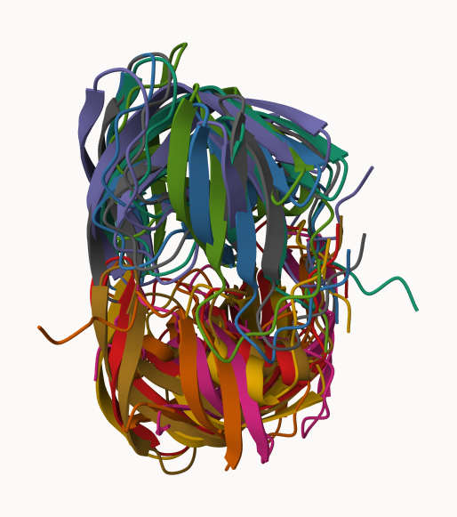
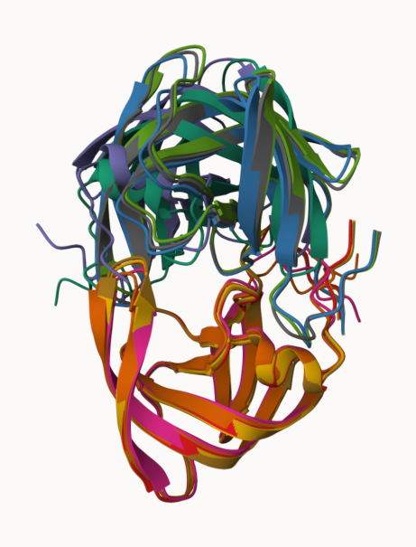
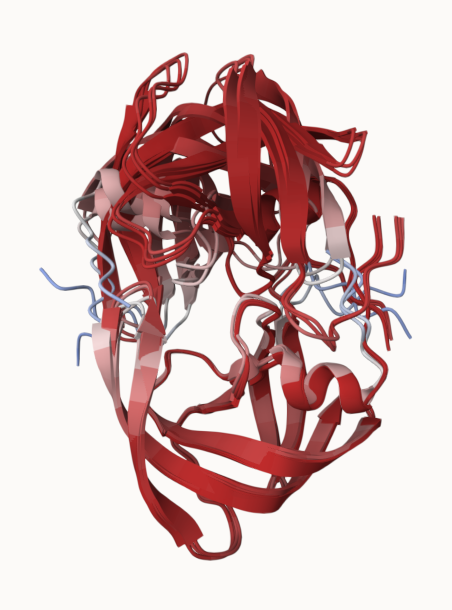
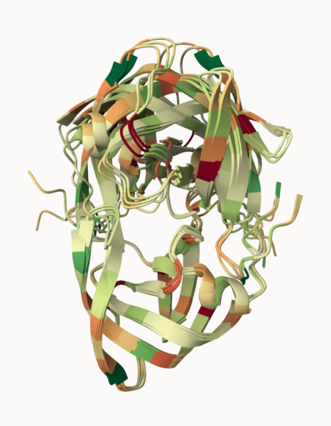
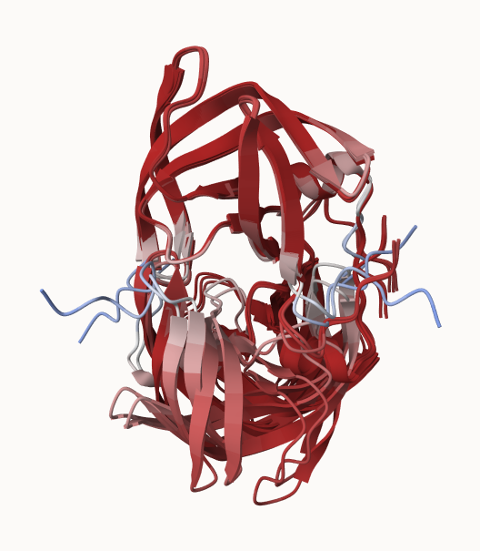
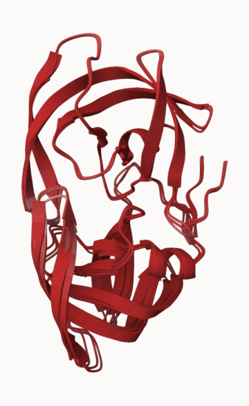
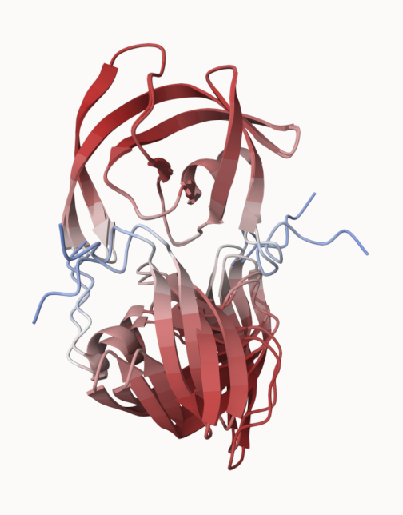
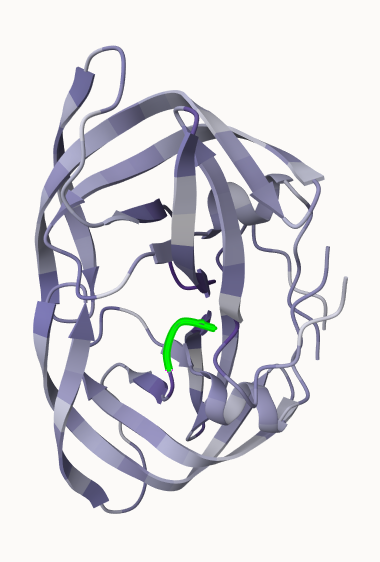

## Section 7: Interpreting Results

After running the HIV protease dimer sequence in the AlphaFold MMSeqs2 notebook (with default settings) and acquiring a zip file, we can begin result interpretation.

### Visualization of the models and their estimated reliability

We will use Mol* to visualize the model PDB files for the HIV protease dimer.

Step 1: Loading the five PDB files into Mol*.

 

Step 2: Performing superposition of the five models. A single chain is aligned at a time.



Step 3: Coloring our superposed dimer model by Mol* Uncertainty/Disorder (i.e. using the pLDDT scores derived from AlphaFold)



We see that secondary structures (i.e. alpha helices and beta sheets) are generally colored pink/red and have higher confidence scores, whereas non-compact loop regions (which may be instrinsically disordered regions, or IDRs) are more likely to be white/blue and have lower confidence scores. Furthermore, by browsing each chain in Residue-selection mode, it seems regions at the N and C termini are more likely to have lower confidence scores. 

Step 4: Exploring other coloring settings. For instance, we can color residues by hydrophobicity.



Coloring the residues by hydrophobicity shows that the HIV protease dimer appears to have a more hydrophobic (green) core. The dimer's hydrophilic residues (orange/red) are generally positioned along the surface of the protein. This suggests that the protease may be a soluble protein (i.e. found in the cytosol, as opposed to being an integral membrane protein).

## Section 8: Custom analysis of resulting models

We need to read in the data from our AlphaFold models. 

```{r}
library(bio3d)

# Method 1: Use read.pdb() to read in an individual PDB file.
pdb <- read.pdb("hivpr_dimer_23119//hivpr_dimer_23119_unrelaxed_rank_001_alphafold2_multimer_v3_model_4_seed_000.pdb")
pdb
```

Alternatively, make a vector of input PDB file names that we can read into R:
```{r}
# Method 2: First make vector of file names for all PDB models.
pdbfiles <- list.files(path = "hivpr_dimer_23119/", 
           pattern = ".pdb", 
           full.names = TRUE)
# Print PDB file names.
pdbfiles
```

```{r}
# Read all data from models using pdbaln() (from BioCon's msa package)
# Superpose coordinates using fit argument
pdbs <- pdbaln(pdbfiles, fit=TRUE, exefile="msa")
# Print PDB model sequences.
pdbs
```

### RMSD

Calculate the RMSD (measure of structural distance between coordinate sets) between all pairs of models.
```{r}
# Calculate RMSD values, and store as an RMSD matrix
rd <- rmsd(pdbs, fit=T)

# Calculate range of RMSD scores
range(rd)
```

Make a heatmap of RMSD matrix values:
```{r}
library(pheatmap)

# Rename columns and rows of RMSD matrix
colnames(rd) <- paste0("m",1:5)
rownames(rd) <- paste0("m",1:5)
# Generate heatmap from matrix
pheatmap(rd)
```

From my AlphaFold results, it appears that Models 2 and 3 are the most similar pair of models (have the smallest pairwise RMSD). Models 2 and 3 are in turn fairly similar to Model 1, and this  trio of models is relatively *dis*similar to models 4 and 5 (i.e. they separate into two distant clusters). Models 4 and 5 are similar to each other (though not as similar as models 1, 2, and 3 are to each other).

### pLDDT

Plot the pLDDT values across all models.

```{r}
# Read the reference PDB structure, to later plot its secondary structure data 
pdb_ref <- read.pdb("1hsg")

# Plot the pLDDT values for each model (stored in B-factor column, pdbs$b)
plotb3(pdbs$b[1,], typ="l", lwd=2, sse=pdb_ref)
points(pdbs$b[2,], typ="l", col="red")
points(pdbs$b[3,], typ="l", col="blue")
points(pdbs$b[4,], typ="l", col="darkgreen")
points(pdbs$b[5,], typ="l", col="orange")
abline(v=100, col="gray")
```

### Using `core.find()` to superpose our models

To improve the superposition:
```{r}
# Use core.find() to identify consistent core atom positions across all models:
core <- core.find(pdbs)
core.inds <- print(core, vol=0.5)

# Write out fitted structures, and store superposed coordinates in a new directory
xyz <- pdbfit(pdbs, core.inds, outpath="corefit_structures")
```

Open superposed coordinates (in `corefit_structures` directory) in Mol*. Color by Uncertainty/Disorder (B-factor column with pLDDT scores).



One of the two chains (positioned at the bottom, in the orientation shown above) appears to be quite variable across the 5 models, whereas the other chain (positioned at the top, in the orientation shown above) is fairly consistent.

  



Models 1-3 appear to have high pLDDT scores (most regions are bright red), whereas Models 4 and 5 appear to have more regions of uncertainty (much more white/pink in their structures, reflecting lower pLDDT scores). It also seems that the two sets of models differ greatly in the bottom chain.

### RMSF

Calculate the RMSF (measure of conformational variance along the structure).
```{r}
rf <- rmsf(xyz)

# Plot the RMSF values along the (superposed) structure's residues
plotb3(rf, sse=pdb_ref)
abline(v=100, col="gray", ylab="RMSF")
```

It appears that one chain has high variability across the structures (high RMSF values, as shown on left side of plot above), whereas the second has very little variability (low RMSF values, as shown on right side of plot). This is consistent with Mol* observations, as discussed.

### Predicted Alignment Error (PAE) for domains

Read in AlphaFold's Predicted Aligned Error (PAE) files, formatted as JSON.

```{r}
library(jsonlite)

# List all PAE JSON files
pae_files <- list.files(path="hivpr_dimer_23119/",
                        pattern=".*model.*\\.json",
                        full.names = TRUE)

# Read all 5 PAE files. 
pae1 <- read_json(pae_files[1],simplifyVector = TRUE)
pae2 <- read_json(pae_files[2],simplifyVector = TRUE)
pae3 <- read_json(pae_files[3],simplifyVector = TRUE)
pae4 <- read_json(pae_files[4],simplifyVector = TRUE)
pae5 <- read_json(pae_files[5],simplifyVector = TRUE)

# Check what attributes are stored in a PAE file.
attributes(pae1)
```

```{r}
# One attribute is the per-residue pLDDT scores 
# The values are also in the B-factor column of PDB files

# Print pLDDT scores for the first few residues from 1st PAE file
head(pae1$plddt)
```

```{r}
# Determine max PAE value for each model 
# i.e. Access the max_pae attribute
pae1$max_pae
pae2$max_pae
pae3$max_pae
pae4$max_pae
pae5$max_pae
```

The maximum PAE values generally increase going from model 1 to model 5. Model 1 has the best/lowest PAE score of 12.34, whereas Model 5 has a substantially worse/higher PAE score of 29.45. Models 2-4 generally fall between those lower and higher ends of max PAE values (with max PAE scores of 18.67, 14.39, and 29.58, respectively).

Plot NxN (N = # of residues) PAE scores. You can use ggplot or Bio3D functions, as shown below:
```{r}
# Plot PAE scores for Model 1.
plot.dmat(pae1$pae,
          xlab="Residue Position (i)",
          ylab="Residue Position (j)")
```

To compare PAE plots for different models, we should ensure they are on the same z range.
```{r}
# Re-plot PAE scores for Model 1, setting (0,30) as z range.
plot.dmat(pae1$pae,
          xlab="Residue Position (i)",
          ylab="Residue Position (j)",
          grid.col = "black",
          zlim=c(0,30))
```

```{r}
# Plot PAE scores for Model 5, setting (0,30) as z range.
plot.dmat(pae5$pae,
          xlab="Residue Position (i)",
          ylab="Residue Position (j)",
          grid.col = "black",
          zlim=c(0,30))
```

Most of Model 1's plot is bright blue, suggesting the model generally has low PAE scores. By contrast, the upper left and lower right quadrants of Model 5's plot (inter-chain residue pairs) are red-dominated, indicating AlphaFold has low confidence in the relative positioning of these residue pairs. 

### Residue conservation from alignment file

```{r}
# Print out alignment file.
aln_file <- list.files(path="hivpr_dimer_23119/",
                       pattern=".a3m$",
                       full.names = TRUE)
aln_file
```

```{r}
# Read alignment file.
aln <- read.fasta(aln_file[1], to.upper = TRUE)

# How many sequences are in the alignment?
dim(aln$ali)
```

There are 5397 sequences in the alignment.

Use the `conserv()` function to score conservation of individual residues in the alignment:
```{r}
sim <- conserv(aln)
length(sim)
```

Plot the residue conservation scores:
```{r}
plotb3(sim[1:99], 
       sse=trim.pdb(pdb_ref, chain="A"), 
       ylab="Conservation Score")
```

We can observe from the plot above that residues 25-28 have the highest conservation scores (these residues correspond to a DTGA sequence).

When we generate a consensus sequence using a very high cutoff value, D25, T26, G27, A28 are returned.
```{r}
con <- consensus(aln, cutoff = 0.9)
con$seq
```

Let's visualize the conserved residues in Mol*.
```{r}
# Write PDB file for model 1, adding Occupancy column (containing conservation scores)
m1.pdb <- read.pdb(pdbfiles[1])
occ <- vec2resno(c(sim[1:99], sim[1:99]), m1.pdb$atom$resno)
write.pdb(m1.pdb, o=occ, file="m1_conserv.pdb")
```



The Mol* visualization, with DTGA highlighted, shows structural conservation at the HIV protease's active site (at the center/interior of the protein). This is a functionally important region of the protease, as it is where substrates bind. 
