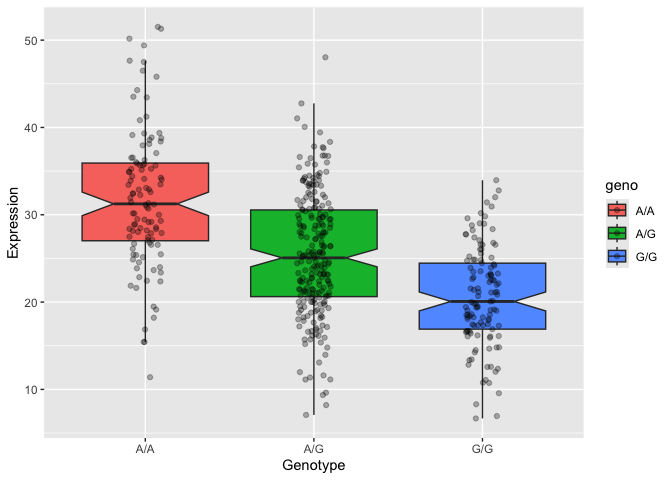

# Class 12: RNASeq Galaxy
Harshitha Palacharla (PID: A17775151)

- [Section 1: Proportion of G/G in a
  population](#section-1-proportion-of-gg-in-a-population)
- [Section 4: Population Scale Analysis
  \[HOMEWORK\]](#section-4-population-scale-analysis-homework)

# Section 1: Proportion of G/G in a population

Downloaded a CSV file from Ensemble \<
https://www.ensembl.org/Homo_sapiens/Variation/Sample?db=core;r=17:39894595-39895595;v=rs8067378;vdb=variation;vf=959672880#373531_tablePanel
\>

Here we read this CSV file

``` r
mxl <- read.csv("373531-SampleGenotypes-Homo_sapiens_Variation_Sample_rs8067378.csv")

head(mxl)
```

      Sample..Male.Female.Unknown. Genotype..forward.strand. Population.s. Father
    1                  NA19648 (F)                       A|A ALL, AMR, MXL      -
    2                  NA19649 (M)                       G|G ALL, AMR, MXL      -
    3                  NA19651 (F)                       A|A ALL, AMR, MXL      -
    4                  NA19652 (M)                       G|G ALL, AMR, MXL      -
    5                  NA19654 (F)                       G|G ALL, AMR, MXL      -
    6                  NA19655 (M)                       A|G ALL, AMR, MXL      -
      Mother
    1      -
    2      -
    3      -
    4      -
    5      -
    6      -

Access column of mxl object containing genotype information, and feed
this to `table()` function:

``` r
table(mxl$Genotype..forward.strand.)
```


    A|A A|G G|A G|G 
     22  21  12   9 

``` r
round(table(mxl$Genotype..forward.strand.) / nrow(mxl) * 100, 2)
```


      A|A   A|G   G|A   G|G 
    34.38 32.81 18.75 14.06 

Now let’s look at a different population. I picked the GBR.

``` r
gbr <- read.csv("373522-SampleGenotypes-Homo_sapiens_Variation_Sample_rs8067378.csv")
```

Find proportion of G\|G.

``` r
round(table(gbr$Genotype..forward.strand.) / nrow(gbr) * 100, 2)
```


      A|A   A|G   G|A   G|G 
    25.27 18.68 26.37 29.67 

This varient that is associated with childhood asthma is more frequent
in the GBR population than the MKL population.

Let’s now dig into this further.

# Section 4: Population Scale Analysis \[HOMEWORK\]

One sample is obviously not enough to know what is happening in a
population. You are interested in assessing genetic differences on a
population scale.

> Q13: Read this file into R and determine the sample size for each
> genotype and their corresponding median expression levels for each of
> these genotypes.

``` r
# Read the file into R.
expr <- read.table("rs8067378_ENSG00000172057.6.txt")

# Preview the first 6 rows (samples) of expr.
head(expr)
```

       sample geno      exp
    1 HG00367  A/G 28.96038
    2 NA20768  A/G 20.24449
    3 HG00361  A/A 31.32628
    4 HG00135  A/A 34.11169
    5 NA18870  G/G 18.25141
    6 NA11993  A/A 32.89721

How many samples do we have?

``` r
nrow(expr)
```

    [1] 462

We have 462 samples in total.

**Determining sample size per genotype:**

``` r
table(expr$geno)
```


    A/A A/G G/G 
    108 233 121 

The sample size for each genotype is as follows: 108 samples for A/A,
233 samples for A/G, and 121 samples for G/G.

**Determining median expression per genotype:**

Method 1: My preferred method is to use the dplyr package’s `group_by()`
(to group the samples by genotype) and `summarise()` functions (to
calculate the median expression level for each group).

``` r
library(dplyr)
```


    Attaching package: 'dplyr'

    The following objects are masked from 'package:stats':

        filter, lag

    The following objects are masked from 'package:base':

        intersect, setdiff, setequal, union

``` r
expr.median <- expr |>
  group_by(geno) |>
  summarise(median = median(exp))
expr.median
```

    # A tibble: 3 × 2
      geno  median
      <chr>  <dbl>
    1 A/A     31.2
    2 A/G     25.1
    3 G/G     20.1

The median ORMDL3 gene expression level for each genotype is as follows:
31.2 for A/A, 25.1 for A/G, and 20.1 for G/G.

Method 2: We can also generate and examine a base R boxplot of the data.

``` r
# Store boxplot output of expression level vs. genotype to an object
expr.box <- boxplot(exp ~ geno, data = expr)
```


``` r
# Examine stat values from boxplot object
expr.box$stats
```

             [,1]     [,2]     [,3]
    [1,] 15.42908  7.07505  6.67482
    [2,] 26.95022 20.62572 16.90256
    [3,] 31.24847 25.06486 20.07363
    [4,] 35.95503 30.55183 24.45672
    [5,] 49.39612 42.75662 33.95602

By saving the boxplot output as an object and accessing the object’s
`stats` matrix, we can examine the lower whisker, 1st quartile, median,
3rd quartile, and upper whisker expression levels (rows 1-5,
respectively) for genotypes A/A, A/G, and G/G (columns 1-3,
respectively). The median expression levels (`expr.box$stats[3,]`) for
A/A, A/G, and G/G are 31.25, 25.06, and 20.07, respectively.

> Q14: Generate a boxplot with a box per genotype, what could you infer
> from the relative expression value between A/A and G/G displayed in
> this plot? Does the SNP effect the expression of ORMDL3?

Let’s make a ggplot2 boxplot of expression level vs. genotype:

``` r
library(ggplot2)

ggplot(expr) +
  aes(x = geno, y = exp, fill = geno) +
  geom_boxplot(notch = TRUE) + 
  labs(x = "Genotype", y = "Expression")
```


From the boxplot, it seems the 3rd quartile / 75th percentile expression
level of G/G individuals sampled is lower than the 1st quartile / 25th
percentile expression level of A/A individuals sampled. Thus, it appears
the G/G genotype is associated with lower expression of ORMDL3 than the
A/A genotype, and the SNP *does* affect the expression of ORMDL3.

Note: Extra boxplot, with raw data points displayed over the boxplot
using the additional, `geom_jitter()` layer:

``` r
ggplot(expr) +
  aes(x = geno, y = exp, fill = geno) +
  geom_boxplot(notch = TRUE, outliers = FALSE) + 
  geom_jitter(alpha = 0.3, width = 0.1) +
  labs(x = "Genotype", y = "Expression") 
```


