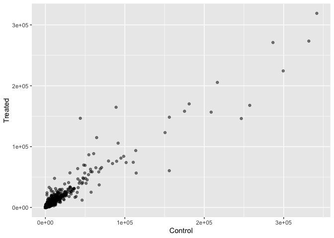
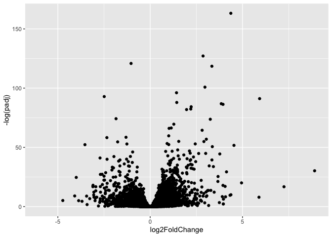
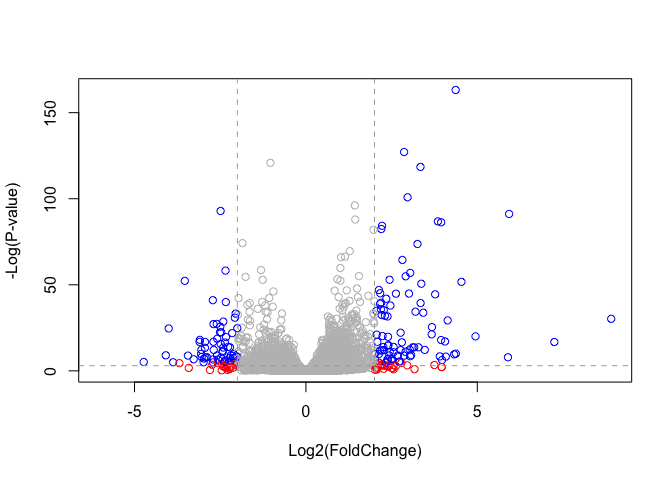
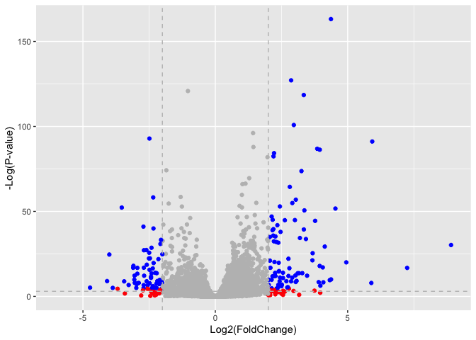

# Class 13: RNASeq Analysis with DESeq
Harshitha Palacharla (PID: A17775151)

- [Background](#background)
- [Data Import](#data-import)
- [Toy differential gene expression](#toy-differential-gene-expression)
- [Setting up for DESeq](#setting-up-for-deseq)
- [DESeq analysis](#deseq-analysis)
- [Volcano plot](#volcano-plot)
- [Save our results to date](#save-our-results-to-date)
- [Adding annotation data](#adding-annotation-data)
- [Pathway analysis](#pathway-analysis)
- [Save our annotated results](#save-our-annotated-results)
- [What we did](#what-we-did)

## Background

Today we’re going to do an RNA-seq analysis of a data set on the common
glucocorticoid steroid dexamethasone (dex), and we’ll use DESeq for this
analysis.

## Data Import

Let’s read the `counts` data and `metadata` about this experiment setup
from the supplied CSV files:

``` r
counts <- read.csv("airway_scaledcounts.csv", row.names = 1)
metadata <- read.csv("airway_metadata.csv")
```

Preview the `counts` object:

``` r
head(counts)
```

                    SRR1039508 SRR1039509 SRR1039512 SRR1039513 SRR1039516
    ENSG00000000003        723        486        904        445       1170
    ENSG00000000005          0          0          0          0          0
    ENSG00000000419        467        523        616        371        582
    ENSG00000000457        347        258        364        237        318
    ENSG00000000460         96         81         73         66        118
    ENSG00000000938          0          0          1          0          2
                    SRR1039517 SRR1039520 SRR1039521
    ENSG00000000003       1097        806        604
    ENSG00000000005          0          0          0
    ENSG00000000419        781        417        509
    ENSG00000000457        447        330        324
    ENSG00000000460         94        102         74
    ENSG00000000938          0          0          0

Preview the `metadata` object, which tells us what is actually in the
columns of our `counts` object:

``` r
head(metadata)
```

              id     dex celltype     geo_id
    1 SRR1039508 control   N61311 GSM1275862
    2 SRR1039509 treated   N61311 GSM1275863
    3 SRR1039512 control  N052611 GSM1275866
    4 SRR1039513 treated  N052611 GSM1275867
    5 SRR1039516 control  N080611 GSM1275870
    6 SRR1039517 treated  N080611 GSM1275871

> Q1. How many genes are in this dataset?

``` r
nrow(counts)
```

    [1] 38694

There are 38694 genes in this dataset.

> Q2. How many ‘control’ cell lines do we have?

``` r
table(metadata$dex)
```


    control treated 
          4       4 

``` r
sum(metadata$dex == "control")
```

    [1] 4

We have 4 control cell lines.

## Toy differential gene expression

``` r
colnames(counts)
```

    [1] "SRR1039508" "SRR1039509" "SRR1039512" "SRR1039513" "SRR1039516"
    [6] "SRR1039517" "SRR1039520" "SRR1039521"

``` r
metadata$id
```

    [1] "SRR1039508" "SRR1039509" "SRR1039512" "SRR1039513" "SRR1039516"
    [6] "SRR1039517" "SRR1039520" "SRR1039521"

``` r
# Check that the countData column names match the first, 'id' column of colData 
colnames(counts) == metadata$id
```

    [1] TRUE TRUE TRUE TRUE TRUE TRUE TRUE TRUE

Plan of action for calculating the mean counts per gene across control
samples: - Step 1: Find the “control” columns in our `counts` object -
Step 2: Extract just the “control” column values in `counts` object for
all genes - Step 3: Calculate the average value per gene in these
“control” columns

``` r
# Step 1
control.inds <- metadata$dex == "control"
# Step 2
control.counts <- counts[,control.inds]
# Step 3
control.mean <- rowSums(control.counts) / 4

head(control.mean)
```

    ENSG00000000003 ENSG00000000005 ENSG00000000419 ENSG00000000457 ENSG00000000460 
             900.75            0.00          520.50          339.75           97.25 
    ENSG00000000938 
               0.75 

Alternative option for Step 3:

``` r
# Step 1
control.inds <- metadata$dex == "control"
# Step 2
control.counts <- counts[,control.inds]
# Step 3
control.mean <- rowMeans(control.counts)

head(control.mean)
```

    ENSG00000000003 ENSG00000000005 ENSG00000000419 ENSG00000000457 ENSG00000000460 
             900.75            0.00          520.50          339.75           97.25 
    ENSG00000000938 
               0.75 

> Q3. How would you make the above code in either approach more robust?
> Is there a function that could help here?

The issue with using`rowSums(control.counts)/4` to calculate the mean
count per gene is that the calculation is only valid so long as there
are exactly 4 control samples (i.e. 4 `control.counts` columns). If we
were to add more control samples, we would need to explicitly change 4
to the new number of `control.counts` columns.

The most robust alternative approach is to use the **`rowMeans()`**
function. The code would read as follows:
`control.mean <- rowMeans(control.counts)`.

Alternatively, we could use `rowSums()` with the **`ncol()`** function:
`control.mean <- rowSums(control.counts)/ncol(control.counts)`. Both
approaches would avoid pre-defining the total number of control samples,
though using `rowMeans()` is simpler.

> Q4. Follow the same procedure for the treated samples (i.e. calculate
> the mean per gene across drug treated samples and assign to a labeled
> vector called treated.mean)

``` r
treated.inds <- metadata$dex == "treated"
treated.counts <- counts[, treated.inds]
treated.mean <- rowMeans(treated.counts)

head(treated.mean)
```

    ENSG00000000003 ENSG00000000005 ENSG00000000419 ENSG00000000457 ENSG00000000460 
             658.00            0.00          546.00          316.50           78.75 
    ENSG00000000938 
               0.00 

For book-keeping, let’s store these together as a new object called
`meancounts`:

``` r
meancounts <- data.frame(control.mean, treated.mean)
head(meancounts)
```

                    control.mean treated.mean
    ENSG00000000003       900.75       658.00
    ENSG00000000005         0.00         0.00
    ENSG00000000419       520.50       546.00
    ENSG00000000457       339.75       316.50
    ENSG00000000460        97.25        78.75
    ENSG00000000938         0.75         0.00

``` r
# Sum the mean counts across all genes for each group
colSums(meancounts)
```

    control.mean treated.mean 
        23005324     22196524 

> Q5(a). Create a scatter plot showing the mean of the treated samples
> against the mean of the control samples.

``` r
# Using base R
plot(meancounts, xlab = "Control", ylab = "Treated")
```


> Q5 (b).You could also use the ggplot2 package to make this figure
> producing the plot below. What geom\_?() function would you use for
> this plot?

We would use `geom_point()` for this plot.

``` r
library(ggplot2)

# Using ggplot2
ggplot(meancounts) +
  aes(control.mean, treated.mean) +
  geom_point(alpha = 0.5) +
  labs(x = "Control", y = "Treated")
```



Our count data is highly skewed (the vast majority of genes have low
counts, and a couple genes have very high counts). When we see a pattern
like this plot, we need to log transform the data.

> Q6. Try plotting both axes on a log scale. What is the argument to
> `plot()` that allows you to do this?

The `log` argument to `plot()` (in base R) allows us to plot both axes
on a log scale.

``` r
plot(meancounts, log = "xy", xlab = "Control", ylab = "Treated")
```

    Warning in xy.coords(x, y, xlabel, ylabel, log): 15032 x values <= 0 omitted
    from logarithmic plot

    Warning in xy.coords(x, y, xlabel, ylabel, log): 15281 y values <= 0 omitted
    from logarithmic plot


We most often use log2 transform for this kind of data in bioinformatics
because it makes the interpretation much easier.

For instance:

``` r
# Treated / Control

log2( 20/20 )
```

    [1] 0

``` r
log2( 40/20 )
```

    [1] 1

``` r
log2( 10/20 )
```

    [1] -1

``` r
log2( 80/20 )
```

    [1] 2

We call this fraction the **“log2 fold change”**, as it tells us how
much more or less gene expression we have in units of doubling, etc.

Let’s calculate the log2 fold change for our `treated.mean` and
`control.mean` counts and call this `meancounts$log2fc`:

``` r
meancounts$log2fc <- log2(meancounts$treated.mean/meancounts$control.mean)

head(meancounts)
```

                    control.mean treated.mean      log2fc
    ENSG00000000003       900.75       658.00 -0.45303916
    ENSG00000000005         0.00         0.00         NaN
    ENSG00000000419       520.50       546.00  0.06900279
    ENSG00000000457       339.75       316.50 -0.10226805
    ENSG00000000460        97.25        78.75 -0.30441833
    ENSG00000000938         0.75         0.00        -Inf

A common “rule of thumb” threshold for calling a gene “upregulated” or
“downregulated” is a log2 fold change value of +2 or -2 (or greater).

Let’s filter out genes yielding -Inf (result of attempting log of zero)
or NaN (result of attempting log on a division by zero):

``` r
zero.vals <- which(meancounts[,1:2] == 0, arr.ind = TRUE)

to.rm <- unique(zero.vals[,1])
mycounts <- meancounts[-to.rm,]
head(mycounts)
```

                    control.mean treated.mean      log2fc
    ENSG00000000003       900.75       658.00 -0.45303916
    ENSG00000000419       520.50       546.00  0.06900279
    ENSG00000000457       339.75       316.50 -0.10226805
    ENSG00000000460        97.25        78.75 -0.30441833
    ENSG00000000971      5219.00      6687.50  0.35769358
    ENSG00000001036      2327.00      1785.75 -0.38194109

> Q7. What is the purpose of the arr.ind argument in the `which()`
> function call above? Why would we then take the first column of the
> output and need to call the `unique()` function?

When we add `arr.ind = TRUE` to `which(meancounts[,1:2] == 0)`, R will
output a matrix containing the row index (corresponding to gene) and the
column index (1 for control, 2 for treated) for each zero count in the
`meancounts` data frame. From this output, we can see every gene and
group pairing that has zero reads. If `arr.ind = TRUE` is not specified,
the `which()` output will be a flattened 1D vector index instead.

Since we are only interested in the outputted row indices–corresponding
to genes with a zero count (regardless of which condition group the 0
belongs to)–we take only the first column of `zero.vals`
(i.e. zero.vals\[,1\]). Finally, since a gene (row index) with a zero
count in both the control and treated groups would appear twice in
`zero.vals`, we should call `unique()` to avoid double counting it.

> Q8. Using the up.ind vector above can you determine how many up
> regulated genes we have at the greater than 2 fc level?

``` r
up.ind <- mycounts$log2fc > 2
sum(up.ind)
```

    [1] 250

We have 250 upregulated genes, with a log2(FoldChange) greater than 2.

> Q9. Using the down.ind vector above can you determine how many down
> regulated genes we have at the greater than 2 fc level?

``` r
down.ind <- mycounts$log2fc < (-2)
sum(down.ind)
```

    [1] 367

We have 367 downregulated genes, with a log2(FoldChange) less than -2.

> Q10. Do you trust these results? Why or why not?

No, we cannot trust these results. Our analysis thus far has relied on
fold change alone. Since we do not have p-values, we can’t determine
which fold changes are statistically significant. That is, even if a
given gene has a large log2(FoldChange) in expression between the
control and treated samples, the difference may not statistically
significant to confidently classify it as a differentially expressed
gene.

## Setting up for DESeq

Let’s do this analysis properly and not forget about the significance of
the differences.

For this we will use the **DESeq2** package:

``` r
library(DESeq2)
```

To run a DESeq analysis, we need at least two inputs: - `countData`
i.e. our gene counts across different experiments - `colData` i.e. our
metadata about those count columns

``` r
dds <- DESeqDataSetFromMatrix(countData = counts, colData = metadata, design =~dex)
```

    converting counts to integer mode

    Warning in DESeqDataSet(se, design = design, ignoreRank): some variables in
    design formula are characters, converting to factors

``` r
dds
```

    class: DESeqDataSet 
    dim: 38694 8 
    metadata(1): version
    assays(1): counts
    rownames(38694): ENSG00000000003 ENSG00000000005 ... ENSG00000283120
      ENSG00000283123
    rowData names(0):
    colnames(8): SRR1039508 SRR1039509 ... SRR1039520 SRR1039521
    colData names(4): id dex celltype geo_id

## DESeq analysis

Now we can run the DESeq analysis pipeline using this `dds` object that
has all the inputs we need.

``` r
dds <- DESeq(dds)
```

    estimating size factors

    estimating dispersions

    gene-wise dispersion estimates

    mean-dispersion relationship

    final dispersion estimates

    fitting model and testing

``` r
res <- results(dds)
head(res)
```

    log2 fold change (MLE): dex treated vs control 
    Wald test p-value: dex treated vs control 
    DataFrame with 6 rows and 6 columns
                      baseMean log2FoldChange     lfcSE      stat    pvalue
                     <numeric>      <numeric> <numeric> <numeric> <numeric>
    ENSG00000000003 747.194195      -0.350703  0.168242 -2.084514 0.0371134
    ENSG00000000005   0.000000             NA        NA        NA        NA
    ENSG00000000419 520.134160       0.206107  0.101042  2.039828 0.0413675
    ENSG00000000457 322.664844       0.024527  0.145134  0.168996 0.8658000
    ENSG00000000460  87.682625      -0.147143  0.256995 -0.572550 0.5669497
    ENSG00000000938   0.319167      -1.732289  3.493601 -0.495846 0.6200029
                         padj
                    <numeric>
    ENSG00000000003  0.163017
    ENSG00000000005        NA
    ENSG00000000419  0.175937
    ENSG00000000457  0.961682
    ENSG00000000460  0.815805
    ENSG00000000938        NA

We can use `summary()` to determine the number of upregulated and
downregulated genes at the default, adjusted p value cutoff of 0.1:

``` r
summary(res)
```


    out of 25258 with nonzero total read count
    adjusted p-value < 0.1
    LFC > 0 (up)       : 1564, 6.2%
    LFC < 0 (down)     : 1188, 4.7%
    outliers [1]       : 142, 0.56%
    low counts [2]     : 9971, 39%
    (mean count < 10)
    [1] see 'cooksCutoff' argument of ?results
    [2] see 'independentFiltering' argument of ?results

For an adjusted p value cutoff of 0.05:

``` r
res05 <- results(dds, alpha=0.05)
summary(res05)
```


    out of 25258 with nonzero total read count
    adjusted p-value < 0.05
    LFC > 0 (up)       : 1237, 4.9%
    LFC < 0 (down)     : 933, 3.7%
    outliers [1]       : 142, 0.56%
    low counts [2]     : 9033, 36%
    (mean count < 6)
    [1] see 'cooksCutoff' argument of ?results
    [2] see 'independentFiltering' argument of ?results

## Volcano plot

This is a ubiquitous and common visualization for this type of data that
puts the log2 fold change and the adjusted p-value together in one plot
that people can get insight for what is going on in the whole data
results.

``` r
ggplot(res) +
  aes(log2FoldChange, padj) +
  geom_point(alpha = 0.3)
```

    Warning: Removed 23549 rows containing missing values or values outside the scale range
    (`geom_point()`).


That plot is not very useful because we don’t care about genes with high
p-values, we want the very low values below our alpha threshold
(e.g. 0.01).

Let’s take the log of the adjusted p-value on the y-axis, so we can see
these genes/points more clearly:

``` r
ggplot(res) +
  aes(log2FoldChange, log(padj)) +
  geom_point(alpha = 0.3)
```

    Warning: Removed 23549 rows containing missing values or values outside the scale range
    (`geom_point()`).


We need to flip the y-axis so our “volcano” is not upside down.

``` r
ggplot(res) +
  aes(log2FoldChange, -log(padj)) +
  geom_point()
```

    Warning: Removed 23549 rows containing missing values or values outside the scale range
    (`geom_point()`).



> Q. Add annotation to this volcano plot including the log2 fold-change
> threshold of +2 and -2, and the p-value threshold of 0.05.

To make our plot more useful, we can add some guidelines (using
`abline()`) and color (with a custom color vector) genes that have
absolute log2FoldChange \> 2 and/or padj \< 0.05.

``` r
# Make a custom color vector
mycols <- rep("gray", nrow(res))
mycols[ abs(res$log2FoldChange) > 2 ]  <- "red" 
mycols[ abs(res$log2FoldChange) > 2 & res$padj < 0.01] <- "blue"
```

``` r
# Using plot() in base R and custom color vector
plot(res$log2FoldChange, -log(res$padj),
     col = mycols,
     xlab = "Log2(FoldChange)",
     ylab = "-Log(P-value)")

# Add cut-off lines
abline(v=c(-2,2), col="darkgray", lty=2)
abline(h=-log(0.05), col="darkgray", lty=2)
```



``` r
# Using ggplot() 
ggplot(res) +
  aes(log2FoldChange, -log(padj)) +
  geom_point(col = mycols) +
  labs(x = "Log2(FoldChange)", y = "-Log(P-value)") +
  geom_vline(xintercept = 2, col = "gray", linetype = "dashed") +
  geom_vline(xintercept = -2, col = "gray", linetype = "dashed") +
  geom_hline(yintercept = -log(0.05), col = "gray", linetype = "dashed")
```

    Warning: Removed 23549 rows containing missing values or values outside the scale range
    (`geom_point()`).



## Save our results to date

``` r
write.csv(res, file = "myresults.csv")
```

## Adding annotation data

We need to “map” or “translate” our Ensembl gene identifiers (as in our
results object, to date) to the identifiers used in different databases
we’d like to use for learning more about these genes.

For this we will use a couple of BioConductor packages that we can
install with: `BiocManager::install("AnnotationDbi")` and
`BiocManager::install("org.Hs.eg.db")`

``` r
# Load AnnotationDbi package
library("AnnotationDbi")

# Load annotation data package for Homo sapiens
library("org.Hs.eg.db")
```

We can see the columns in `org.Hs.eg.db` that list the different data
bases we can map between:

``` r
columns(org.Hs.eg.db)
```

     [1] "ACCNUM"       "ALIAS"        "ENSEMBL"      "ENSEMBLPROT"  "ENSEMBLTRANS"
     [6] "ENTREZID"     "ENZYME"       "EVIDENCE"     "EVIDENCEALL"  "GENENAME"    
    [11] "GENETYPE"     "GO"           "GOALL"        "IPI"          "MAP"         
    [16] "OMIM"         "ONTOLOGY"     "ONTOLOGYALL"  "PATH"         "PFAM"        
    [21] "PMID"         "PROSITE"      "REFSEQ"       "SYMBOL"       "UCSCKG"      
    [26] "UNIPROT"     

We can now use the `mapIDs()` function, in the AnnotationDbi package, to
map between these different database identifier formats:

``` r
# Add a new column to res with SYMBOL format of gene names
res$symbol <- mapIds(org.Hs.eg.db,
       keys=row.names(res), # Our gene names
       keytype="ENSEMBL", # Input format of gene names
       column="SYMBOL", # Desired new format to add
       multiVals="first")
```

    'select()' returned 1:many mapping between keys and columns

``` r
head(res)
```

    log2 fold change (MLE): dex treated vs control 
    Wald test p-value: dex treated vs control 
    DataFrame with 6 rows and 7 columns
                      baseMean log2FoldChange     lfcSE      stat    pvalue
                     <numeric>      <numeric> <numeric> <numeric> <numeric>
    ENSG00000000003 747.194195      -0.350703  0.168242 -2.084514 0.0371134
    ENSG00000000005   0.000000             NA        NA        NA        NA
    ENSG00000000419 520.134160       0.206107  0.101042  2.039828 0.0413675
    ENSG00000000457 322.664844       0.024527  0.145134  0.168996 0.8658000
    ENSG00000000460  87.682625      -0.147143  0.256995 -0.572550 0.5669497
    ENSG00000000938   0.319167      -1.732289  3.493601 -0.495846 0.6200029
                         padj      symbol
                    <numeric> <character>
    ENSG00000000003  0.163017      TSPAN6
    ENSG00000000005        NA        TNMD
    ENSG00000000419  0.175937        DPM1
    ENSG00000000457  0.961682       SCYL3
    ENSG00000000460  0.815805       FIRRM
    ENSG00000000938        NA         FGR

> Q11a. Can you map to “GENENAME” and add as a new col to our `res`
> object?

``` r
# Add a new column to res with GENENAME format of gene names
res$genename <- mapIds(org.Hs.eg.db,
       keys=row.names(res),
       keytype="ENSEMBL",
       column="GENENAME",
       multiVals="first")
```

    'select()' returned 1:many mapping between keys and columns

> Q11b. And “ENTREZID” as `res$entrez`?

``` r
# Add a new column to res with ENTREZ format of gene names
res$entrez <- mapIds(org.Hs.eg.db,
       keys=row.names(res),
       keytype="ENSEMBL",
       column="ENTREZID",
       multiVals="first")
```

    'select()' returned 1:many mapping between keys and columns

> Q11c. And “UNIPROT” as `res$uniprot`?

``` r
# Add a new column to res with UNIPROT format of gene names
res$uniprot <- mapIds(org.Hs.eg.db,
       keys=row.names(res),
       keytype="ENSEMBL",
       column="UNIPROT",
       multiVals="first")
```

    'select()' returned 1:many mapping between keys and columns

``` r
head(res)
```

    log2 fold change (MLE): dex treated vs control 
    Wald test p-value: dex treated vs control 
    DataFrame with 6 rows and 10 columns
                      baseMean log2FoldChange     lfcSE      stat    pvalue
                     <numeric>      <numeric> <numeric> <numeric> <numeric>
    ENSG00000000003 747.194195      -0.350703  0.168242 -2.084514 0.0371134
    ENSG00000000005   0.000000             NA        NA        NA        NA
    ENSG00000000419 520.134160       0.206107  0.101042  2.039828 0.0413675
    ENSG00000000457 322.664844       0.024527  0.145134  0.168996 0.8658000
    ENSG00000000460  87.682625      -0.147143  0.256995 -0.572550 0.5669497
    ENSG00000000938   0.319167      -1.732289  3.493601 -0.495846 0.6200029
                         padj      symbol               genename      entrez
                    <numeric> <character>            <character> <character>
    ENSG00000000003  0.163017      TSPAN6          tetraspanin 6        7105
    ENSG00000000005        NA        TNMD            tenomodulin       64102
    ENSG00000000419  0.175937        DPM1 dolichyl-phosphate m..        8813
    ENSG00000000457  0.961682       SCYL3 SCY1 like pseudokina..       57147
    ENSG00000000460  0.815805       FIRRM FIGNL1 interacting r..       55732
    ENSG00000000938        NA         FGR FGR proto-oncogene, ..        2268
                        uniprot
                    <character>
    ENSG00000000003  A0A087WYV6
    ENSG00000000005      Q9H2S6
    ENSG00000000419      H0Y368
    ENSG00000000457      X6RHX1
    ENSG00000000460      A6NFP1
    ENSG00000000938      B7Z6W7

We can arrange the `res` object by adjusted p-value:

``` r
ord <- order(res$padj)
head(res[ord,])
```

    log2 fold change (MLE): dex treated vs control 
    Wald test p-value: dex treated vs control 
    DataFrame with 6 rows and 10 columns
                     baseMean log2FoldChange     lfcSE      stat      pvalue
                    <numeric>      <numeric> <numeric> <numeric>   <numeric>
    ENSG00000152583   954.771        4.36836 0.2371306   18.4217 8.79214e-76
    ENSG00000179094   743.253        2.86389 0.1755659   16.3123 8.06568e-60
    ENSG00000116584  2277.913       -1.03470 0.0650826  -15.8983 6.51317e-57
    ENSG00000189221  2383.754        3.34154 0.2124091   15.7316 9.17960e-56
    ENSG00000120129  3440.704        2.96521 0.2036978   14.5569 5.27883e-48
    ENSG00000148175 13493.920        1.42717 0.1003811   14.2175 7.13625e-46
                           padj      symbol               genename      entrez
                      <numeric> <character>            <character> <character>
    ENSG00000152583 1.33157e-71     SPARCL1           SPARC like 1        8404
    ENSG00000179094 6.10774e-56        PER1 period circadian reg..        5187
    ENSG00000116584 3.28806e-53     ARHGEF2 Rho/Rac guanine nucl..        9181
    ENSG00000189221 3.47563e-52        MAOA    monoamine oxidase A        4128
    ENSG00000120129 1.59896e-44       DUSP1 dual specificity pho..        1843
    ENSG00000148175 1.80131e-42        STOM               stomatin        2040
                        uniprot
                    <character>
    ENSG00000152583      B4E2Z0
    ENSG00000179094      A2I2P6
    ENSG00000116584  A0A8Q3SIN5
    ENSG00000189221      B4DF46
    ENSG00000120129      B4DRR4
    ENSG00000148175      F8VSL7

## Pathway analysis

Now that we have our annotates results with their log2fold-change and
p-values, we can figure our which biological pathways and processes
these genes are involved with.

We will use the **gage** and **pathview** packages for this step and we
can install them in R console
with:`BiocManager::install( c("pathview", "gage", "gageData") )`

``` r
library(pathview)
library(gage) 
library(gageData) 
```

Let’s have a look at gageData. Each element of `kegg.sets.hs` is a
vector of member gene **Entrez IDs** (character strings) for a single
KEGG pathway.

``` r
data(kegg.sets.hs)

# Examine the first 2 pathways in this kegg set for humans
head(kegg.sets.hs, 2)
```

    $`hsa00232 Caffeine metabolism`
    [1] "10"   "1544" "1548" "1549" "1553" "7498" "9"   

    $`hsa00983 Drug metabolism - other enzymes`
     [1] "10"     "1066"   "10720"  "10941"  "151531" "1548"   "1549"   "1551"  
     [9] "1553"   "1576"   "1577"   "1806"   "1807"   "1890"   "221223" "2990"  
    [17] "3251"   "3614"   "3615"   "3704"   "51733"  "54490"  "54575"  "54576" 
    [25] "54577"  "54578"  "54579"  "54600"  "54657"  "54658"  "54659"  "54963" 
    [33] "574537" "64816"  "7083"   "7084"   "7172"   "7363"   "7364"   "7365"  
    [41] "7366"   "7367"   "7371"   "7372"   "7378"   "7498"   "79799"  "83549" 
    [49] "8824"   "8833"   "9"      "978"   

We need a vector of importance (e.g. fold-change values) that has gene
ids as names. These names need to be in the correct format (using the
correct database format for the IDs).

``` r
# How we name vector elements:
x <- c(10, 9, 7)
names(x) <- c("alice", "chandea", "barry")
x
```

      alice chandea   barry 
         10       9       7 

``` r
names(x)
```

    [1] "alice"   "chandea" "barry"  

Here, we will make an input vector called `foldchanges` that has
“entrez” ids as names.

``` r
foldchanges <- res$log2FoldChange
names(foldchanges) <- res$entrez
head(foldchanges)
```

           7105       64102        8813       57147       55732        2268 
    -0.35070296          NA  0.20610728  0.02452701 -0.14714263 -1.73228897 

Now we can run `gage()` to do our pathway analysis. Note that `gage()`
sets the default `same.dir=TRUE`, thus generating separating lists for
upregulated versus downregulated pathways:

``` r
keggres = gage(foldchanges, gsets=kegg.sets.hs)
```

``` r
# View kegg results
attributes(keggres)
```

    $names
    [1] "greater" "less"    "stats"  

The top 3 down (less) pathways from KEGG:

``` r
head(keggres$less, 3)
```

                                          p.geomean stat.mean        p.val
    hsa05332 Graft-versus-host disease 0.0004250607 -3.473335 0.0004250607
    hsa04940 Type I diabetes mellitus  0.0017820379 -3.002350 0.0017820379
    hsa05310 Asthma                    0.0020046180 -3.009045 0.0020046180
                                            q.val set.size         exp1
    hsa05332 Graft-versus-host disease 0.09053792       40 0.0004250607
    hsa04940 Type I diabetes mellitus  0.14232788       42 0.0017820379
    hsa05310 Asthma                    0.14232788       29 0.0020046180

Now we can use the **pathview** package with the found KEGG pathway IDs
(e.g. hsa05310 for the Asthma pathway) to make a pathway figure showing
our Differentially Expressed Genes (DEGs). Perturbed genes are colored
in the output diagram.

``` r
pathview(gene.data=foldchanges, pathway.id="hsa05310")
```

    'select()' returned 1:1 mapping between keys and columns

    Info: Working in directory /Users/harshi/Documents/UCSD/2025:2026/Spring '26/BIMM 143/bimm143_github/class13

    Info: Writing image file hsa05310.pathview.png


> Q12. Can you do the same procedure as above to plot the pathview
> figures for the top 2 down-regulated pathways?

``` r
# For Graft-versus-host disease 
pathview(gene.data=foldchanges, pathway.id="hsa05332")
```

    'select()' returned 1:1 mapping between keys and columns

    Info: Working in directory /Users/harshi/Documents/UCSD/2025:2026/Spring '26/BIMM 143/bimm143_github/class13

    Info: Writing image file hsa05332.pathview.png


``` r
# For Type I diabetes mellitus
pathview(gene.data=foldchanges, pathway.id="hsa04940")
```

    'select()' returned 1:1 mapping between keys and columns

    Info: Working in directory /Users/harshi/Documents/UCSD/2025:2026/Spring '26/BIMM 143/bimm143_github/class13

    Info: Writing image file hsa04940.pathview.png


## Save our annotated results

``` r
write.csv(res, file="myresults_annotated.csv")
```

## What we did

- Import (read csv of Counts and Metadata)
- Setup of DESeq object
- Run DESeq
- Visualize DESeq results (Volcano plot)
- Annotate DESeq results
- Perform pathway analysis
