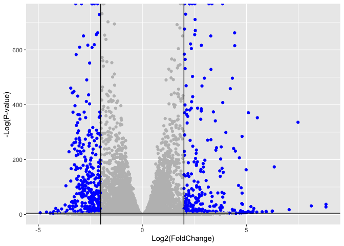
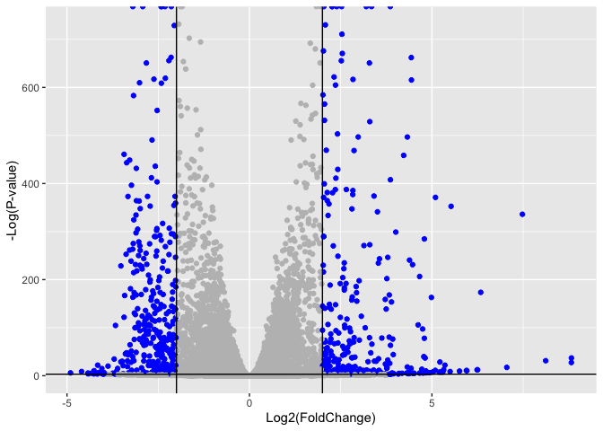

# Class 14: RNASeq Mini Project
Harshitha Palacharla (PID: A17775151)

- [Background](#background)
- [Data Import](#data-import)
  - [Sanity check](#sanity-check)
- [Setup DESeq object](#setup-deseq-object)
- [Run DESeq analysis pipeline](#run-deseq-analysis-pipeline)
- [Extract the results](#extract-the-results)
- [Data Viz](#data-viz)
- [Add gene annotation data](#add-gene-annotation-data)
- [Pathway analysis](#pathway-analysis)
  - [KEGG](#kegg)
  - [Gene Ontology](#gene-ontology)
  - [Reactome](#reactome)
- [Save our results](#save-our-results)

## Background

Here, we will do RNA-seq analysis of lung fibroblasts with knockdown of
the HOXA1 developmental transcription factor. We’ll use DESeq for
differential expression analysis, followed by pathway analysis using
KEGG, GO, and Reactome.

## Data Import

Read counts and metadata CSV files

``` r
# Load data files
metaFile <- "GSE37704_metadata.csv"
countFile <- "GSE37704_featurecounts.csv"
```

``` r
# Import and view metadata
colData = read.csv(metaFile, row.names=1)
colData
```

                  condition
    SRR493366 control_sirna
    SRR493367 control_sirna
    SRR493368 control_sirna
    SRR493369      hoxa1_kd
    SRR493370      hoxa1_kd
    SRR493371      hoxa1_kd

``` r
# Import and view countdata
countData = read.csv(countFile, row.names=1)
head(countData)
```

                    length SRR493366 SRR493367 SRR493368 SRR493369 SRR493370
    ENSG00000186092    918         0         0         0         0         0
    ENSG00000279928    718         0         0         0         0         0
    ENSG00000279457   1982        23        28        29        29        28
    ENSG00000278566    939         0         0         0         0         0
    ENSG00000273547    939         0         0         0         0         0
    ENSG00000187634   3214       124       123       205       207       212
                    SRR493371
    ENSG00000186092         0
    ENSG00000279928         0
    ENSG00000279457        46
    ENSG00000278566         0
    ENSG00000273547         0
    ENSG00000187634       258

> Q. Complete the code below to remove the troublesome first column from
> `countData`

``` r
# Remove the first column of countData
countData <- as.matrix(countData[,-1])
head(countData)
```

                    SRR493366 SRR493367 SRR493368 SRR493369 SRR493370 SRR493371
    ENSG00000186092         0         0         0         0         0         0
    ENSG00000279928         0         0         0         0         0         0
    ENSG00000279457        23        28        29        29        28        46
    ENSG00000278566         0         0         0         0         0         0
    ENSG00000273547         0         0         0         0         0         0
    ENSG00000187634       124       123       205       207       212       258

> Q. Complete the code below to filter `countData` to exclude genes
> (i.e. rows) where we have 0 read count across all samples
> (i.e. columns). Tip: What will **rowSums()** of `countData` return and
> how could you use it in this context?

Since each row of `countData` corresponds to a gene, `rowSums()` will
return a vector with the total number of reads per gene. Since we want
to keep genes that do *not* have zero read counts, we can filter the
rows of countData with `rowSums(countData) != 0` (returns TRUE for row
indices that don’t have a zero sum), as shown below.

``` r
# Make logical vector identifying rows that do NOT sum to 0
to.keep <- rowSums(countData) != 0

# Filter countData using the to.keep logical vector
countData = countData[to.keep,]
head(countData)
```

                    SRR493366 SRR493367 SRR493368 SRR493369 SRR493370 SRR493371
    ENSG00000279457        23        28        29        29        28        46
    ENSG00000187634       124       123       205       207       212       258
    ENSG00000188976      1637      1831      2383      1226      1326      1504
    ENSG00000187961       120       153       180       236       255       357
    ENSG00000187583        24        48        65        44        48        64
    ENSG00000187642         4         9        16        14        16        16

``` r
# Check the new dimensions of countData
dim(countData)
```

    [1] 15975     6

### Sanity check

Let’s make sure the column names of our countdata align with the row
names of our metadata (i.e. the names of samples).

``` r
# Column names of countdata
colnames(countData)
```

    [1] "SRR493366" "SRR493367" "SRR493368" "SRR493369" "SRR493370" "SRR493371"

``` r
# Row names of metadata
rownames(colData)
```

    [1] "SRR493366" "SRR493367" "SRR493368" "SRR493369" "SRR493370" "SRR493371"

``` r
# Check that the countdata column names are the same as the metadata row names.
colnames(countData) == rownames(colData)
```

    [1] TRUE TRUE TRUE TRUE TRUE TRUE

## Setup DESeq object

``` r
library(DESeq2)
```

``` r
dds = DESeqDataSetFromMatrix(countData=countData, colData=colData, design=~condition)
```

    Warning in DESeqDataSet(se, design = design, ignoreRank): some variables in
    design formula are characters, converting to factors

``` r
dds
```

    class: DESeqDataSet 
    dim: 15975 6 
    metadata(1): version
    assays(1): counts
    rownames(15975): ENSG00000279457 ENSG00000187634 ... ENSG00000276345
      ENSG00000271254
    rowData names(0):
    colnames(6): SRR493366 SRR493367 ... SRR493370 SRR493371
    colData names(1): condition

## Run DESeq analysis pipeline

``` r
dds = DESeq(dds)
```

    estimating size factors

    estimating dispersions

    gene-wise dispersion estimates

    mean-dispersion relationship

    final dispersion estimates

    fitting model and testing

``` r
dds
```

    class: DESeqDataSet 
    dim: 15975 6 
    metadata(1): version
    assays(4): counts mu H cooks
    rownames(15975): ENSG00000279457 ENSG00000187634 ... ENSG00000276345
      ENSG00000271254
    rowData names(22): baseMean baseVar ... deviance maxCooks
    colnames(6): SRR493366 SRR493367 ... SRR493370 SRR493371
    colData names(2): condition sizeFactor

## Extract the results

Big table with log2 fold changes and p-values, comparing HoxA1 knockdown
(hoxa1_kd) versus control siRNA (control_sirna)

``` r
res = results(dds)
```

> Q. Call the summary() function on your results to get a sense of how
> many genes are up or down-regulated at the default 0.1 p-value cutoff.

4349 genes are upregulated and 4396 genes are downregulated at the
default 0.1 adjusted p-value cutoff.

``` r
summary(res)
```


    out of 15975 with nonzero total read count
    adjusted p-value < 0.1
    LFC > 0 (up)       : 4349, 27%
    LFC < 0 (down)     : 4396, 28%
    outliers [1]       : 0, 0%
    low counts [2]     : 1237, 7.7%
    (mean count < 0)
    [1] see 'cooksCutoff' argument of ?results
    [2] see 'independentFiltering' argument of ?results

## Data Viz

Make a volcano plot of log2(fold change) versus -log(adjusted p-value)

``` r
library(ggplot2)

ggplot(res) + 
  aes(log2FoldChange, -log(padj)) +
  geom_point()
```

    Warning: Removed 1237 rows containing missing values or values outside the scale range
    (`geom_point()`).


> Q. Improve this plot by completing the below code, which adds color,
> axis labels and cutoff lines:

``` r
# Make a color vector for all genes
mycols <- rep("gray", nrow(res))

# Color blue the genes with |L2FC| > 2
mycols[ abs(res$log2FoldChange) > 2 ] <- "blue"

# Color gray genes with adjusted p-value > 0.01
mycols[ res$padj > 0.01 ] <- "gray"

# Add custom color vector, axis labels, cutoff lines to plot
ggplot(res) +
  aes(log2FoldChange, -log(padj)) +
  geom_point(col = mycols) +
  xlab("Log2(FoldChange)") +
  ylab("-Log(P-value)") +
  geom_vline(xintercept = c(-2,2)) +
  geom_hline(yintercept = -log(0.01))
```

    Warning: Removed 1237 rows containing missing values or values outside the scale range
    (`geom_point()`).



> Q. Volcano plot highlighting padj \< 0.05 and abs(foldchanges) \> 2.

The following volcano plot has a less stringent adjusted p-value cutoff
of 0.05 (the previous plot uses a cutoff of 0.01).

``` r
# Make a color vector for all genes
mycols_05 <- rep("gray", nrow(res))

# Color blue the genes with |L2FC| > 2 & padj < 0.05
mycols_05 [ abs(res$log2FoldChange) > 2 & res$padj < 0.05 ] <- "blue"

# Add custom color vector, axis labels, cutoff lines to plot
ggplot(res) +
  aes(log2FoldChange, -log(padj)) +
  geom_point(col = mycols_05) +
  xlab("Log2(FoldChange)") +
  ylab("-Log(P-value)") +
  geom_vline(xintercept = c(-2,2)) +
  geom_hline(yintercept = -log(0.05))
```

    Warning: Removed 1237 rows containing missing values or values outside the scale range
    (`geom_point()`).



## Add gene annotation data

Add gene SYMBOL, ENTREZID, and GENENAME to `res` object.

> Q. Use the mapIDs() function multiple times to add SYMBOL, ENTREZID
> and GENENAME annotation to our results by completing the code below.

``` r
# Load AnnotationDbi package
library("AnnotationDbi")

# Load annotation data package for Homo sapiens
library("org.Hs.eg.db")
```

``` r
# Examine formats available in org.Hs.eg.db
columns(org.Hs.eg.db)
```

     [1] "ACCNUM"       "ALIAS"        "ENSEMBL"      "ENSEMBLPROT"  "ENSEMBLTRANS"
     [6] "ENTREZID"     "ENZYME"       "EVIDENCE"     "EVIDENCEALL"  "GENENAME"    
    [11] "GENETYPE"     "GO"           "GOALL"        "IPI"          "MAP"         
    [16] "OMIM"         "ONTOLOGY"     "ONTOLOGYALL"  "PATH"         "PFAM"        
    [21] "PMID"         "PROSITE"      "REFSEQ"       "SYMBOL"       "UCSCKG"      
    [26] "UNIPROT"     

``` r
# Add a new column to res with SYMBOL format of gene names
res$symbol = mapIds(org.Hs.eg.db,
                    keys=row.names(res), 
                    keytype="ENSEMBL",
                    column="SYMBOL",
                    multiVals="first")
```

    'select()' returned 1:many mapping between keys and columns

``` r
# Add a new column to res with ENTREZID format of gene names
res$entrez = mapIds(org.Hs.eg.db,
                    keys=row.names(res),
                    keytype="ENSEMBL",
                    column="ENTREZID",
                    multiVals="first")
```

    'select()' returned 1:many mapping between keys and columns

``` r
# Add a new column to res with GENENAME format of gene names
res$name =   mapIds(org.Hs.eg.db,
                    keys=row.names(res),
                    keytype="ENSEMBL",
                    column="GENENAME",
                    multiVals="first")
```

    'select()' returned 1:many mapping between keys and columns

``` r
# View annotated res object
head(res, 10)
```

    log2 fold change (MLE): condition hoxa1 kd vs control sirna 
    Wald test p-value: condition hoxa1 kd vs control sirna 
    DataFrame with 10 rows and 9 columns
                       baseMean log2FoldChange     lfcSE       stat      pvalue
                      <numeric>      <numeric> <numeric>  <numeric>   <numeric>
    ENSG00000279457   29.913579      0.1792571 0.3248215   0.551863 5.81042e-01
    ENSG00000187634  183.229650      0.4264571 0.1402658   3.040350 2.36304e-03
    ENSG00000188976 1651.188076     -0.6927205 0.0548465 -12.630156 1.43993e-36
    ENSG00000187961  209.637938      0.7297556 0.1318599   5.534326 3.12428e-08
    ENSG00000187583   47.255123      0.0405765 0.2718928   0.149237 8.81366e-01
    ENSG00000187642   11.979750      0.5428105 0.5215598   1.040744 2.97994e-01
    ENSG00000188290  108.922128      2.0570638 0.1969053  10.446970 1.51281e-25
    ENSG00000187608  350.716868      0.2573837 0.1027266   2.505522 1.22271e-02
    ENSG00000188157 9128.439422      0.3899088 0.0467164   8.346302 7.04333e-17
    ENSG00000237330    0.158192      0.7859552 4.0804729   0.192614 8.47261e-01
                           padj      symbol      entrez                   name
                      <numeric> <character> <character>            <character>
    ENSG00000279457 6.86555e-01          NA          NA                     NA
    ENSG00000187634 5.15718e-03      SAMD11      148398 sterile alpha motif ..
    ENSG00000188976 1.76553e-35       NOC2L       26155 NOC2 like nucleolar ..
    ENSG00000187961 1.13413e-07      KLHL17      339451 kelch like family me..
    ENSG00000187583 9.19031e-01     PLEKHN1       84069 pleckstrin homology ..
    ENSG00000187642 4.03379e-01       PERM1       84808 PPARGC1 and ESRR ind..
    ENSG00000188290 1.30538e-24        HES4       57801 hes family bHLH tran..
    ENSG00000187608 2.37452e-02       ISG15        9636 ISG15 ubiquitin like..
    ENSG00000188157 4.21970e-16        AGRN      375790                  agrin
    ENSG00000237330          NA      RNF223      401934 ring finger protein ..

> Q. Finally for this section let’s reorder these results by adjusted
> p-value and save them to a CSV file in your current project directory.

``` r
# Reorder res by p-value
res = res[order(res$pvalue),]

# Save results to CSV file
write.csv(res, file="deseq_results.csv")
```

## Pathway analysis

KEGG, GO, and REACTOME

### KEGG

``` r
library(pathview)
```

    ##############################################################################
    Pathview is an open source software package distributed under GNU General
    Public License version 3 (GPLv3). Details of GPLv3 is available at
    http://www.gnu.org/licenses/gpl-3.0.html. Particullary, users are required to
    formally cite the original Pathview paper (not just mention it) in publications
    or products. For details, do citation("pathview") within R.

    The pathview downloads and uses KEGG data. Non-academic uses may require a KEGG
    license agreement (details at http://www.kegg.jp/kegg/legal.html).
    ##############################################################################

``` r
library(gage)
```

``` r
library(gageData)

# Load KEGG pathway data
data(kegg.sets.hs)

# Load vector of kegg.sets.hs indices corresponding to signaling/metabolic pathways
data(sigmet.idx.hs)
```

``` r
# Filter kegg.sets.hs to signaling and metabolic pathways only
kegg.sets.hs = kegg.sets.hs[sigmet.idx.hs]

# Examine the first 3 pathways
head(kegg.sets.hs, 3)
```

    $`hsa00232 Caffeine metabolism`
    [1] "10"   "1544" "1548" "1549" "1553" "7498" "9"   

    $`hsa00983 Drug metabolism - other enzymes`
     [1] "10"     "1066"   "10720"  "10941"  "151531" "1548"   "1549"   "1551"  
     [9] "1553"   "1576"   "1577"   "1806"   "1807"   "1890"   "221223" "2990"  
    [17] "3251"   "3614"   "3615"   "3704"   "51733"  "54490"  "54575"  "54576" 
    [25] "54577"  "54578"  "54579"  "54600"  "54657"  "54658"  "54659"  "54963" 
    [33] "574537" "64816"  "7083"   "7084"   "7172"   "7363"   "7364"   "7365"  
    [41] "7366"   "7367"   "7371"   "7372"   "7378"   "7498"   "79799"  "83549" 
    [49] "8824"   "8833"   "9"      "978"   

    $`hsa00230 Purine metabolism`
      [1] "100"    "10201"  "10606"  "10621"  "10622"  "10623"  "107"    "10714" 
      [9] "108"    "10846"  "109"    "111"    "11128"  "11164"  "112"    "113"   
     [17] "114"    "115"    "122481" "122622" "124583" "132"    "158"    "159"   
     [25] "1633"   "171568" "1716"   "196883" "203"    "204"    "205"    "221823"
     [33] "2272"   "22978"  "23649"  "246721" "25885"  "2618"   "26289"  "270"   
     [41] "271"    "27115"  "272"    "2766"   "2977"   "2982"   "2983"   "2984"  
     [49] "2986"   "2987"   "29922"  "3000"   "30833"  "30834"  "318"    "3251"  
     [57] "353"    "3614"   "3615"   "3704"   "377841" "471"    "4830"   "4831"  
     [65] "4832"   "4833"   "4860"   "4881"   "4882"   "4907"   "50484"  "50940" 
     [73] "51082"  "51251"  "51292"  "5136"   "5137"   "5138"   "5139"   "5140"  
     [81] "5141"   "5142"   "5143"   "5144"   "5145"   "5146"   "5147"   "5148"  
     [89] "5149"   "5150"   "5151"   "5152"   "5153"   "5158"   "5167"   "5169"  
     [97] "51728"  "5198"   "5236"   "5313"   "5315"   "53343"  "54107"  "5422"  
    [105] "5424"   "5425"   "5426"   "5427"   "5430"   "5431"   "5432"   "5433"  
    [113] "5434"   "5435"   "5436"   "5437"   "5438"   "5439"   "5440"   "5441"  
    [121] "5471"   "548644" "55276"  "5557"   "5558"   "55703"  "55811"  "55821" 
    [129] "5631"   "5634"   "56655"  "56953"  "56985"  "57804"  "58497"  "6240"  
    [137] "6241"   "64425"  "646625" "654364" "661"    "7498"   "8382"   "84172" 
    [145] "84265"  "84284"  "84618"  "8622"   "8654"   "87178"  "8833"   "9060"  
    [153] "9061"   "93034"  "953"    "9533"   "954"    "955"    "956"    "957"   
    [161] "9583"   "9615"  

Set up `foldchanges` vector with log2foldchange values from `res`, named
by Entrez gene IDs from `res`:

``` r
foldchanges = res$log2FoldChange
names(foldchanges) = res$entrez
head(foldchanges)
```

         1266     54855      1465      2034      2150      6659 
    -2.422719  3.201955 -2.313738 -1.888019  3.344508  2.392288 

Run **gage** pathway analysis:

``` r
# Get the results
keggres = gage(foldchanges, gsets=kegg.sets.hs)

# View results
attributes(keggres)
```

    $names
    [1] "greater" "less"    "stats"  

``` r
# Look at the first few down (less) pathways
head(keggres$less)
```

                                             p.geomean stat.mean        p.val
    hsa04110 Cell cycle                   8.995727e-06 -4.378644 8.995727e-06
    hsa03030 DNA replication              9.424076e-05 -3.951803 9.424076e-05
    hsa03013 RNA transport                1.375901e-03 -3.028500 1.375901e-03
    hsa03440 Homologous recombination     3.066756e-03 -2.852899 3.066756e-03
    hsa04114 Oocyte meiosis               3.784520e-03 -2.698128 3.784520e-03
    hsa00010 Glycolysis / Gluconeogenesis 8.961413e-03 -2.405398 8.961413e-03
                                                q.val set.size         exp1
    hsa04110 Cell cycle                   0.001448312      121 8.995727e-06
    hsa03030 DNA replication              0.007586381       36 9.424076e-05
    hsa03013 RNA transport                0.073840037      144 1.375901e-03
    hsa03440 Homologous recombination     0.121861535       28 3.066756e-03
    hsa04114 Oocyte meiosis               0.121861535      102 3.784520e-03
    hsa00010 Glycolysis / Gluconeogenesis 0.212222694       53 8.961413e-03

``` r
# Look at the first few up (greater) pathways
head(keggres$greater)
```

                                            p.geomean stat.mean       p.val
    hsa04640 Hematopoietic cell lineage   0.002822776  2.833362 0.002822776
    hsa04630 Jak-STAT signaling pathway   0.005202070  2.585673 0.005202070
    hsa00140 Steroid hormone biosynthesis 0.007255099  2.526744 0.007255099
    hsa04142 Lysosome                     0.010107392  2.338364 0.010107392
    hsa04330 Notch signaling pathway      0.018747253  2.111725 0.018747253
    hsa04916 Melanogenesis                0.019399766  2.081927 0.019399766
                                              q.val set.size        exp1
    hsa04640 Hematopoietic cell lineage   0.3893570       55 0.002822776
    hsa04630 Jak-STAT signaling pathway   0.3893570      109 0.005202070
    hsa00140 Steroid hormone biosynthesis 0.3893570       31 0.007255099
    hsa04142 Lysosome                     0.4068225      118 0.010107392
    hsa04330 Notch signaling pathway      0.4391731       46 0.018747253
    hsa04916 Melanogenesis                0.4391731       90 0.019399766

The top less/down pathway from `keggres` is “Cell cycle”, with the KEGG
pathway id hsa04110. Make a plot of this pathway, with our RNA-Seq
expression results overlaid:

``` r
pathview(gene.data=foldchanges, pathway.id="hsa04110")
```


``` r
# We can also generate a PDF output of the same data
pathview(gene.data=foldchanges, pathway.id="hsa04110", kegg.native=FALSE)
```

         [,1] [,2] 
    [1,] "9"  "300"
    [2,] "9"  "306"

#### Plot the top 5 upregulated KEGG pathways

``` r
## Access rownames for top 5 up/greater pathways
keggrespathways_up <- rownames(keggres$greater)[1:5]
# Extract the 8 character long IDs part of each string
keggresids_up = substr(keggrespathways_up, start=1, stop=8)
# View kegg ids 
keggresids_up
```

    [1] "hsa04640" "hsa04630" "hsa00140" "hsa04142" "hsa04330"

Pass the vector of top 5 upregulated KEGG pathway ids to **pathview()**:

``` r
pathview(gene.data=foldchanges, pathway.id=keggresids_up, species="hsa")
```


> Q. Can you do the same procedure as above to plot the pathview figures
> for the top 5 down-regulated pathways?

``` r
## Access rownames for top 5 down/less pathways
keggrespathways_down <- rownames(keggres$less)[1:5]
# Extract the 8 character long IDs part of each string
keggresids_down = substr(keggrespathways_down, start=1, stop=8)
# View kegg ids 
keggresids_down
```

    [1] "hsa04110" "hsa03030" "hsa03013" "hsa03440" "hsa04114"

Pass the vector of top 5 downregulated KEGG pathway ids to
**pathview()**:

``` r
pathview(gene.data=foldchanges, pathway.id=keggresids_down, species="hsa")
```


### Gene Ontology

``` r
# Load GO terms 
data(go.sets.hs)

# Load list of go.sets.hs indices corresponding to BP, CC, and MF ontologies
data(go.subs.hs)

# Focus on Biological Process subset of GO
gobpsets = go.sets.hs[go.subs.hs$BP]

# Get the results
gobpres = gage(foldchanges, gsets=gobpsets)

# View the results
lapply(gobpres, head)
```

    $greater
                                                 p.geomean stat.mean        p.val
    GO:0007156 homophilic cell adhesion       8.519724e-05  3.824205 8.519724e-05
    GO:0002009 morphogenesis of an epithelium 1.396681e-04  3.653886 1.396681e-04
    GO:0048729 tissue morphogenesis           1.432451e-04  3.643242 1.432451e-04
    GO:0007610 behavior                       1.925222e-04  3.565432 1.925222e-04
    GO:0060562 epithelial tube morphogenesis  5.932837e-04  3.261376 5.932837e-04
    GO:0035295 tube development               5.953254e-04  3.253665 5.953254e-04
                                                  q.val set.size         exp1
    GO:0007156 homophilic cell adhesion       0.1951953      113 8.519724e-05
    GO:0002009 morphogenesis of an epithelium 0.1951953      339 1.396681e-04
    GO:0048729 tissue morphogenesis           0.1951953      424 1.432451e-04
    GO:0007610 behavior                       0.1967577      426 1.925222e-04
    GO:0060562 epithelial tube morphogenesis  0.3565320      257 5.932837e-04
    GO:0035295 tube development               0.3565320      391 5.953254e-04

    $less
                                                p.geomean stat.mean        p.val
    GO:0048285 organelle fission             1.536227e-15 -8.063910 1.536227e-15
    GO:0000280 nuclear division              4.286961e-15 -7.939217 4.286961e-15
    GO:0007067 mitosis                       4.286961e-15 -7.939217 4.286961e-15
    GO:0000087 M phase of mitotic cell cycle 1.169934e-14 -7.797496 1.169934e-14
    GO:0007059 chromosome segregation        2.028624e-11 -6.878340 2.028624e-11
    GO:0000236 mitotic prometaphase          1.729553e-10 -6.695966 1.729553e-10
                                                    q.val set.size         exp1
    GO:0048285 organelle fission             5.841698e-12      376 1.536227e-15
    GO:0000280 nuclear division              5.841698e-12      352 4.286961e-15
    GO:0007067 mitosis                       5.841698e-12      352 4.286961e-15
    GO:0000087 M phase of mitotic cell cycle 1.195672e-11      362 1.169934e-14
    GO:0007059 chromosome segregation        1.658603e-08      142 2.028624e-11
    GO:0000236 mitotic prometaphase          1.178402e-07       84 1.729553e-10

    $stats
                                              stat.mean     exp1
    GO:0007156 homophilic cell adhesion        3.824205 3.824205
    GO:0002009 morphogenesis of an epithelium  3.653886 3.653886
    GO:0048729 tissue morphogenesis            3.643242 3.643242
    GO:0007610 behavior                        3.565432 3.565432
    GO:0060562 epithelial tube morphogenesis   3.261376 3.261376
    GO:0035295 tube development                3.253665 3.253665

### Reactome

There is an R package for this analysis and a new-ish website.

To use the website you can paste or upload a list of your DEGs.

``` r
# Extract significant genes from res
sig_genes <- res[res$padj <= 0.05 & !is.na(res$padj), "symbol"]

# Print number of extracted genes
print(paste("Total number of significant genes:", length(sig_genes)))
```

    [1] "Total number of significant genes: 8147"

``` r
# Write list as a plain text file 
write.table(sig_genes, file="significant_genes.txt",
            row.names=FALSE,
            col.names=FALSE,
            quote=FALSE)
```

Upload txt file to Reactome, selecting the parameter “Project to
Humans”:


> Q: What pathway has the most significant “Entities p-value”? Do the
> most significant pathways listed match your previous KEGG results?
> What factors could cause differences between the two methods?

The pathway with the most significant “Entities p-value” is **Cell
cycle** (with an Entities pValue of 2.63E-5).

Generally speaking, the most significant pathways outputted by Reactome
are found in the “Cell cycle, Mitotic” and “Cell cycle, Checkpoints”
branches. This matches the KEGG results, which named “Cell cycle” as the
top downregulated (“less”) pathway.

One factor for differences in KEGG and Reactome results is how the two
define and map pathways, which affects the composition, size, and
specificity of individual pathways. A given KEGG pathway will not
necessarily be a one-to-one match with its counterpart/most closely
related pathway in Reactome. Additionally, KEGG and Reactome have
different areas of emphasis: while KEGG pathways tend to be broad and
systems-level, Reactome focuses more on mechanisms/signaling. Another
factor is the difference in the number/types of annotated genes
available for mapping in each method.

## Save our results

See end of “Add gene annotation data” section.
