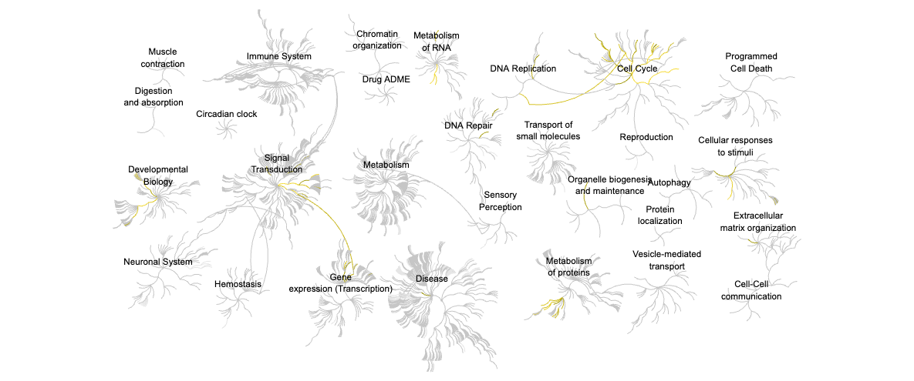
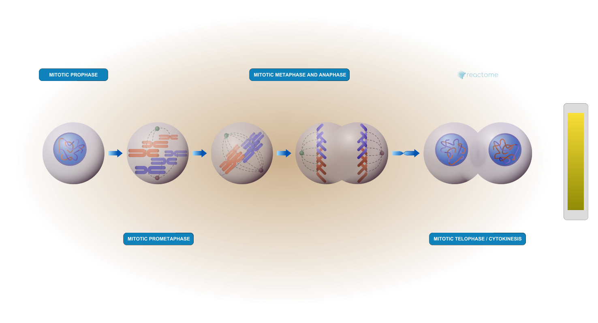

## Background

Here, we will do RNA-seq analysis of lung fibroblasts with knockdown of the HOXA1 developmental transcription factor. We’ll use DESeq for differential expression analysis, followed by pathway analysis using KEGG, GO, and Reactome. 

## Data Import
Read counts and metadata CSV files

```{r}
# Load data files
metaFile <- "GSE37704_metadata.csv"
countFile <- "GSE37704_featurecounts.csv"
```

```{r import metadata}
# Import and view metadata
colData = read.csv(metaFile, row.names=1)
colData
```

```{r import countdata}
# Import and view countdata
countData = read.csv(countFile, row.names=1)
head(countData)
```

> Q. Complete the code below to remove the troublesome first column from `countData`

```{r}
# Remove the first column of countData
countData <- as.matrix(countData[,-1])
head(countData)
```

> Q. Complete the code below to filter `countData` to exclude genes (i.e. rows) where we have 0 read count across all samples (i.e. columns). Tip: What will **rowSums()** of `countData` return and how could you use it in this context?

Since each row of `countData` corresponds to a gene, `rowSums()` will return a vector with the total number of reads per gene. Since we want to keep genes that do *not* have zero read counts, we can filter the rows of countData with `rowSums(countData) != 0` (returns TRUE for row indices that don't have a zero sum), as shown below. 

```{r}
# Make logical vector identifying rows that do NOT sum to 0
to.keep <- rowSums(countData) != 0

# Filter countData using the to.keep logical vector
countData = countData[to.keep,]
head(countData)
```

```{r}
# Check the new dimensions of countData
dim(countData)
```

### Sanity check

Let's make sure the column names of our countdata align with the row names of our metadata (i.e. the names of samples).

```{r}
# Column names of countdata
colnames(countData)
```

```{r}
# Row names of metadata
rownames(colData)
```

```{r}
# Check that the countdata column names are the same as the metadata row names.
colnames(countData) == rownames(colData)
```

## Setup DESeq object 

```{r, message = FALSE}
library(DESeq2)
```

```{r}
dds = DESeqDataSetFromMatrix(countData=countData, colData=colData, design=~condition)

dds
```

## Run DESeq analysis pipeline

```{r}
dds = DESeq(dds)
dds
```

## Extract the results

Big table with log2 fold changes and p-values, comparing HoxA1 knockdown (hoxa1_kd) versus control siRNA (control_sirna)

```{r}
res = results(dds)
```

> Q. Call the summary() function on your results to get a sense of how many genes are up or down-regulated at the default 0.1 p-value cutoff.

4349 genes are upregulated and 4396 genes are downregulated at the default 0.1 adjusted p-value cutoff.

```{r}
summary(res)
```

## Data Viz

Make a volcano plot of log2(fold change) versus -log(adjusted p-value)

```{r}
library(ggplot2)

ggplot(res) + 
  aes(log2FoldChange, -log(padj)) +
  geom_point()
```

> Q. Improve this plot by completing the below code, which adds color, axis labels and cutoff lines:

```{r}
# Make a color vector for all genes
mycols <- rep("gray", nrow(res))

# Color blue the genes with |L2FC| > 2
mycols[ abs(res$log2FoldChange) > 2 ] <- "blue"

# Color gray genes with adjusted p-value > 0.01
mycols[ res$padj > 0.01 ] <- "gray"

# Add custom color vector, axis labels, cutoff lines to plot
ggplot(res) +
  aes(log2FoldChange, -log(padj)) +
  geom_point(col = mycols) +
  xlab("Log2(FoldChange)") +
  ylab("-Log(P-value)") +
  geom_vline(xintercept = c(-2,2)) +
  geom_hline(yintercept = -log(0.01))
```

> Q. Volcano plot highlighting padj < 0.05 and abs(foldchanges) > 2. 

The following volcano plot has a less stringent adjusted p-value cutoff of 0.05 (the previous plot uses a cutoff of 0.01).

```{r}
# Make a color vector for all genes
mycols_05 <- rep("gray", nrow(res))

# Color blue the genes with |L2FC| > 2 & padj < 0.05
mycols_05 [ abs(res$log2FoldChange) > 2 & res$padj < 0.05 ] <- "blue"

# Add custom color vector, axis labels, cutoff lines to plot
ggplot(res) +
  aes(log2FoldChange, -log(padj)) +
  geom_point(col = mycols_05) +
  xlab("Log2(FoldChange)") +
  ylab("-Log(P-value)") +
  geom_vline(xintercept = c(-2,2)) +
  geom_hline(yintercept = -log(0.05))
```


## Add gene annotation data 
Add gene SYMBOL, ENTREZID, and GENENAME to `res` object.

> Q. Use the mapIDs() function multiple times to add SYMBOL, ENTREZID and GENENAME annotation to our results by completing the code below.

```{r}
# Load AnnotationDbi package
library("AnnotationDbi")

# Load annotation data package for Homo sapiens
library("org.Hs.eg.db")
```

```{r}
# Examine formats available in org.Hs.eg.db
columns(org.Hs.eg.db)
```

```{r}
# Add a new column to res with SYMBOL format of gene names
res$symbol = mapIds(org.Hs.eg.db,
                    keys=row.names(res), 
                    keytype="ENSEMBL",
                    column="SYMBOL",
                    multiVals="first")

# Add a new column to res with ENTREZID format of gene names
res$entrez = mapIds(org.Hs.eg.db,
                    keys=row.names(res),
                    keytype="ENSEMBL",
                    column="ENTREZID",
                    multiVals="first")

# Add a new column to res with GENENAME format of gene names
res$name =   mapIds(org.Hs.eg.db,
                    keys=row.names(res),
                    keytype="ENSEMBL",
                    column="GENENAME",
                    multiVals="first")
```

```{r}
# View annotated res object
head(res, 10)
```

> Q. Finally for this section let's reorder these results by adjusted p-value and save them to a CSV file in your current project directory.

```{r}
# Reorder res by p-value
res = res[order(res$pvalue),]

# Save results to CSV file
write.csv(res, file="deseq_results.csv")
```


## Pathway analysis
KEGG, GO, and REACTOME

### KEGG

```{r}
library(pathview)
library(gage)
library(gageData)

# Load KEGG pathway data
data(kegg.sets.hs)

# Load vector of kegg.sets.hs indices corresponding to signaling/metabolic pathways
data(sigmet.idx.hs)
```

```{r}
# Filter kegg.sets.hs to signaling and metabolic pathways only
kegg.sets.hs = kegg.sets.hs[sigmet.idx.hs]

# Examine the first 3 pathways
head(kegg.sets.hs, 3)
```

Set up `foldchanges` vector with log2foldchange values from `res`, named by Entrez gene IDs from `res`:
```{r}
foldchanges = res$log2FoldChange
names(foldchanges) = res$entrez
head(foldchanges)
```

Run **gage** pathway analysis:
```{r}
# Get the results
keggres = gage(foldchanges, gsets=kegg.sets.hs)

# View results
attributes(keggres)
```

```{r}
# Look at the first few down (less) pathways
head(keggres$less)
```

```{r}
# Look at the first few up (greater) pathways
head(keggres$greater)
```

The top less/down pathway from `keggres` is "Cell cycle", with the KEGG pathway id hsa04110. Make a plot of this pathway, with our RNA-Seq expression results overlaid:
```{r, message = FALSE}
pathview(gene.data=foldchanges, pathway.id="hsa04110")
```
 

```{r, message = FALSE}
# We can also generate a PDF output of the same data
pathview(gene.data=foldchanges, pathway.id="hsa04110", kegg.native=FALSE)
```

#### Plot the top 5 upregulated KEGG pathways

```{r}
## Access rownames for top 5 up/greater pathways
keggrespathways_up <- rownames(keggres$greater)[1:5]
# Extract the 8 character long IDs part of each string
keggresids_up = substr(keggrespathways_up, start=1, stop=8)
# View kegg ids 
keggresids_up
```

Pass the vector of top 5 upregulated KEGG pathway ids to **pathview()**:
```{r, message = FALSE}
pathview(gene.data=foldchanges, pathway.id=keggresids_up, species="hsa")
```


> Q. Can you do the same procedure as above to plot the pathview figures for the top 5 down-regulated pathways?

```{r}
## Access rownames for top 5 down/less pathways
keggrespathways_down <- rownames(keggres$less)[1:5]
# Extract the 8 character long IDs part of each string
keggresids_down = substr(keggrespathways_down, start=1, stop=8)
# View kegg ids 
keggresids_down
```

Pass the vector of top 5 downregulated KEGG pathway ids to **pathview()**:
```{r, message = FALSE}
pathview(gene.data=foldchanges, pathway.id=keggresids_down, species="hsa")
```


### Gene Ontology

```{r}
# Load GO terms 
data(go.sets.hs)

# Load list of go.sets.hs indices corresponding to BP, CC, and MF ontologies
data(go.subs.hs)

# Focus on Biological Process subset of GO
gobpsets = go.sets.hs[go.subs.hs$BP]

# Get the results
gobpres = gage(foldchanges, gsets=gobpsets)

# View the results
lapply(gobpres, head)
```

### Reactome

There is an R package for this analysis and a new-ish website.

To use the website you can paste or upload a list of your DEGs.

```{r}
# Extract significant genes from res
sig_genes <- res[res$padj <= 0.05 & !is.na(res$padj), "symbol"]

# Print number of extracted genes
print(paste("Total number of significant genes:", length(sig_genes)))
```

```{r}
# Write list as a plain text file 
write.table(sig_genes, file="significant_genes.txt",
            row.names=FALSE,
            col.names=FALSE,
            quote=FALSE)
```

Upload txt file to Reactome, selecting the parameter “Project to Humans”:





> Q: What pathway has the most significant “Entities p-value”? Do the most significant pathways listed match your previous KEGG results? What factors could cause differences between the two methods?

The pathway with the most significant "Entities p-value" is **Cell cycle** (with an Entities pValue of 2.63E-5). 

Generally speaking, the most significant pathways outputted by Reactome are found in the "Cell cycle, Mitotic" and "Cell cycle, Checkpoints" branches. This matches the KEGG results, which named "Cell cycle" as the top downregulated ("less") pathway. 

One factor for differences in KEGG and Reactome results is how the two define and map pathways, which affects the composition, size, and specificity of individual pathways. A given KEGG pathway will not necessarily be a one-to-one match with its counterpart/most closely related pathway in Reactome. Additionally, KEGG and Reactome have different areas of emphasis: while KEGG pathways tend to be broad and systems-level, Reactome focuses more on mechanisms/signaling. Another factor is the difference in the number/types of annotated genes available for mapping in each method.

## Save our results

See end of "Add gene annotation data" section.
