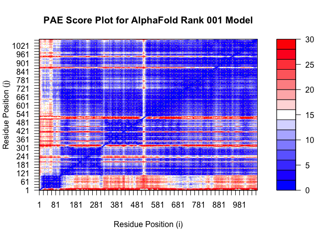
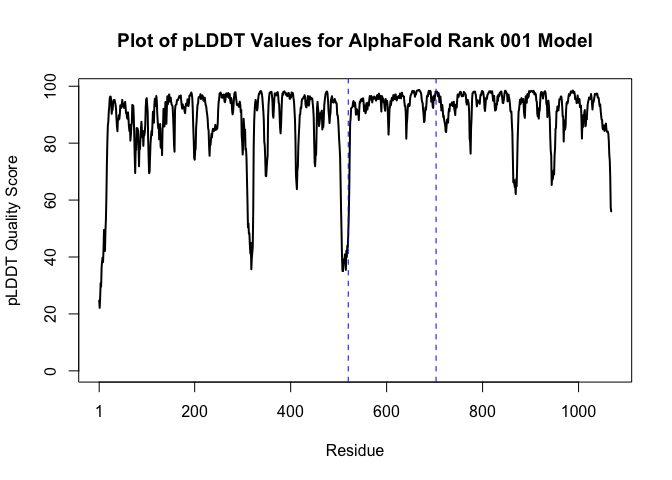

# Class 19
Harshitha Palacharla

``` r
library(bio3d)

sd <- read.fasta("A17775151_mutant_seq.fa")
sd
```

                   1        .         .         .         .         .         60 
    wt_healthy     MPPRPSSGELWGIHLMPPRILVECLLPNGMIVTLECLREATLITIKHELFKEARKYPLHQ
    mutant_tumor   MPPRPSSGELWGIHLMPPRILVECLLPNGMIVTLECLREATLITIKHELFKEARKYPLHQ
                   ************************************************************ 
                   1        .         .         .         .         .         60 

                  61        .         .         .         .         .         120 
    wt_healthy     LLQDESSYIFVSVTQEAEREEFFDETRRLCDLRLFQPFLKVIEPVGNREEKILNREIGFA
    mutant_tumor   LLQDESSYIFVSVTQEAEREEFFDETRRLCDLRLFQPFLKVIEPVGNREEKILNREIGFA
                   ************************************************************ 
                  61        .         .         .         .         .         120 

                 121        .         .         .         .         .         180 
    wt_healthy     IGMPVCEFDMVKDPEVQDFRRNILNVCKEAVDLRDLNSPHSRAMYVYPPNVESSPELPKH
    mutant_tumor   IGMPVCEFDMVKDPEVQDFRRNILNVCKEAVDLRDLNSPHSRAMYVYPPNVESSPELPKH
                   ************************************************************ 
                 121        .         .         .         .         .         180 

                 181        .         .         .         .         .         240 
    wt_healthy     IYNKLDKGQIIVVIWVIVSPNNDKQKYTLKINHDCVPEQVIAEAIRKKTRSMLLSSEQLK
    mutant_tumor   IYNKLDKGQIIVVIWVIVSPNNDKQKYTLKINHDCVPEQVIAEAIRKKTRSMLLSSEQLK
                   ************************************************************ 
                 181        .         .         .         .         .         240 

                 241        .         .         .         .         .         300 
    wt_healthy     LCVLEYQGKYILKVCGCDEYFLEKYPLSQYKYIRSCIMLGRMPNLMLMAKESLYSQLPMD
    mutant_tumor   LCVLEYQGKYILKVCGCDEYFLEKYPLSQYKYIRSCIMLGRMPNLMLMAKESLYSQLPMD
                   ************************************************************ 
                 241        .         .         .         .         .         300 

                 301        .         .         .         .         .         360 
    wt_healthy     CFTMPSYSRRISTATPYMNGETSTKSLWVINSALRIKILCATYVNVNIRDIDKIYVRTGI
    mutant_tumor   CFTMPSYSRRISTATPYMNGETSTKSLWVINSALRIKILCATYVNVNIRDIDKIYVRTGI
                   ************************************************************ 
                 301        .         .         .         .         .         360 

                 361        .         .         .         .         .         420 
    wt_healthy     YHGGEPLCDNVNTQRVPCSNPRWNEWLNYDIYIPDLPRAARLCLSICSVKGRKGAKEEHC
    mutant_tumor   YHGGEPLCDNVNTQRVPCSNPRWNEWLNYDIYIPDLPRAARLCLSICSVKGRKGAKEEHC
                   ************************************************************ 
                 361        .         .         .         .         .         420 

                 421        .         .         .         .         .         480 
    wt_healthy     PLAWGNINLFDYTDTLVSGKMALNLWPVPHGLEDLLNPIGVTGSNPNKETPCLELEFDWF
    mutant_tumor   PLAWGNINLFDYTDTLVSGKMALNLWPVPHGLEDLLNPIGVTGSNPNKETPCLELEFDWF
                   ************************************************************ 
                 421        .         .         .         .         .         480 

                 481        .         .         .         .         .         540 
    wt_healthy     SSVVKFPDMSVIEEHANWSVSREAGFSYSHAGLSNRLARDNELRENDKEQLKAISTRDPL
    mutant_tumor   SSVVKFPDMSVIEEHANWSVSREAGFSYSHAGLSNRLARDNELRENDKEQLKAISTRDPL
                   ************************************************************ 
                 481        .         .         .         .         .         540 

                 541        .         .         .         .         .         600 
    wt_healthy     SEITEQEKDFLWSHRHYCVTIPEILPKLLLSVKWNSRDEVAQMYCLVKDWPPIKPEQAME
    mutant_tumor   SEITEQEKDFLWVHRHYCVTIPEILPKLLLSVEWNSRDEVAQMYCLVKDWPPIKPEQAME
                   ************ ******************* *************************** 
                 541        .         .         .         .         .         600 

                 601        .         .         .         .         .         660 
    wt_healthy     LLDCNYPDPMVRGFAVRCLEKYLTDDKLSQYLIQLVQVLKYEQYLDNLLVRFLLKKALTN
    mutant_tumor   LLDCNYPDPMVRGFARRCLEKYLTDDKLSQYLIQLVQVLKYYQYLDNLLVRFLLKKALTN
                   *************** ************************* ****************** 
                 601        .         .         .         .         .         660 

                 661        .         .         .         .         .         720 
    wt_healthy     QRIGHFFFWHLKSEMHNKTVSQRFGLLLESYCRACGMYLKHLNRQVEAMEKLINLTDILK
    mutant_tumor   QRIGHFFFWHLKSEMHNKTVSQRFGLLLESYCRACGMYLKHLNRQVEAMEKLINLTDILK
                   ************************************************************ 
                 661        .         .         .         .         .         720 

                 721        .         .         .         .         .         780 
    wt_healthy     QEKKDETQKVQMKFLVEQMRRPDFMDALQGFLSPLNPAHQLGNLRLEECRIMSSAKRPLW
    mutant_tumor   QEKKDETQKVQMKFLVEQMRRPDFMDALQGFLSPLNPAHQLGNLRLEECRIMSSAKRPLW
                   ************************************************************ 
                 721        .         .         .         .         .         780 

                 781        .         .         .         .         .         840 
    wt_healthy     LNWENPDIMSELLFQNNEIIFKNGDDLRQDMLTLQIIRIMENIWQNQGLDLRMLPYGCLS
    mutant_tumor   LNWENPDIMSELLFQNNEIIFKNGDDLRQDMLTLQIIRIMENIWQNQGLDLRMLPYGCLS
                   ************************************************************ 
                 781        .         .         .         .         .         840 

                 841        .         .         .         .         .         900 
    wt_healthy     IGDCVGLIEVVRNSHTIMQIQCKGGLKGALQFNSHTLHQWLKDKNKGEIYDAAIDLFTRS
    mutant_tumor   IGDCVGLIEVVRNSHTIMQIQCKGGLKGALQFNSHTLHQWLKDKNKGEIYDAAIDLFTRS
                   ************************************************************ 
                 841        .         .         .         .         .         900 

                 901        .         .         .         .         .         960 
    wt_healthy     CAGYCVATFILGIGDRHNSNIMVKDDGQLFHIDFGHFLDHKKKKFGYKRERVPFVLTQDF
    mutant_tumor   CAGYCVATFILGIGDRHNSNIMVKDDGQLFHIDFGHFLDHKKKKFGYKRERVPFVLTQDF
                   ************************************************************ 
                 901        .         .         .         .         .         960 

                 961        .         .         .         .         .         1020 
    wt_healthy     LIVISKGAQECTKTREFERFQEMCYKAYLAIRQHANLFINLFSMMLGSGMPELQSFDDIA
    mutant_tumor   LIVISKGAQECTKTREFERFQEMCYKAYLAIRQHANLFINLFSMMLGSGMPELQSFDDIA
                   ************************************************************ 
                 961        .         .         .         .         .         1020 

                1021        .         .         .         .       1068 
    wt_healthy     YIRKTLALDKTEQEALEYFMKQMNDAHHGGWTTKMDWIFHTIKQHALN
    mutant_tumor   YIRKTLALDKTEQEALEYFMKQMNDAHHGGWTTKMDWIFHTIKQHALN
                   ************************************************ 
                1021        .         .         .         .       1068 

    Call:
      read.fasta(file = "A17775151_mutant_seq.fa")

    Class:
      fasta

    Alignment dimensions:
      2 sequence rows; 1068 position columns (1068 non-gap, 0 gap) 

    + attr: id, ali, call

``` r
norm.seq <- paste0(sd$ali[1,], collapse = "")
norm.seq
```

    [1] "MPPRPSSGELWGIHLMPPRILVECLLPNGMIVTLECLREATLITIKHELFKEARKYPLHQLLQDESSYIFVSVTQEAEREEFFDETRRLCDLRLFQPFLKVIEPVGNREEKILNREIGFAIGMPVCEFDMVKDPEVQDFRRNILNVCKEAVDLRDLNSPHSRAMYVYPPNVESSPELPKHIYNKLDKGQIIVVIWVIVSPNNDKQKYTLKINHDCVPEQVIAEAIRKKTRSMLLSSEQLKLCVLEYQGKYILKVCGCDEYFLEKYPLSQYKYIRSCIMLGRMPNLMLMAKESLYSQLPMDCFTMPSYSRRISTATPYMNGETSTKSLWVINSALRIKILCATYVNVNIRDIDKIYVRTGIYHGGEPLCDNVNTQRVPCSNPRWNEWLNYDIYIPDLPRAARLCLSICSVKGRKGAKEEHCPLAWGNINLFDYTDTLVSGKMALNLWPVPHGLEDLLNPIGVTGSNPNKETPCLELEFDWFSSVVKFPDMSVIEEHANWSVSREAGFSYSHAGLSNRLARDNELRENDKEQLKAISTRDPLSEITEQEKDFLWSHRHYCVTIPEILPKLLLSVKWNSRDEVAQMYCLVKDWPPIKPEQAMELLDCNYPDPMVRGFAVRCLEKYLTDDKLSQYLIQLVQVLKYEQYLDNLLVRFLLKKALTNQRIGHFFFWHLKSEMHNKTVSQRFGLLLESYCRACGMYLKHLNRQVEAMEKLINLTDILKQEKKDETQKVQMKFLVEQMRRPDFMDALQGFLSPLNPAHQLGNLRLEECRIMSSAKRPLWLNWENPDIMSELLFQNNEIIFKNGDDLRQDMLTLQIIRIMENIWQNQGLDLRMLPYGCLSIGDCVGLIEVVRNSHTIMQIQCKGGLKGALQFNSHTLHQWLKDKNKGEIYDAAIDLFTRSCAGYCVATFILGIGDRHNSNIMVKDDGQLFHIDFGHFLDHKKKKFGYKRERVPFVLTQDFLIVISKGAQECTKTREFERFQEMCYKAYLAIRQHANLFINLFSMMLGSGMPELQSFDDIAYIRKTLALDKTEQEALEYFMKQMNDAHHGGWTTKMDWIFHTIKQHALN"

``` r
nchar(norm.seq)
```

    [1] 1068

``` r
mut.seq <- paste0(sd$ali[2,], collapse = "")
mut.seq
```

    [1] "MPPRPSSGELWGIHLMPPRILVECLLPNGMIVTLECLREATLITIKHELFKEARKYPLHQLLQDESSYIFVSVTQEAEREEFFDETRRLCDLRLFQPFLKVIEPVGNREEKILNREIGFAIGMPVCEFDMVKDPEVQDFRRNILNVCKEAVDLRDLNSPHSRAMYVYPPNVESSPELPKHIYNKLDKGQIIVVIWVIVSPNNDKQKYTLKINHDCVPEQVIAEAIRKKTRSMLLSSEQLKLCVLEYQGKYILKVCGCDEYFLEKYPLSQYKYIRSCIMLGRMPNLMLMAKESLYSQLPMDCFTMPSYSRRISTATPYMNGETSTKSLWVINSALRIKILCATYVNVNIRDIDKIYVRTGIYHGGEPLCDNVNTQRVPCSNPRWNEWLNYDIYIPDLPRAARLCLSICSVKGRKGAKEEHCPLAWGNINLFDYTDTLVSGKMALNLWPVPHGLEDLLNPIGVTGSNPNKETPCLELEFDWFSSVVKFPDMSVIEEHANWSVSREAGFSYSHAGLSNRLARDNELRENDKEQLKAISTRDPLSEITEQEKDFLWVHRHYCVTIPEILPKLLLSVEWNSRDEVAQMYCLVKDWPPIKPEQAMELLDCNYPDPMVRGFARRCLEKYLTDDKLSQYLIQLVQVLKYYQYLDNLLVRFLLKKALTNQRIGHFFFWHLKSEMHNKTVSQRFGLLLESYCRACGMYLKHLNRQVEAMEKLINLTDILKQEKKDETQKVQMKFLVEQMRRPDFMDALQGFLSPLNPAHQLGNLRLEECRIMSSAKRPLWLNWENPDIMSELLFQNNEIIFKNGDDLRQDMLTLQIIRIMENIWQNQGLDLRMLPYGCLSIGDCVGLIEVVRNSHTIMQIQCKGGLKGALQFNSHTLHQWLKDKNKGEIYDAAIDLFTRSCAGYCVATFILGIGDRHNSNIMVKDDGQLFHIDFGHFLDHKKKKFGYKRERVPFVLTQDFLIVISKGAQECTKTREFERFQEMCYKAYLAIRQHANLFINLFSMMLGSGMPELQSFDDIAYIRKTLALDKTEQEALEYFMKQMNDAHHGGWTTKMDWIFHTIKQHALN"

``` r
nchar(mut.seq)
```

    [1] 1068

> Q1. \[1pt\] What protein do these sequences correspond to? (Give both
> full gene/protein name and official symbol).

BLASTp search with normal sequence, against RefSeq database and filtered
to Homo sapien.

Top hit (NP_006209.2) is phosphatidylinositol 4,5-bisphosphate 3-kinase
catalytic subunit alpha isoform \[Homo sapiens\], with 100% identity,
100% query coverage, E = 0.0.

Official Symbol: PIK3CA Official Full Name:
phosphatidylinositol-4,5-bisphosphate 3-kinase catalytic subunit alpha
Gene ID: 5290

> Q2. \[6pts\] What are the tumor specific mutations in this particular
> case ( e.g. A130V)?

``` r
match <- sd$ali[1,] == sd$ali[2,]
which(match == FALSE)
```

    [1] 553 573 616 642

``` r
sd$ali[,553]
```

      wt_healthy mutant_tumor 
             "S"          "V" 

``` r
sd$ali[,573]
```

      wt_healthy mutant_tumor 
             "K"          "E" 

``` r
sd$ali[,616]
```

      wt_healthy mutant_tumor 
             "V"          "R" 

``` r
sd$ali[,642]
```

      wt_healthy mutant_tumor 
             "E"          "Y" 

``` r
sd$ali[2,520:703]
```

      [1] "D" "N" "E" "L" "R" "E" "N" "D" "K" "E" "Q" "L" "K" "A" "I" "S" "T" "R"
     [19] "D" "P" "L" "S" "E" "I" "T" "E" "Q" "E" "K" "D" "F" "L" "W" "V" "H" "R"
     [37] "H" "Y" "C" "V" "T" "I" "P" "E" "I" "L" "P" "K" "L" "L" "L" "S" "V" "E"
     [55] "W" "N" "S" "R" "D" "E" "V" "A" "Q" "M" "Y" "C" "L" "V" "K" "D" "W" "P"
     [73] "P" "I" "K" "P" "E" "Q" "A" "M" "E" "L" "L" "D" "C" "N" "Y" "P" "D" "P"
     [91] "M" "V" "R" "G" "F" "A" "R" "R" "C" "L" "E" "K" "Y" "L" "T" "D" "D" "K"
    [109] "L" "S" "Q" "Y" "L" "I" "Q" "L" "V" "Q" "V" "L" "K" "Y" "Y" "Q" "Y" "L"
    [127] "D" "N" "L" "L" "V" "R" "F" "L" "L" "K" "K" "A" "L" "T" "N" "Q" "R" "I"
    [145] "G" "H" "F" "F" "F" "W" "H" "L" "K" "S" "E" "M" "H" "N" "K" "T" "V" "S"
    [163] "Q" "R" "F" "G" "L" "L" "L" "E" "S" "Y" "C" "R" "A" "C" "G" "M" "Y" "L"
    [181] "K" "H" "L" "N"

``` r
# File names for all PDB models
pdb_files <- list.files(path="mutant_tumor_b6146/",
                        pattern="*.pdb",
                        full.names = TRUE)

# Print our PDB file names
basename(pdb_files)
```

    [1] "mutant_tumor_b6146_unrelaxed_rank_001_alphafold2_ptm_model_3_seed_000.pdb"
    [2] "mutant_tumor_b6146_unrelaxed_rank_002_alphafold2_ptm_model_4_seed_000.pdb"
    [3] "mutant_tumor_b6146_unrelaxed_rank_003_alphafold2_ptm_model_2_seed_000.pdb"
    [4] "mutant_tumor_b6146_unrelaxed_rank_004_alphafold2_ptm_model_1_seed_000.pdb"
    [5] "mutant_tumor_b6146_unrelaxed_rank_005_alphafold2_ptm_model_5_seed_000.pdb"

``` r
pdb_files[1]
```

    [1] "mutant_tumor_b6146//mutant_tumor_b6146_unrelaxed_rank_001_alphafold2_ptm_model_3_seed_000.pdb"

``` r
m1.pdb <- read.pdb(pdb_files[1])
```

``` r
library(jsonlite)

# Listing of all PAE JSON files
pae_files <- list.files(path="mutant_tumor_b6146/",
                        pattern=".*model.*\\.json",
                        full.names = TRUE)

pae1 <- read_json(pae_files[1],simplifyVector = TRUE)
```

``` r
plot.dmat(pae1$pae, 
          xlab="Residue Position (i)",
          ylab="Residue Position (j)",
          main="PAE Score Plot for AlphaFold Rank 001 Model",
          zlim=c(0,30))
```



``` r
library(bio3d)

# Read all data from Models 
#  and superpose/fit coords
pdbs <- pdbaln(pdb_files, fit=TRUE, exefile="msa")
```

    Reading PDB files:
    mutant_tumor_b6146//mutant_tumor_b6146_unrelaxed_rank_001_alphafold2_ptm_model_3_seed_000.pdb
    mutant_tumor_b6146//mutant_tumor_b6146_unrelaxed_rank_002_alphafold2_ptm_model_4_seed_000.pdb
    mutant_tumor_b6146//mutant_tumor_b6146_unrelaxed_rank_003_alphafold2_ptm_model_2_seed_000.pdb
    mutant_tumor_b6146//mutant_tumor_b6146_unrelaxed_rank_004_alphafold2_ptm_model_1_seed_000.pdb
    mutant_tumor_b6146//mutant_tumor_b6146_unrelaxed_rank_005_alphafold2_ptm_model_5_seed_000.pdb
    .....

    Extracting sequences

    pdb/seq: 1   name: mutant_tumor_b6146//mutant_tumor_b6146_unrelaxed_rank_001_alphafold2_ptm_model_3_seed_000.pdb 
    pdb/seq: 2   name: mutant_tumor_b6146//mutant_tumor_b6146_unrelaxed_rank_002_alphafold2_ptm_model_4_seed_000.pdb 
    pdb/seq: 3   name: mutant_tumor_b6146//mutant_tumor_b6146_unrelaxed_rank_003_alphafold2_ptm_model_2_seed_000.pdb 
    pdb/seq: 4   name: mutant_tumor_b6146//mutant_tumor_b6146_unrelaxed_rank_004_alphafold2_ptm_model_1_seed_000.pdb 
    pdb/seq: 5   name: mutant_tumor_b6146//mutant_tumor_b6146_unrelaxed_rank_005_alphafold2_ptm_model_5_seed_000.pdb 

``` r
pdbs
```

                                   1        .         .         .         .         50 
    [Truncated_Name:1]mutant_tum   MPPRPSSGELWGIHLMPPRILVECLLPNGMIVTLECLREATLITIKHELF
    [Truncated_Name:2]mutant_tum   MPPRPSSGELWGIHLMPPRILVECLLPNGMIVTLECLREATLITIKHELF
    [Truncated_Name:3]mutant_tum   MPPRPSSGELWGIHLMPPRILVECLLPNGMIVTLECLREATLITIKHELF
    [Truncated_Name:4]mutant_tum   MPPRPSSGELWGIHLMPPRILVECLLPNGMIVTLECLREATLITIKHELF
    [Truncated_Name:5]mutant_tum   MPPRPSSGELWGIHLMPPRILVECLLPNGMIVTLECLREATLITIKHELF
                                   ************************************************** 
                                   1        .         .         .         .         50 

                                  51        .         .         .         .         100 
    [Truncated_Name:1]mutant_tum   KEARKYPLHQLLQDESSYIFVSVTQEAEREEFFDETRRLCDLRLFQPFLK
    [Truncated_Name:2]mutant_tum   KEARKYPLHQLLQDESSYIFVSVTQEAEREEFFDETRRLCDLRLFQPFLK
    [Truncated_Name:3]mutant_tum   KEARKYPLHQLLQDESSYIFVSVTQEAEREEFFDETRRLCDLRLFQPFLK
    [Truncated_Name:4]mutant_tum   KEARKYPLHQLLQDESSYIFVSVTQEAEREEFFDETRRLCDLRLFQPFLK
    [Truncated_Name:5]mutant_tum   KEARKYPLHQLLQDESSYIFVSVTQEAEREEFFDETRRLCDLRLFQPFLK
                                   ************************************************** 
                                  51        .         .         .         .         100 

                                 101        .         .         .         .         150 
    [Truncated_Name:1]mutant_tum   VIEPVGNREEKILNREIGFAIGMPVCEFDMVKDPEVQDFRRNILNVCKEA
    [Truncated_Name:2]mutant_tum   VIEPVGNREEKILNREIGFAIGMPVCEFDMVKDPEVQDFRRNILNVCKEA
    [Truncated_Name:3]mutant_tum   VIEPVGNREEKILNREIGFAIGMPVCEFDMVKDPEVQDFRRNILNVCKEA
    [Truncated_Name:4]mutant_tum   VIEPVGNREEKILNREIGFAIGMPVCEFDMVKDPEVQDFRRNILNVCKEA
    [Truncated_Name:5]mutant_tum   VIEPVGNREEKILNREIGFAIGMPVCEFDMVKDPEVQDFRRNILNVCKEA
                                   ************************************************** 
                                 101        .         .         .         .         150 

                                 151        .         .         .         .         200 
    [Truncated_Name:1]mutant_tum   VDLRDLNSPHSRAMYVYPPNVESSPELPKHIYNKLDKGQIIVVIWVIVSP
    [Truncated_Name:2]mutant_tum   VDLRDLNSPHSRAMYVYPPNVESSPELPKHIYNKLDKGQIIVVIWVIVSP
    [Truncated_Name:3]mutant_tum   VDLRDLNSPHSRAMYVYPPNVESSPELPKHIYNKLDKGQIIVVIWVIVSP
    [Truncated_Name:4]mutant_tum   VDLRDLNSPHSRAMYVYPPNVESSPELPKHIYNKLDKGQIIVVIWVIVSP
    [Truncated_Name:5]mutant_tum   VDLRDLNSPHSRAMYVYPPNVESSPELPKHIYNKLDKGQIIVVIWVIVSP
                                   ************************************************** 
                                 151        .         .         .         .         200 

                                 201        .         .         .         .         250 
    [Truncated_Name:1]mutant_tum   NNDKQKYTLKINHDCVPEQVIAEAIRKKTRSMLLSSEQLKLCVLEYQGKY
    [Truncated_Name:2]mutant_tum   NNDKQKYTLKINHDCVPEQVIAEAIRKKTRSMLLSSEQLKLCVLEYQGKY
    [Truncated_Name:3]mutant_tum   NNDKQKYTLKINHDCVPEQVIAEAIRKKTRSMLLSSEQLKLCVLEYQGKY
    [Truncated_Name:4]mutant_tum   NNDKQKYTLKINHDCVPEQVIAEAIRKKTRSMLLSSEQLKLCVLEYQGKY
    [Truncated_Name:5]mutant_tum   NNDKQKYTLKINHDCVPEQVIAEAIRKKTRSMLLSSEQLKLCVLEYQGKY
                                   ************************************************** 
                                 201        .         .         .         .         250 

                                 251        .         .         .         .         300 
    [Truncated_Name:1]mutant_tum   ILKVCGCDEYFLEKYPLSQYKYIRSCIMLGRMPNLMLMAKESLYSQLPMD
    [Truncated_Name:2]mutant_tum   ILKVCGCDEYFLEKYPLSQYKYIRSCIMLGRMPNLMLMAKESLYSQLPMD
    [Truncated_Name:3]mutant_tum   ILKVCGCDEYFLEKYPLSQYKYIRSCIMLGRMPNLMLMAKESLYSQLPMD
    [Truncated_Name:4]mutant_tum   ILKVCGCDEYFLEKYPLSQYKYIRSCIMLGRMPNLMLMAKESLYSQLPMD
    [Truncated_Name:5]mutant_tum   ILKVCGCDEYFLEKYPLSQYKYIRSCIMLGRMPNLMLMAKESLYSQLPMD
                                   ************************************************** 
                                 251        .         .         .         .         300 

                                 301        .         .         .         .         350 
    [Truncated_Name:1]mutant_tum   CFTMPSYSRRISTATPYMNGETSTKSLWVINSALRIKILCATYVNVNIRD
    [Truncated_Name:2]mutant_tum   CFTMPSYSRRISTATPYMNGETSTKSLWVINSALRIKILCATYVNVNIRD
    [Truncated_Name:3]mutant_tum   CFTMPSYSRRISTATPYMNGETSTKSLWVINSALRIKILCATYVNVNIRD
    [Truncated_Name:4]mutant_tum   CFTMPSYSRRISTATPYMNGETSTKSLWVINSALRIKILCATYVNVNIRD
    [Truncated_Name:5]mutant_tum   CFTMPSYSRRISTATPYMNGETSTKSLWVINSALRIKILCATYVNVNIRD
                                   ************************************************** 
                                 301        .         .         .         .         350 

                                 351        .         .         .         .         400 
    [Truncated_Name:1]mutant_tum   IDKIYVRTGIYHGGEPLCDNVNTQRVPCSNPRWNEWLNYDIYIPDLPRAA
    [Truncated_Name:2]mutant_tum   IDKIYVRTGIYHGGEPLCDNVNTQRVPCSNPRWNEWLNYDIYIPDLPRAA
    [Truncated_Name:3]mutant_tum   IDKIYVRTGIYHGGEPLCDNVNTQRVPCSNPRWNEWLNYDIYIPDLPRAA
    [Truncated_Name:4]mutant_tum   IDKIYVRTGIYHGGEPLCDNVNTQRVPCSNPRWNEWLNYDIYIPDLPRAA
    [Truncated_Name:5]mutant_tum   IDKIYVRTGIYHGGEPLCDNVNTQRVPCSNPRWNEWLNYDIYIPDLPRAA
                                   ************************************************** 
                                 351        .         .         .         .         400 

                                 401        .         .         .         .         450 
    [Truncated_Name:1]mutant_tum   RLCLSICSVKGRKGAKEEHCPLAWGNINLFDYTDTLVSGKMALNLWPVPH
    [Truncated_Name:2]mutant_tum   RLCLSICSVKGRKGAKEEHCPLAWGNINLFDYTDTLVSGKMALNLWPVPH
    [Truncated_Name:3]mutant_tum   RLCLSICSVKGRKGAKEEHCPLAWGNINLFDYTDTLVSGKMALNLWPVPH
    [Truncated_Name:4]mutant_tum   RLCLSICSVKGRKGAKEEHCPLAWGNINLFDYTDTLVSGKMALNLWPVPH
    [Truncated_Name:5]mutant_tum   RLCLSICSVKGRKGAKEEHCPLAWGNINLFDYTDTLVSGKMALNLWPVPH
                                   ************************************************** 
                                 401        .         .         .         .         450 

                                 451        .         .         .         .         500 
    [Truncated_Name:1]mutant_tum   GLEDLLNPIGVTGSNPNKETPCLELEFDWFSSVVKFPDMSVIEEHANWSV
    [Truncated_Name:2]mutant_tum   GLEDLLNPIGVTGSNPNKETPCLELEFDWFSSVVKFPDMSVIEEHANWSV
    [Truncated_Name:3]mutant_tum   GLEDLLNPIGVTGSNPNKETPCLELEFDWFSSVVKFPDMSVIEEHANWSV
    [Truncated_Name:4]mutant_tum   GLEDLLNPIGVTGSNPNKETPCLELEFDWFSSVVKFPDMSVIEEHANWSV
    [Truncated_Name:5]mutant_tum   GLEDLLNPIGVTGSNPNKETPCLELEFDWFSSVVKFPDMSVIEEHANWSV
                                   ************************************************** 
                                 451        .         .         .         .         500 

                                 501        .         .         .         .         550 
    [Truncated_Name:1]mutant_tum   SREAGFSYSHAGLSNRLARDNELRENDKEQLKAISTRDPLSEITEQEKDF
    [Truncated_Name:2]mutant_tum   SREAGFSYSHAGLSNRLARDNELRENDKEQLKAISTRDPLSEITEQEKDF
    [Truncated_Name:3]mutant_tum   SREAGFSYSHAGLSNRLARDNELRENDKEQLKAISTRDPLSEITEQEKDF
    [Truncated_Name:4]mutant_tum   SREAGFSYSHAGLSNRLARDNELRENDKEQLKAISTRDPLSEITEQEKDF
    [Truncated_Name:5]mutant_tum   SREAGFSYSHAGLSNRLARDNELRENDKEQLKAISTRDPLSEITEQEKDF
                                   ************************************************** 
                                 501        .         .         .         .         550 

                                 551        .         .         .         .         600 
    [Truncated_Name:1]mutant_tum   LWVHRHYCVTIPEILPKLLLSVEWNSRDEVAQMYCLVKDWPPIKPEQAME
    [Truncated_Name:2]mutant_tum   LWVHRHYCVTIPEILPKLLLSVEWNSRDEVAQMYCLVKDWPPIKPEQAME
    [Truncated_Name:3]mutant_tum   LWVHRHYCVTIPEILPKLLLSVEWNSRDEVAQMYCLVKDWPPIKPEQAME
    [Truncated_Name:4]mutant_tum   LWVHRHYCVTIPEILPKLLLSVEWNSRDEVAQMYCLVKDWPPIKPEQAME
    [Truncated_Name:5]mutant_tum   LWVHRHYCVTIPEILPKLLLSVEWNSRDEVAQMYCLVKDWPPIKPEQAME
                                   ************************************************** 
                                 551        .         .         .         .         600 

                                 601        .         .         .         .         650 
    [Truncated_Name:1]mutant_tum   LLDCNYPDPMVRGFARRCLEKYLTDDKLSQYLIQLVQVLKYYQYLDNLLV
    [Truncated_Name:2]mutant_tum   LLDCNYPDPMVRGFARRCLEKYLTDDKLSQYLIQLVQVLKYYQYLDNLLV
    [Truncated_Name:3]mutant_tum   LLDCNYPDPMVRGFARRCLEKYLTDDKLSQYLIQLVQVLKYYQYLDNLLV
    [Truncated_Name:4]mutant_tum   LLDCNYPDPMVRGFARRCLEKYLTDDKLSQYLIQLVQVLKYYQYLDNLLV
    [Truncated_Name:5]mutant_tum   LLDCNYPDPMVRGFARRCLEKYLTDDKLSQYLIQLVQVLKYYQYLDNLLV
                                   ************************************************** 
                                 601        .         .         .         .         650 

                                 651        .         .         .         .         700 
    [Truncated_Name:1]mutant_tum   RFLLKKALTNQRIGHFFFWHLKSEMHNKTVSQRFGLLLESYCRACGMYLK
    [Truncated_Name:2]mutant_tum   RFLLKKALTNQRIGHFFFWHLKSEMHNKTVSQRFGLLLESYCRACGMYLK
    [Truncated_Name:3]mutant_tum   RFLLKKALTNQRIGHFFFWHLKSEMHNKTVSQRFGLLLESYCRACGMYLK
    [Truncated_Name:4]mutant_tum   RFLLKKALTNQRIGHFFFWHLKSEMHNKTVSQRFGLLLESYCRACGMYLK
    [Truncated_Name:5]mutant_tum   RFLLKKALTNQRIGHFFFWHLKSEMHNKTVSQRFGLLLESYCRACGMYLK
                                   ************************************************** 
                                 651        .         .         .         .         700 

                                 701        .         .         .         .         750 
    [Truncated_Name:1]mutant_tum   HLNRQVEAMEKLINLTDILKQEKKDETQKVQMKFLVEQMRRPDFMDALQG
    [Truncated_Name:2]mutant_tum   HLNRQVEAMEKLINLTDILKQEKKDETQKVQMKFLVEQMRRPDFMDALQG
    [Truncated_Name:3]mutant_tum   HLNRQVEAMEKLINLTDILKQEKKDETQKVQMKFLVEQMRRPDFMDALQG
    [Truncated_Name:4]mutant_tum   HLNRQVEAMEKLINLTDILKQEKKDETQKVQMKFLVEQMRRPDFMDALQG
    [Truncated_Name:5]mutant_tum   HLNRQVEAMEKLINLTDILKQEKKDETQKVQMKFLVEQMRRPDFMDALQG
                                   ************************************************** 
                                 701        .         .         .         .         750 

                                 751        .         .         .         .         800 
    [Truncated_Name:1]mutant_tum   FLSPLNPAHQLGNLRLEECRIMSSAKRPLWLNWENPDIMSELLFQNNEII
    [Truncated_Name:2]mutant_tum   FLSPLNPAHQLGNLRLEECRIMSSAKRPLWLNWENPDIMSELLFQNNEII
    [Truncated_Name:3]mutant_tum   FLSPLNPAHQLGNLRLEECRIMSSAKRPLWLNWENPDIMSELLFQNNEII
    [Truncated_Name:4]mutant_tum   FLSPLNPAHQLGNLRLEECRIMSSAKRPLWLNWENPDIMSELLFQNNEII
    [Truncated_Name:5]mutant_tum   FLSPLNPAHQLGNLRLEECRIMSSAKRPLWLNWENPDIMSELLFQNNEII
                                   ************************************************** 
                                 751        .         .         .         .         800 

                                 801        .         .         .         .         850 
    [Truncated_Name:1]mutant_tum   FKNGDDLRQDMLTLQIIRIMENIWQNQGLDLRMLPYGCLSIGDCVGLIEV
    [Truncated_Name:2]mutant_tum   FKNGDDLRQDMLTLQIIRIMENIWQNQGLDLRMLPYGCLSIGDCVGLIEV
    [Truncated_Name:3]mutant_tum   FKNGDDLRQDMLTLQIIRIMENIWQNQGLDLRMLPYGCLSIGDCVGLIEV
    [Truncated_Name:4]mutant_tum   FKNGDDLRQDMLTLQIIRIMENIWQNQGLDLRMLPYGCLSIGDCVGLIEV
    [Truncated_Name:5]mutant_tum   FKNGDDLRQDMLTLQIIRIMENIWQNQGLDLRMLPYGCLSIGDCVGLIEV
                                   ************************************************** 
                                 801        .         .         .         .         850 

                                 851        .         .         .         .         900 
    [Truncated_Name:1]mutant_tum   VRNSHTIMQIQCKGGLKGALQFNSHTLHQWLKDKNKGEIYDAAIDLFTRS
    [Truncated_Name:2]mutant_tum   VRNSHTIMQIQCKGGLKGALQFNSHTLHQWLKDKNKGEIYDAAIDLFTRS
    [Truncated_Name:3]mutant_tum   VRNSHTIMQIQCKGGLKGALQFNSHTLHQWLKDKNKGEIYDAAIDLFTRS
    [Truncated_Name:4]mutant_tum   VRNSHTIMQIQCKGGLKGALQFNSHTLHQWLKDKNKGEIYDAAIDLFTRS
    [Truncated_Name:5]mutant_tum   VRNSHTIMQIQCKGGLKGALQFNSHTLHQWLKDKNKGEIYDAAIDLFTRS
                                   ************************************************** 
                                 851        .         .         .         .         900 

                                 901        .         .         .         .         950 
    [Truncated_Name:1]mutant_tum   CAGYCVATFILGIGDRHNSNIMVKDDGQLFHIDFGHFLDHKKKKFGYKRE
    [Truncated_Name:2]mutant_tum   CAGYCVATFILGIGDRHNSNIMVKDDGQLFHIDFGHFLDHKKKKFGYKRE
    [Truncated_Name:3]mutant_tum   CAGYCVATFILGIGDRHNSNIMVKDDGQLFHIDFGHFLDHKKKKFGYKRE
    [Truncated_Name:4]mutant_tum   CAGYCVATFILGIGDRHNSNIMVKDDGQLFHIDFGHFLDHKKKKFGYKRE
    [Truncated_Name:5]mutant_tum   CAGYCVATFILGIGDRHNSNIMVKDDGQLFHIDFGHFLDHKKKKFGYKRE
                                   ************************************************** 
                                 901        .         .         .         .         950 

                                 951        .         .         .         .         1000 
    [Truncated_Name:1]mutant_tum   RVPFVLTQDFLIVISKGAQECTKTREFERFQEMCYKAYLAIRQHANLFIN
    [Truncated_Name:2]mutant_tum   RVPFVLTQDFLIVISKGAQECTKTREFERFQEMCYKAYLAIRQHANLFIN
    [Truncated_Name:3]mutant_tum   RVPFVLTQDFLIVISKGAQECTKTREFERFQEMCYKAYLAIRQHANLFIN
    [Truncated_Name:4]mutant_tum   RVPFVLTQDFLIVISKGAQECTKTREFERFQEMCYKAYLAIRQHANLFIN
    [Truncated_Name:5]mutant_tum   RVPFVLTQDFLIVISKGAQECTKTREFERFQEMCYKAYLAIRQHANLFIN
                                   ************************************************** 
                                 951        .         .         .         .         1000 

                                1001        .         .         .         .         1050 
    [Truncated_Name:1]mutant_tum   LFSMMLGSGMPELQSFDDIAYIRKTLALDKTEQEALEYFMKQMNDAHHGG
    [Truncated_Name:2]mutant_tum   LFSMMLGSGMPELQSFDDIAYIRKTLALDKTEQEALEYFMKQMNDAHHGG
    [Truncated_Name:3]mutant_tum   LFSMMLGSGMPELQSFDDIAYIRKTLALDKTEQEALEYFMKQMNDAHHGG
    [Truncated_Name:4]mutant_tum   LFSMMLGSGMPELQSFDDIAYIRKTLALDKTEQEALEYFMKQMNDAHHGG
    [Truncated_Name:5]mutant_tum   LFSMMLGSGMPELQSFDDIAYIRKTLALDKTEQEALEYFMKQMNDAHHGG
                                   ************************************************** 
                                1001        .         .         .         .         1050 

                                1051        .       1068 
    [Truncated_Name:1]mutant_tum   WTTKMDWIFHTIKQHALN
    [Truncated_Name:2]mutant_tum   WTTKMDWIFHTIKQHALN
    [Truncated_Name:3]mutant_tum   WTTKMDWIFHTIKQHALN
    [Truncated_Name:4]mutant_tum   WTTKMDWIFHTIKQHALN
    [Truncated_Name:5]mutant_tum   WTTKMDWIFHTIKQHALN
                                   ****************** 
                                1051        .       1068 

    Call:
      pdbaln(files = pdb_files, fit = TRUE, exefile = "msa")

    Class:
      pdbs, fasta

    Alignment dimensions:
      5 sequence rows; 1068 position columns (1068 non-gap, 0 gap) 

    + attr: xyz, resno, b, chain, id, ali, resid, sse, call

``` r
plotb3(pdbs$b[1,], typ="l", lwd=2, main = "Plot of pLDDT Values for AlphaFold Rank 001 Model", ylab = "pLDDT Quality Score")
abline(v=520, col="blue", lwd=1, lty = "dashed")
abline(v=703, col="blue", lwd=1, lty = "dashed")
```



``` r
summary(pdbs$b[1,])
```

       Min. 1st Qu.  Median    Mean 3rd Qu.    Max. 
      22.14   88.11   93.75   89.45   96.33   98.69 
